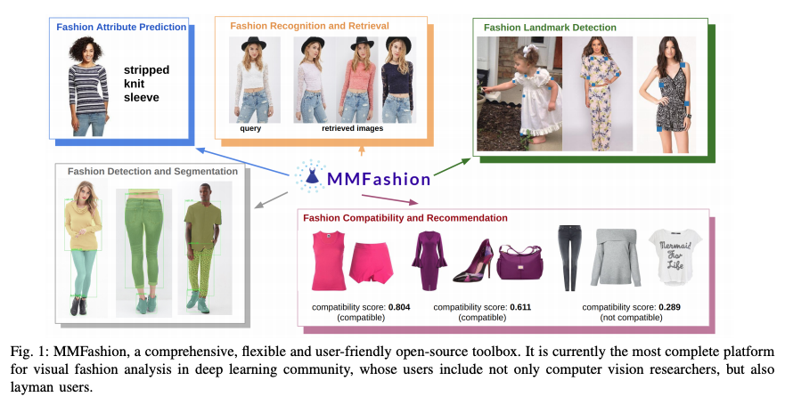
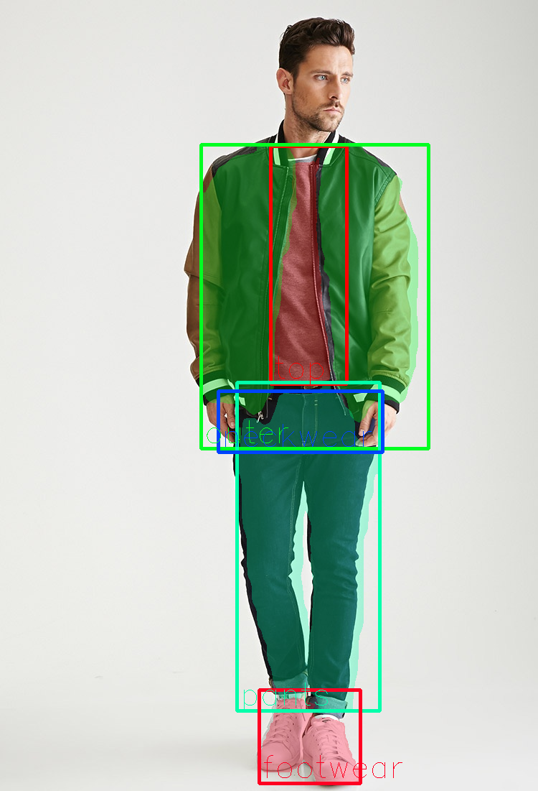

# MMFashion : A Machine Learning Model for Fashion Segmentation

# MMFashion : A Machine Learning Model for Fashion Segmentation

[](/@cochard-dav?source=post_page---byline--a043fa972a2a---------------------------------------)

[David Cochard](/@cochard-dav?source=post_page---byline--a043fa972a2a---------------------------------------)

2 min read

·

Apr 3, 2021

--

[Listen](/m/signin?actionUrl=https%3A%2F%2Fmedium.com%2Fplans%3Fdimension%3Dpost_audio_button%26postId%3Da043fa972a2a&operation=register&redirect=https%3A%2F%2Fmedium.com%2Faxinc-ai%2Fmmfashion-a-machine-learning-model-for-fashion-segmentation-a043fa972a2a&source=---header_actions--a043fa972a2a---------------------post_audio_button------------------)

Share

This is an introduction to「MMFashion」, a machine learning model that can be used with [ailia SDK](https://ailia.jp/en/). You can easily use this model to create AI applications using [ailia SDK](https://ailia.jp/en/) as well as many other ready-to-use [ailia MODELS](https://github.com/axinc-ai/ailia-models).

---

## Overview

MMFashion is an open source toolbox for fashion analysis, which includes models for segmentation and landmark detection. In this article, we will introduce segmentation.

Press enter or click to view image in full size



Source：<https://arxiv.org/pdf/2005.08847.pdf>

[## MMFashion: An Open-Source Toolbox for Visual Fashion Analysis

### We present MMFashion, a comprehensive, flexible and user-friendly open-source visual fashion analysis toolbox based on…

arxiv.org](https://arxiv.org/abs/2005.08847?source=post_page-----a043fa972a2a---------------------------------------)

[## open-mmlab/mmfashion

### Technical Report] MMFashion is an open source visual fashion analysis toolbox based on PyTorch. It is a part of the…

github.com](https://github.com/open-mmlab/mmfashion?source=post_page-----a043fa972a2a---------------------------------------)

## Fashion segmentation using MMFashion

MMFashion uses `MMDetection` as backend, and more specifically `MaskRCNN` included in MMDetection to perform segmentation on the input image.

At the time of writing it is able to detect the following categories.

```
CATEGORY = (  
    'top', 'skirt', 'leggings', 'dress', 'outer', 'pants', 'bag',  
    'neckwear', 'headwear', 'eyeglass', 'belt', 'footwear', 'hair',  
    'skin', 'face'  
)
```

Press enter or click to view image in full size



Source：<https://github.com/open-mmlab/mmfashion/blob/master/demo/imgs/01_4_full.jpg>

## Export to ONNX

The procedure of exporting a model using MMDetection to ONNX is a bit complicated and it is described in the following article.

[## Exporting MMDetection models to ONNX format

### MMDetection is an open-source object detection toolbox based on PyTorch. This article explains how to export…

medium.com](/axinc-ai/exporting-mmdetection-models-to-onnx-format-3ec839c38ff?source=post_page-----a043fa972a2a---------------------------------------)

## How to use MMFashion with ailia SDK

To use MMFashion with the ailia SDK, use the following command to perform segmentation on the input of the webcam.

```
python3 mmfashion.py -v 0
```

[## axinc-ai/ailia-models

### (Image from https://github.com/open-mmlab/mmfashion/blob/master/demo/imgs/01\_4\_full.jpg) Shape : (1, 3, height, width)…

github.com](https://github.com/axinc-ai/ailia-models/tree/master/deep_fashion/mmfashion?source=post_page-----a043fa972a2a---------------------------------------)

---

[ax Inc.](https://axinc.jp/en/) has developed [ailia SDK](https://ailia.jp/en/), which enables cross-platform, GPU-based rapid inference.

ax Inc. provides a wide range of services from consulting and model creation, to the development of AI-based applications and SDKs. Feel free to [contact us](https://axinc.jp/en/) for any inquiry.