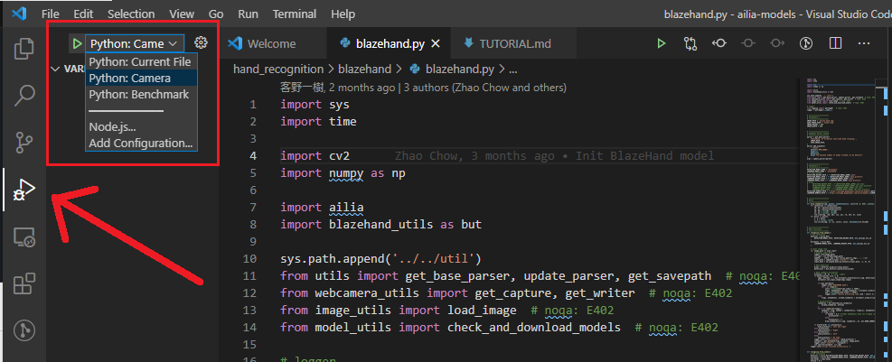
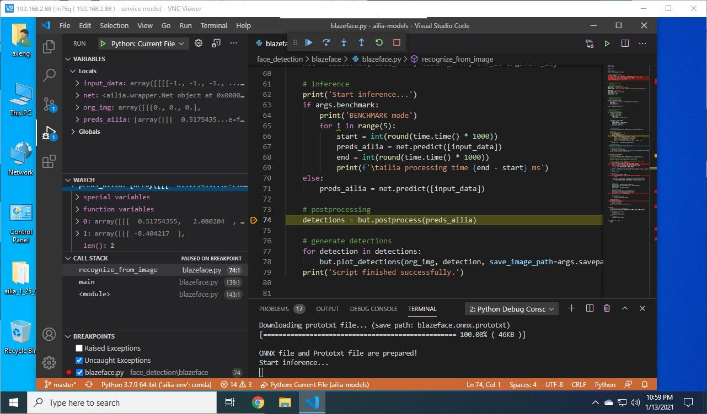
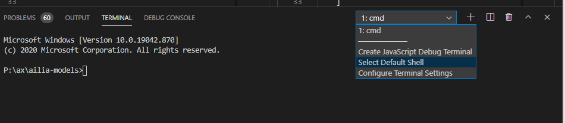
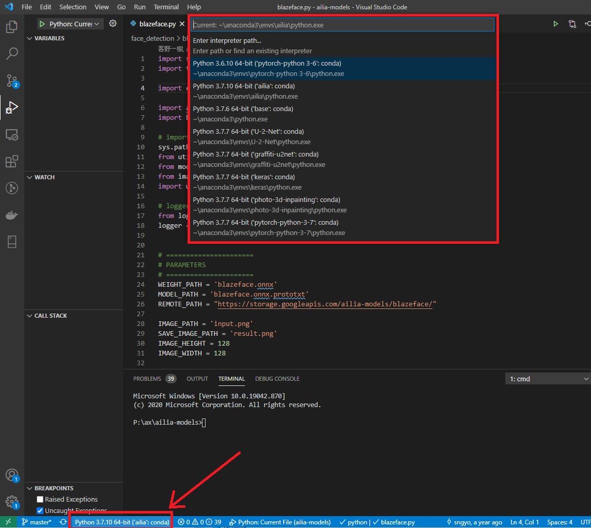

# ailia development using Visual Studio Code

# ailia development using Visual Studio Code

[David Cochard](/@cochard-dav?source=post_page---byline--7f23fa22a95c---------------------------------------)

4 min read

·

Apr 5, 2021

--

[Listen](/m/signin?actionUrl=https%3A%2F%2Fmedium.com%2Fplans%3Fdimension%3Dpost_audio_button%26postId%3D7f23fa22a95c&operation=register&redirect=https%3A%2F%2Fmedium.com%2Faxinc-ai%2Failia-development-using-visual-studio-code-7f23fa22a95c&source=---header_actions--7f23fa22a95c---------------------post_audio_button------------------)

Share

This is a tutorial on how to develop with [ailia SDK](https://ailia.jp/en/) in python using Visual Studio Code, a powerful source code editor. ailia SDK is a GPU-accelerated deep learning inference tool that uses C++, python, C#, and JNI. You can learn more about ailia SDK [here](https://ailia.jp/en/).

---

Visual Studio Code (*VSCode*) is a highly functional source code editor developed by Microsoft for Windows/Linux/macOS that supports various programming languages. It has features such as syntax highlighting, code completion, debugging, and Git control when writing source code. In this article, we will present how to use VSCode to write code with ailia SDK in python. First of all, please refer to [this article](/axinc-ai/ailia-sdk-tutorial-python-ea29ae990cf6) to set up your ailia python development environment.

[## ailia SDK Tutorial (Python)

### Here is a tutorial on how to use ailia SDK in Python. ailia SDK allows you to perform deep learning inference using…

medium.com](/axinc-ai/ailia-sdk-tutorial-python-ea29ae990cf6?source=post_page-----7f23fa22a95c---------------------------------------)

---

There are two versions of Visual Studio Code: an [open source version](https://github.com/microsoft/vscode) and a [commercial license version (free of charge)](https://code.visualstudio.com/) provided by Microsoft. We will use the later for this tutorial. Once VSCode is up and running, install the Python language support extension.

The screen has been captured on Windows 10, but the same can be achieved on macOS/Linux with the same operation.

Clone the *ailia models* repository.

> git clone <https://github.com/axinc-ai/ailia-models>

[## axinc-ai/ailia-models

### Pretrained models for ailia SDK. Contribute to axinc-ai/ailia-models development by creating an account on GitHub.

github.com](https://github.com/axinc-ai/ailia-models?source=post_page-----7f23fa22a95c---------------------------------------)

Since the VSCode configuration files are already part of the *ailia-models* repository, you can run and debug ailia with python code as soon as you open the repository.

Press enter or click to view image in full size

Let’s try running *ailia-models/hand\_recognition/blazehand.* More details on *BlazeHand* are available in [this article](/axinc-ai/blazehand-a-machine-learning-model-for-detecting-hand-key-points-c3943b82739a).

Press enter or click to view image in full size

Select the `Run` icon in the vertical menu on the left, select the *Camera* or *Benchmark* configuration and press the *Play* green button to start the script. There are configurations to use the camera (`Python:Camera`) or an image file (`Python:Current File`) as input, and also a benchmark (`Python:Benchmark`) mode to measure the inference speed.

**For users experiencing errors in an Anaconda environment on Windows, check the next section.**

The first time you run the program, it will automatically download the model file, open a window, and display the inference results of applying the blazehand AI model to the input video from the camera. Note that the webcam is executed assuming a camera with `ID=0` that can be recognized by OpenCV. If you want to apply it to cameras with other IDs, change the “0” in `”args”: [“-v 0”]` in the `ailia-models/.vscode/launch.json` file to an appropriate ID.

> {  
>  “name”: “Python: Camera”,  
>  “type”: “python”,  
>  **“args”: [“-v 0”],**  
>  “request”: “launch”,  
>  “program”: “${file}”,  
>  “console”: “integratedTerminal”,  
>  “cwd”: “${fileDirname}”  
> },

When you click on the left of the line number in the VSCode source code, you can set a breakpoint to check the contents of the variable being executed and execute debugging such as step execution.

Press enter or click to view image in full size

---

## Setup on Windows with Anaconda

Starting the program with the method above spawns a new terminal to perform the action.

Make sure the default terminal is set to an environment having access to `conda` commands and a properly set python environment.

You can change the default terminal to be spawned directly from VSCode. the terminal `cmd` usually works out of the box but others (eg. git bash, powershell) can be setup to work as well.

Press enter or click to view image in full size

Also make sure the python interpreter to be used is the one attached to the environment you setup to run ailia. The interpreter can be set by clicking the python interpreter name at the bottom of the VSCode window, opening a dropdown at the top to select the interpreter path.

Press enter or click to view image in full size

---

[ax Inc.](https://axinc.jp/en/) has developed [ailia SDK](https://ailia.jp/en/), which enables cross-platform, GPU-based rapid inference.

ax Inc. provides a wide range of services from consulting and model creation, to the development of AI-based applications and SDKs. Feel free to [contact us](https://axinc.jp/en/) for any inquiry.