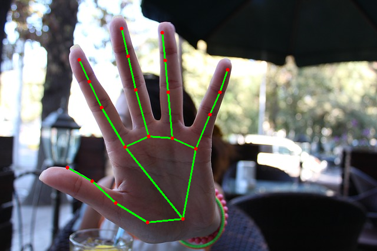
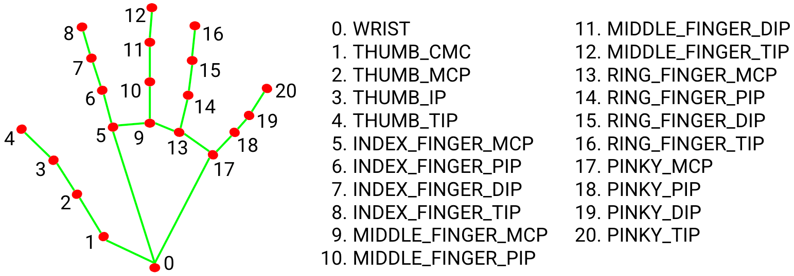
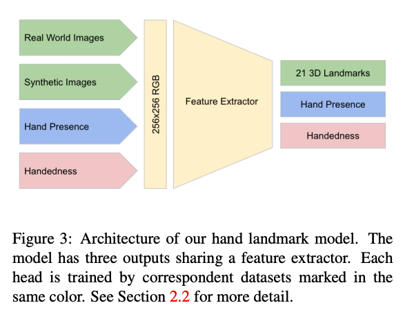

# BlazeHand : A Machine Learning Model for Detecting Hand Key Points

# BlazeHand : A Machine Learning Model for Detecting Hand Key Points

[](/@cochard-dav?source=post_page---byline--c3943b82739a---------------------------------------)

[David Cochard](/@cochard-dav?source=post_page---byline--c3943b82739a---------------------------------------)

3 min read

·

Apr 6, 2021

--

[Listen](/m/signin?actionUrl=https%3A%2F%2Fmedium.com%2Fplans%3Fdimension%3Dpost_audio_button%26postId%3Dc3943b82739a&operation=register&redirect=https%3A%2F%2Fmedium.com%2Faxinc-ai%2Fblazehand-a-machine-learning-model-for-detecting-hand-key-points-c3943b82739a&source=---header_actions--c3943b82739a---------------------post_audio_button------------------)

Share

This is an introduction to「BlazeHand」, a machine learning model that can be used with [ailia SDK](https://ailia.jp/en/). You can easily use this model to create AI applications using [ailia SDK](https://ailia.jp/en/) as well as many other ready-to-use [ailia MODELS](https://github.com/axinc-ai/ailia-models).

---

## Overview

BlazeHand is a machine learning model that detects key points of the hand. Since it can detect detailed hand movements, it can be applied to gesture recognition.

[## MediaPipe Hands: On-device Real-time Hand Tracking

### We present a real-time on-device hand tracking pipeline that predicts hand skeleton from single RGB camera for AR/VR…

arxiv.org](https://arxiv.org/abs/2006.10214?source=post_page-----c3943b82739a---------------------------------------)



Source：<https://pixabay.com/ja/photos/%E5%81%9C%E6%AD%A2-%E5%86%99%E7%9C%9F%E3%81%AA%E3%81%97-%E3%81%AA%E3%81%84%E6%92%AE%E5%BD%B1-%E6%89%8B-565609/>

Detected landmarks follow the following structure.

Press enter or click to view image in full size



Source：<https://google.github.io/mediapipe/solutions/hands.html>

## BlazeHand architecture

BlazeHand consists of two models, `BlazePalm` and `BlazeHand`. After detecting the hand position from the input image with BlazePalm, keypoints of the hand are detected from the hand image with BlazeHand.

The hand detection by BlazePalm is very demanding if it is processed every frame, it may also lose track of the hand. Therefore, in the first frame, BlazePalm performs the detection process, and in subsequent frames, it calculates a slightly larger Rectangle (ROI) from the key point of the hand detected by BlazeHand, and applies BlazeHand to that Rectangle to move the Rectangle. This enables fast and robust recognition.


Source：<https://arxiv.org/pdf/2006.10214.pdf>

*BlazePalm*, the hand position detector, is a simple SSD-based detector with a similar architecture to *BlazeFace*.


Source：<https://arxiv.org/pdf/2006.10214.pdf>

*BlazeHand*, which detects key points of the hand, has an architecture similar to [FPN](https://arxiv.org/abs/1612.03144). For training, real world images were used as well as computer generated synthetic images.



Source：<https://arxiv.org/pdf/2006.10214.pdf>

The output of BlazeHand contains 21 set of (x, y) coordinates, relative depth, plus 2 flags: `Hand Presence`, which indicates the probability of hand presence in the input image, and `Handedness`, which indicates whether the hand is left or right.

## BlazeHand usage

The following commands runs the model using the web camera input.

```
python3 blazehand.py --video 0
```

[## axinc-ai/ailia-models

### (Image from https://pixabay.com/photos/stop-no-photo-no-photographing-hand-565609/) ailia input shape: (1, 3, 256, 256)…

github.com](https://github.com/axinc-ai/ailia-models/tree/master/hand_recognition/blazehand?source=post_page-----c3943b82739a---------------------------------------)

Here is the kind of result you can expect.

---

[ax Inc.](https://axinc.jp/en/) has developed [ailia SDK](https://ailia.jp/en/), which enables cross-platform, GPU-based rapid inference.

ax Inc. provides a wide range of services from consulting and model creation, to the development of AI-based applications and SDKs. Feel free to [contact us](https://axinc.jp/en/) for any inquiry.