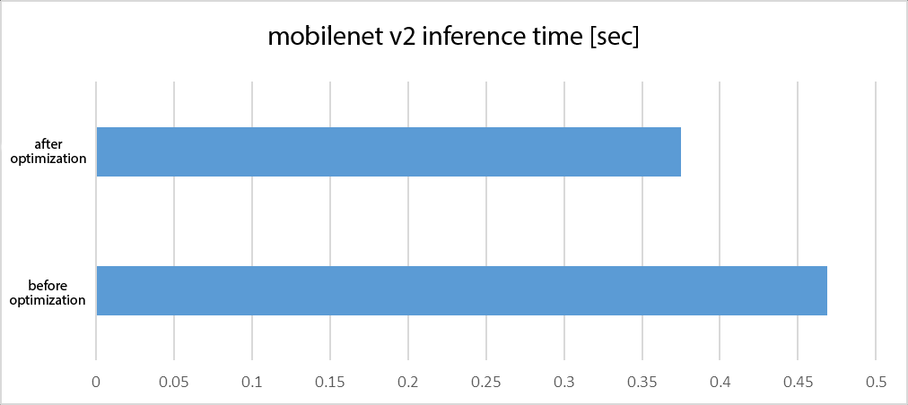
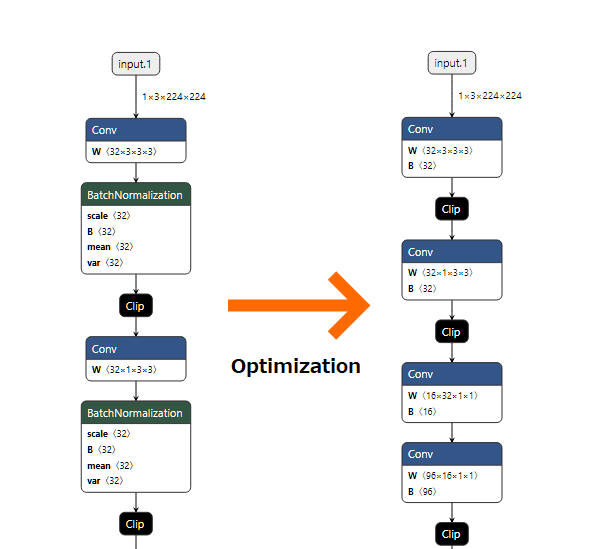

# Using the ONNX Official Optimizer

# Using the ONNX Official Optimizer

[](/@cochard-dav?source=post_page---byline--27d1c7da3531---------------------------------------)

[David Cochard](/@cochard-dav?source=post_page---byline--27d1c7da3531---------------------------------------)

3 min read

·

Apr 13, 2021

--

[Listen](/m/signin?actionUrl=https%3A%2F%2Fmedium.com%2Fplans%3Fdimension%3Dpost_audio_button%26postId%3D27d1c7da3531&operation=register&redirect=https%3A%2F%2Fmedium.com%2Faxinc-ai%2Fusing-the-onnx-official-optimizer-27d1c7da3531&source=---header_actions--27d1c7da3531---------------------post_audio_button------------------)

Share

The [ailia SDK](https://ailia.jp/en/), an inference framework for edge devices, uses the ONNX format to perform fast inference on the GPU. In this article, I introduce some findings regarding ONNX model optimization obtained in the process of developing the ailia SDK.

---

## Why optimizing ONNX models?

ONNX is a standard format for trained models which facilitates the interoperability of models between deep learning frameworks.

ONNX files are created by converting the model files trained by a deep learning framework to ONNX format, but they may contain operations that are unnecessary for the inference processing step.

In this article, we introduce the official ONNX optimizer, which optimizes such ONNX formal models for inference processing.

[## onnx/onnx

### ONNX provides a C++ library for performing arbitrary optimizations on ONNX models, as well as a growing list of…

github.com](https://github.com/onnx/onnx/blob/master/docs/Optimizer.md?source=post_page-----27d1c7da3531---------------------------------------)

### Results of the official ONNX optimizer

*ONNX Runtime* is a deep learning framework developed by Microsoft that performs inference using the ONNX format. In this article, we will use ONNX Runtime for our benchmark.

[## microsoft/onnxruntime

### ONNX Runtime is a performance-focused inference engine for ONNX (Open Neural Network Exchange) models. Models in the…

github.com](https://github.com/microsoft/onnxruntime?source=post_page-----27d1c7da3531---------------------------------------)

Using the `mobilenet v2` model downloaded from the original `ONNX Model Zoo`, we ran the inference 20 times on the same input image data in ONNX Runtime, and displayed the time consumed for the three classes that were most likely to result from the identification of the input image, resulting in the following output.

```
elapsed: 0.46878528594970703  
+ idx=0  
  class=analog clock  
  prob=23.10076332092285  
+ idx=1  
  class=wall clock  
  prob=20.599037170410156  
+ idx=2  
  class=barometer  
  prob=17.743553161621094
```

On the other hand, if we perform inference on the model after running the optimization, we get the following results.

```
elapsed: 0.37501955032348633  
+ idx=0  
  class=analog clock  
  prob=23.10076904296875  
+ idx=1  
  class=wall clock  
  prob=20.599044799804688  
+ idx=2  
  class=barometer  
  prob=17.743555068969727
```

Just by running the model through the optimization library provided by ONNX, we can reduce the processing time from about 0.469 seconds to about 0.375 seconds. This is a very cost effective way to shave off 20% of the calculation time.

Press enter or click to view image in full size



### Benchmark configuration

We confirmed those results in the following configuration.

- Windows 10 / Intel Core i7–4770
- python 3.6.6
- numpy 1.18.1
- onnx 1.6.0
- onnxruntime 1.1.2
- opencv-python 4.2.0.32

### Benchmark script

The python script we used for benchmarking the processing time is the following. It loads the model file `mobilenetv2_1.0.onnx` and the image file `clock.jpg`, runs the inference with ONNX Runtime, and finally displays the results.

inference.py

The `import labels` command at line 6 imports the following `imagenet` labels.

labels.py

Below is the input image we used.


### Optimization script

The script we used for optimization simply loads the onnx file, runs the `onnx.optimizer` on it, and save it.

optimizer.py

The actual optimization is done in *line 11*, which alone gives the results described in the beginning of the article.

### What the optimization script actually does

This script applies the `fuse_bn_into_conv` process provided by the official optimizer. Comparing the onnx files before and after the optimization with [Netron](https://netron.app/) will help you understand the process.



Applying `fuse_bn_into_conv` removes the `BatchNormalization` operations by altering he weights and biases of `Conv` layers.

BatchNormalization is often placed immediately after Convolution to stabilize and improve the efficiency of learning, but it can be omitted by reducing it to the parameters of Convolution since only fixed parameters are used when inferring from a trained model.

By doing this, the BatchNormalization process can be omitted, along with the computation time it requires.

---

[ax Inc.](https://axinc.jp/en/) has developed [ailia SDK](https://ailia.jp/en/), which enables cross-platform, GPU-based rapid inference.

ax Inc. provides a wide range of services from consulting and model creation, to the development of AI-based applications and SDKs. Feel free to [contact us](https://axinc.jp/en/) for any inquiry.