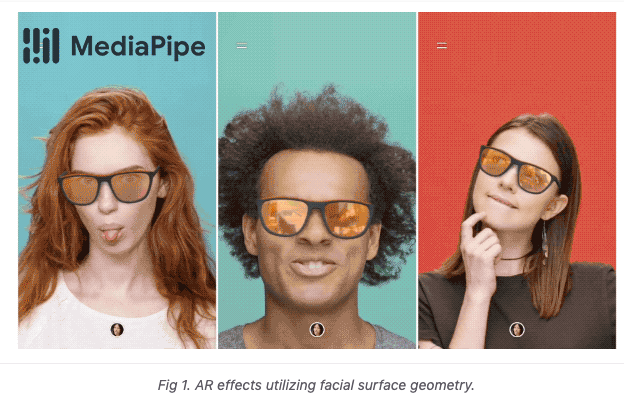
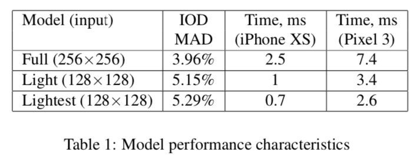

# FaceMesh : Detecting Key Points on Faces in Real Time

# FaceMesh : Detecting Key Points on Faces in Real Time

[](/@cochard-dav?source=post_page---byline--977c03f1bab---------------------------------------)

[David Cochard](/@cochard-dav?source=post_page---byline--977c03f1bab---------------------------------------)

4 min read

·

Apr 14, 2021

--

[Listen](/m/signin?actionUrl=https%3A%2F%2Fmedium.com%2Fplans%3Fdimension%3Dpost_audio_button%26postId%3D977c03f1bab&operation=register&redirect=https%3A%2F%2Fmedium.com%2Faxinc-ai%2Ffacemesh-detecting-key-points-on-faces-in-real-time-977c03f1bab&source=---header_actions--977c03f1bab---------------------post_audio_button------------------)

Share

This is an introduction to「FaceMesh」, a machine learning model that can be used with [ailia SDK](https://ailia.jp/en/). You can easily use this model to create AI applications using [ailia SDK](https://ailia.jp/en/) as well as many other ready-to-use [ailia MODELS](https://github.com/axinc-ai/ailia-models).

---

## Overview

*FaceMesh* is a machine learning model for detecting key facial features from images, published by Google in March 2019. The paper was published in July 2019.

While a typical face keypoint detection computes 68 points (x,y), *FaceMesh* gives us 468 points (x,y,z). Since manual annotation of 468 points is difficult, the model was trained on *3D morphable model* (3DMM) rendered images to annotate real images.

Press enter or click to view image in full size


Source：<https://google.github.io/mediapipe/solutions/face_mesh.html>

*FaceMesh* can be applied to virtual try-on clothes using AR.

Press enter or click to view image in full size



Source：<https://google.github.io/mediapipe/solutions/face_mesh.html>

[## Face Mesh

### MediaPipe Face Mesh is a face geometry solution that estimates 468 3D face landmarks in real-time even on mobile…

google.github.io](https://google.github.io/mediapipe/solutions/face_mesh.html?source=post_page-----977c03f1bab---------------------------------------)

[## Real-time Facial Surface Geometry from Monocular Video on Mobile GPUs

### We present an end-to-end neural network-based model for inferring an approximate 3D mesh representation of a human face…

arxiv.org](https://arxiv.org/abs/1907.06724?source=post_page-----977c03f1bab---------------------------------------)

## FaceMesh architecture

*FaceMesh* takes a 192x192 input image of a face and outputs 468 3D keypoints. The values (x,y) are the pixel coordinates of the input image and z is the depth value relative to the center of gravity of the mesh.

Press enter or click to view image in full size


FaceMesh output（Source：<https://pixabay.com/ja/videos/%E5%A5%B3%E6%80%A7-%E3%83%A4%E3%83%B3%E3%82%B0-%E8%B1%AA%E8%8F%AF%E3%81%A7%E3%81%99-%E8%A1%A8%E7%8F%BE-32387/>）

The architecture of FaceMesh is based on MobileNet, and consists of a combination of *DepthwiseConvolution* and *PointwiseConvolution*. This model is capable of real-time inference on the GPU of a mobile device.

Press enter or click to view image in full size



Source：<https://arxiv.org/pdf/1907.06724>

Press enter or click to view image in full size


[https://netron.app/?url=https://storage.googleapis.com/ailia-models/facemesh/facemesh.onnx.prototxt](https://netron.app/?url=https%3A%2F%2Fstorage.googleapis.com%2Failia-models%2Ffacemesh%2Ffacemesh.onnx.prototxt)

Machine learning models for detecting key points often use 2D heatmaps, but they have the problem of high computational load and the problem of not being able to estimate depth. Therefore, FaceMesh directly calculates the 3D coordinates.

30K images taken with a mobile camera have been used for training. Images taken with a mobile camera have a wide variety of sensors and lighting.

Since annotating 468 key points on a 30K image requires an enormous amount of work, a different approach has been used. Based on 3DMM rendered images, a subset of vertices is designated as Ground Truth. A mechanism infer 2D landmarks separately from 3D landmarks has been added, along with real images annotated with fewer than 468 keypoints as Ground Truth to optimize 3D and 2D simultaneously.

By using the model created by this method, 30% of the dataset was then refined and later used as Ground Truth for training. A brush tool was used for refinement step to easily adjust multiple vertices simultaneously.

By iterating the process of training and updating the dataset, a highly accurate model could be generated.

## FaceMesh usage

The following commands runs the model using the web camera input.

```
$ python3 facemesh.py -v 0
```

[## axinc-ai/ailia-models

### (Image from https://pixabay.com/photos/person-human-male-face-man-view-829966/) ailia input shape: (1, 3, 128, 128) RGB…

github.com](https://github.com/axinc-ai/ailia-models/tree/master/face_recognition/facemesh?source=post_page-----977c03f1bab---------------------------------------)

Since FaceMesh is a computed frame-by-frame, some jitter might be visible. It is recommended to implement a 1D temporal filter when using it in AR applications.

---

## Related topics

[## BlazeFace : A Machine Learning Model for Fast Detection of Face Positions and Key Points

medium.com](/axinc-ai/blazeface-a-machine-learning-model-for-fast-detection-of-face-positions-and-key-points-5dcfb9429d72?source=post_page-----977c03f1bab---------------------------------------)

[## FaceAlignment : A Machine Learning Model For Recognizing Key Points On a Face

medium.com](/axinc-ai/facealignment-a-machine-learning-model-for-recognizing-key-points-on-a-face-956f5e796efa?source=post_page-----977c03f1bab---------------------------------------)

---

[ax Inc.](https://axinc.jp/en/) has developed [ailia SDK](https://ailia.jp/en/), which enables cross-platform, GPU-based rapid inference.

ax Inc. provides a wide range of services from consulting and model creation, to the development of AI-based applications and SDKs. Feel free to [contact us](https://axinc.jp/en/) for any inquiry.