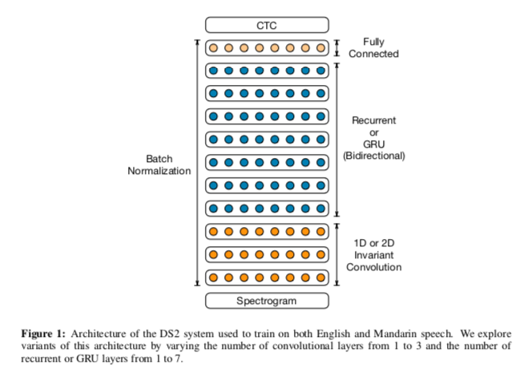

# DeepSpeech2 : A machine learning model for speech recognition

# DeepSpeech2 : A machine learning model for speech recognition

[](/@cochard-dav?source=post_page---byline--d9e64c0d1afc---------------------------------------)

[David Cochard](/@cochard-dav?source=post_page---byline--d9e64c0d1afc---------------------------------------)

4 min read

·

Apr 16, 2021

--

[Listen](/m/signin?actionUrl=https%3A%2F%2Fmedium.com%2Fplans%3Fdimension%3Dpost_audio_button%26postId%3Dd9e64c0d1afc&operation=register&redirect=https%3A%2F%2Fmedium.com%2Faxinc-ai%2Fdeepspeech2-a-machine-learning-model-for-speech-recognition-d9e64c0d1afc&source=---header_actions--d9e64c0d1afc---------------------post_audio_button------------------)

Share

This is an introduction to「DeepSpeech2」, a machine learning model that can be used with [ailia SDK](https://ailia.jp/en/). You can easily use this model to create AI applications using [ailia SDK](https://ailia.jp/en/) as well as many other ready-to-use [ailia MODELS](https://github.com/axinc-ai/ailia-models).

---

## Overview

*DeepSpeech2* is an end to end speech recognition model proposed in December 2015. It is capable of outputting English text from audio speech as input.

[## SeanNaren/deepspeech.pytorch

### Implementation of DeepSpeech2 for PyTorch. The repo supports training/testing and inference using the DeepSpeech2…

github.com](https://github.com/SeanNaren/deepspeech.pytorch?source=post_page-----d9e64c0d1afc---------------------------------------)

[## Deep Speech 2: End-to-End Speech Recognition in English and Mandarin

### We show that an end-to-end deep learning approach can be used to recognize either English or Mandarin Chinese…

arxiv.org](https://arxiv.org/abs/1512.02595?source=post_page-----d9e64c0d1afc---------------------------------------)

## Architecture

DeepSpeech2 converts the input speech into *Melspectrograms*, then applies CNN and RNN, and finally outputs the text using *Connectionist Temporal Classification* (CTC).



Source：<https://arxiv.org/abs/1512.02595>

*Connectionist Temporal Classification* (CTC) is a method often used in character recognition and speech recognition, in combination with LSTM and RNN. In character and speech recognition, the width of a single character and the time length of a single phoneme are variable. This method solves the problem of variable width and time length of a phoneme by erasing the same character in succession on the decoder side.

## Usage of language models

By correcting the output of CTC with a language model, we can make the text more natural. The following library is used for *cctcdecode* with language model.

[## parlance/ctcdecode

### ctcdecode is an implementation of CTC (Connectionist Temporal Classification) beam search decoding for PyTorch. C++…

github.com](https://github.com/parlance/ctcdecode?source=post_page-----d9e64c0d1afc---------------------------------------)

The language model itself can be downloaded from the link below.

[## openslr.org

### Identifier: SLR11 Summary: Language modelling resources, for use with the LibriSpeech ASR corpus Category: Text…

www.openslr.org](http://www.openslr.org/11/?source=post_page-----d9e64c0d1afc---------------------------------------)

In CTC decoding with language models, the probability of occurrence of a word is calculated as the sum of all possible patterns. To make this calculation efficient, dynamic programming is used.

## DeepSpeech2 dataset

DeepSpeech2 has been trained on *AN4*, *Librispeech*, and *TEDLIUM*.

*AN4* is a small 16 kHz data set created by CMU in 1991.

[## CMU Sphinx Group — Audio Databases

### Edit description

www.speech.cs.cmu.edu](http://www.speech.cs.cmu.edu/databases/an4/?source=post_page-----d9e64c0d1afc---------------------------------------)

*Librispeech* contains 1000 hours of speech at 16 kHz retrieved from audiobook

[## openslr.org

### Identifier: SLR12 Summary: Large-scale (1000 hours) corpus of read English speech Category: Speech License: CC BY 4.0…

www.openslr.org](http://www.openslr.org/12/?source=post_page-----d9e64c0d1afc---------------------------------------)

*TEDLIUM* contains approximately 118 hours of speech at 16 kHz using TED Talk.

[## tedlium | TensorFlow Datasets

### FeaturesDict({ ‘gender’: ClassLabel(shape=(), dtype=tf.int64, num\_classes=3), ‘id’: tf.string, ‘speaker\_id’: tf.string…

www.tensorflow.org](https://www.tensorflow.org/datasets/catalog/tedlium?source=post_page-----d9e64c0d1afc---------------------------------------)

## DeepSpeech2 usage

To use DeepSpeech2 with the ailia SDK, use the following command.

```
$ python3 deepspeech2.py -i input.wav
```

To use the language model, use the `-d` option. You need to install the *cctcdecode* library and download the language `model 3-gram.pruned.3e-7.arpa` beforehand.

```
$ python3 deepspeech2.py -i input.wav -d
```

[## axinc-ai/ailia-models

### audio file（16kHz) LibriSpeech ASR corpus http://www.openslr.org/12 1221–135766–0000.wav texts…

github.com](https://github.com/axinc-ai/ailia-models/tree/master/audio_processing/deepspeech2?source=post_page-----d9e64c0d1afc---------------------------------------)

## Example of DeepSpeech2 output

Use the following material.

[## Speech Codec Wav Samples

### Overview | Speech Recognition | Speech Codec Samples | Speech + Noise Codec Samples | ITU ◳ | MELPe Speech Codecs ◳ |…

www.signalogic.com](https://www.signalogic.com/index.pl?page=speech_codec_wav_samples&source=post_page-----d9e64c0d1afc---------------------------------------)

Here is the result using the language model.

```
what somebody decides to break it be careful that you keep angular coverage but look for places to save money ninety is taking longer to get things squared away than the banker's expected during the life for once company may win her taxied retirement and count de bust telle but inadequate new self to seeming rags or hurriedly tolson the two naked bone to want o discussion cannons thou when the title of this type of than is in question or to dying or waxing or gassing tete debrett may be personalized known by a clays leather horn lace work on a flat surface and smooth out a simples tinto separate system uses a single self contained in it the old chap an ad still hold a good mechanic is usually a bad but so figures would do her in lady years we make beautiful chares canet chesnel's etcher'
```

And below is the result without using the language model.

```
wha i somebody decides to break it he careful that you keep anquhaod coverage but look for places to save monyniete its taking longer to get things squired away than the bankers expected liring the life for once comnpany my win her taxited retireent and comnt debouse ta telple but inadequate new self to seeming rags ore hurridly tos on the two naked bone to want o discussion cannins shou when the title of this type of thol is in questions ors o dying or waxing orgassingtete dibrualight may be persoaaised known by o clays leather horne lace work on a flat surface and smooth out a siples tiing to separate system useas a single sof contained un it the old chup an ad still hold a good mechanic is usually a bad bot fo figures would no her in lady years o make beautiful chaires camnets ches dol houses ed cheter
```

The result obtained using the language model is a lot more natural.

---

[ax Inc.](https://axinc.jp/en/) has developed [ailia SDK](https://ailia.jp/en/), which enables cross-platform, GPU-based rapid inference.

ax Inc. provides a wide range of services from consulting and model creation, to the development of AI-based applications and SDKs. Feel free to [contact us](https://axinc.jp/en/) for any inquiry.