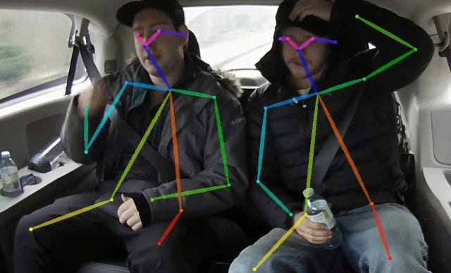

# LightWeightHumanPose : A Machine Learning Model for Fast Multi-person Pose Estimation

# LightWeightHumanPose : A Machine Learning Model for Fast Multi-person Pose Estimation

[](/@cochard-dav?source=post_page---byline--631c042bed50---------------------------------------)

[David Cochard](/@cochard-dav?source=post_page---byline--631c042bed50---------------------------------------)

4 min read

·

Apr 16, 2021

--

[Listen](/m/signin?actionUrl=https%3A%2F%2Fmedium.com%2Fplans%3Fdimension%3Dpost_audio_button%26postId%3D631c042bed50&operation=register&redirect=https%3A%2F%2Fmedium.com%2Faxinc-ai%2Flightweighthumanpose-a-machine-learning-model-for-fast-multi-person-skeleton-detection-631c042bed50&source=---header_actions--631c042bed50---------------------post_audio_button------------------)

Share

This is an introduction to「LightWeightHumanPose」, a machine learning model that can be used with [ailia SDK](https://ailia.jp/en/). You can easily use this model to create AI applications using [ailia SDK](https://ailia.jp/en/) as well as many other ready-to-use [ailia MODELS](https://github.com/axinc-ai/ailia-models).

---

## Overview

*LightWeightHumanPose* is a pose estimation model released by Intel in November 2018 that detects multiple people simultaneously at high speed. It is optimized for fast inference even on CPUs.



Source：<https://github.com/Daniil-Osokin/lightweight-human-pose-estimation.pytorch>

This detection model can be applied to gesture and action detection and recognition, motion capture, and sports analysis.

[## Real-time 2D Multi-Person Pose Estimation on CPU: Lightweight OpenPose

### In this work we adapt multi-person pose estimation architecture to use it on edge devices. We follow the bottom-up…

arxiv.org](https://arxiv.org/abs/1811.12004?source=post_page-----631c042bed50---------------------------------------)

## Architecture

There are two approaches to pose estimation: the *top-down approach* and the *bottom-up approach*.

In the *top-down approach*, pose estimation is performed on each detected person after the person detection is performed by [YOLO](/axinc-ai/yolov5-the-latest-model-for-object-detection-b13320ec516b) or other methods. The detection speed depends on the number of people.

In the *bottom-up approach*, all the key points are detected first, and then the key points are grouped into people. This approach is fast because it performs pose estimation for all people together.

LightWeightHumanPose uses a bottom-up approach, similar to OpenPose. It calculates a *heatmap* for each keypoint and a *Part Affinity Fields* (PAF) showing the connections between keypoints from the input image.

Press enter or click to view image in full size


Source：<https://arxiv.org/pdf/1811.12004>

The PAF indicates which keypoint of the set of keypoints B (e.g. elbow) is the keypoint of the same person, given keypoint A (e.g. shoulder). To calculate the relevance of the candidate connection keypoint B1 to a certain coordinate A1 of keypoint A, calculate the sum of the PAF values on the line between the coordinates A1 and B1. Calculate this value for all of the keypoints B1 to BN, and adopt the combination with the largest total value.

The original OpenPose uses *VGG-19* for the backbone. It also repeats Refinment 5 times. The input resolution is 368x368.

Press enter or click to view image in full size


Source：<https://arxiv.org/pdf/1811.12004>

LightWeightHumanPose uses *MobileNet v1* as backbone. It performs only one Refinement and replaces 7x7 Convolution with a combination of 1x1, 3x3 and 3x3 Convolutions to have the same receptive field (reference pixel).


Source：<https://arxiv.org/pdf/1811.12004>

This reduces computational complexity from 136.1 GFlops for OpenPose, to 9 GFlops for LightWeightHumanPose, while maintaining an AP of 42.8 versus 48.6.

Press enter or click to view image in full size


Source：<https://arxiv.org/pdf/1811.12004>

As a result, it runs at 26 fps on the CPU.  
The COCO Dataset was used for training.

## Usage

The ailia SDK implements the pre-processing and post-processing in C++, which makes it faster than the usual Python implementation.

```
$ python3 lightweight-human-pose-estimation.py -v 0
```

In a RTX2080 + cuDNN environment, inference can be done in 11ms including post-processing.

The default recognition resolution is 320x240, but if you want to recognize smaller people, you can use the -dw and -dh options to increase the recognition resolution.

```
$ python3 lightweight-human-pose-estimation.py -v 0 -dw 640 -dh 480
```

By reducing the recognition resolution to 160x120 with the -dw and -dh options, it is also possible to increase the inference speed on the RaspberryPi4 to about 150ms.

```
$ python3 lightweight-human-pose-estimation.py -v 0 -dw 160 -dh 120
```

[## axinc-ai/ailia-models

### (Image from…

github.com](https://github.com/axinc-ai/ailia-models/tree/master/pose_estimation/lightweight-human-pose-estimation?source=post_page-----631c042bed50---------------------------------------)

Here is the result of LightWeightHumanPose.

---

## Related topics

[## BlazePose : A 3D Pose Estimation Model

### This is an introduction to「BlazePose」, a machine learning model that can be used with ailia SDK. You can easily use…

medium.com](/axinc-ai/blazepose-a-3d-pose-estimation-model-d8689d06b7c4?source=post_page-----631c042bed50---------------------------------------)

[## PoseResnet : A Top-down Machine Learning Model for Pose Estimation

medium.com](/axinc-ai/poseresnet-a-top-down-machine-learning-model-for-skeletal-detection-9454f391ae4d?source=post_page-----631c042bed50---------------------------------------)

[## GAST : A machine learning model that predicts a 3D skeleton from a 2D skeleton

medium.com](/axinc-ai/gast-a-machine-learning-model-that-predicts-a-3d-skeleton-from-a-2d-skeleton-44449d1ff78d?source=post_page-----631c042bed50---------------------------------------)

[## AnimalPose : Pose Esimation for Animals

### This is an introduction to「AnimalPose」, a machine learning model that can be used with ailia SDK. You can easily use…

medium.com](/axinc-ai/animalpose-pose-esimation-for-animals-700603e0dbae?source=post_page-----631c042bed50---------------------------------------)

---

[ax Inc.](https://axinc.jp/en/) has developed [ailia SDK](https://ailia.jp/en/), which enables cross-platform, GPU-based rapid inference.

ax Inc. provides a wide range of services from consulting and model creation, to the development of AI-based applications and SDKs. Feel free to [contact us](https://axinc.jp/en/) for any inquiry.