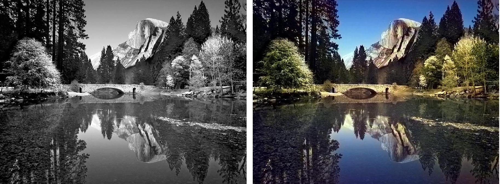

# Colorization : A Machine Learning Model for Colorizing Black and White Images

# Colorization : A Machine Learning Model for Colorizing Black and White Images

[](/@cochard-dav?source=post_page---byline--829e35e4f91c---------------------------------------)

[David Cochard](/@cochard-dav?source=post_page---byline--829e35e4f91c---------------------------------------)

2 min read

·

Apr 26, 2021

--

[Listen](/m/signin?actionUrl=https%3A%2F%2Fmedium.com%2Fplans%3Fdimension%3Dpost_audio_button%26postId%3D829e35e4f91c&operation=register&redirect=https%3A%2F%2Fmedium.com%2Faxinc-ai%2Fcolorization-a-machine-learning-model-for-colorizing-black-and-white-images-829e35e4f91c&source=---header_actions--829e35e4f91c---------------------post_audio_button------------------)

Share

This is an introduction to「Colorization」, a machine learning model that can be used with [ailia SDK](https://ailia.jp/en/). You can easily use this model to create AI applications using [ailia SDK](https://ailia.jp/en/) as well as many other ready-to-use [ailia MODELS](https://github.com/axinc-ai/ailia-models).

---

## Overview

*Colorization* is a machine learning model released in March of 2016 that takes a black and white image as input and outputs a colorized version of it. The machine learning model performs colorization based on these semantic meanings, such as grass is green, the sky is blue, and ladybugs are red.

Press enter or click to view image in full size



Source: <https://github.com/richzhang/colorization/tree/master/imgs>

[## Colorful Image Colorization

### Given a grayscale photograph as input, this paper attacks the problem of hallucinating a plausible color version of the…

arxiv.org](https://arxiv.org/abs/1603.08511?source=post_page-----829e35e4f91c---------------------------------------)

Press enter or click to view image in full size


Source：<https://arxiv.org/pdf/1603.08511.pdf>

## Architecture

*Colorization* works in the `Lab` color space. It takes the lightness `L`, and estimates colors `a` and `b`. It adds `L` to the computed `ab` and returns it to RGB space.

The model architecture is based on VGG.

Press enter or click to view image in full size


Source：<https://arxiv.org/pdf/1603.08511.pdf>

The paper introduces an optimal error function for Colorization. The usual method of minimizing the L2 error of pixel values often converges to average values, resulting in an image with low saturation.

The proposed method solves this problem by using the distribution of *ab* values as the error function. The training quantizes the *ab*-values and learn to bring the distribution of ab-values closer together.

Press enter or click to view image in full size


Source：<https://arxiv.org/pdf/1603.08511.pdf>

## Usage

You can run the *Colorization* model in ailia SDK with the following command.

```
python3 colorization.py --input input.jpg --savepath output.jpg
```

[## axinc-ai/ailia-models

### (Image above is from https://github.com/richzhang/colorization/tree/master/imgs) Automatically downloads the onnx and…

github.com](https://github.com/axinc-ai/ailia-models/tree/master/image_manipulation/colorization?source=post_page-----829e35e4f91c---------------------------------------)

---

[ax Inc.](https://axinc.jp/en/) has developed [ailia SDK](https://ailia.jp/en/), which enables cross-platform, GPU-based rapid inference.

ax Inc. provides a wide range of services from consulting and model creation, to the development of AI-based applications and SDKs. Feel free to [contact us](https://axinc.jp/en/) for any inquiry.