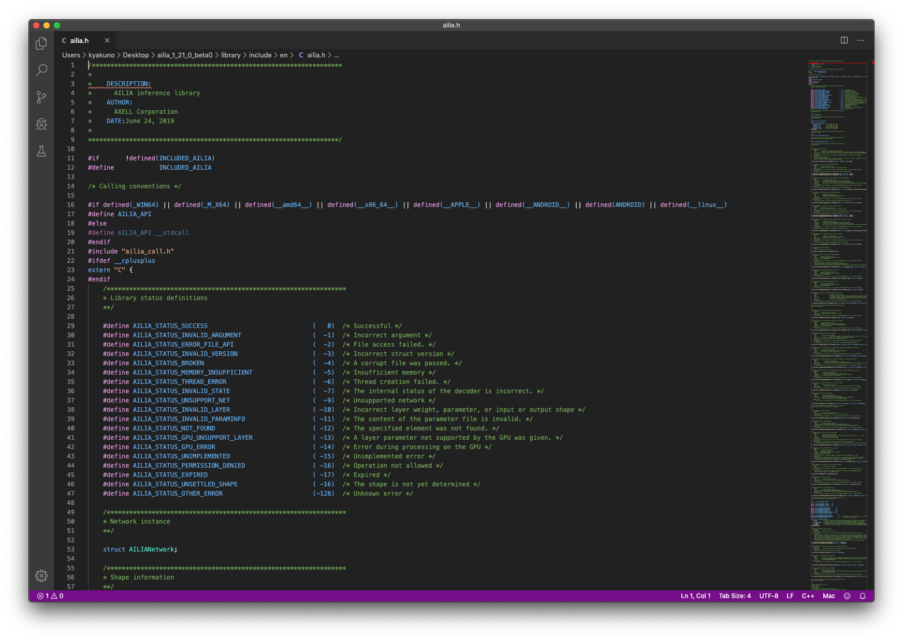

# ailia SDK Tutorial (Predict API)

# ailia SDK Tutorial (Predict API)

[David Cochard](/@cochard-dav?source=post_page---byline--c0f1f72cd437---------------------------------------)

2 min read

·

Apr 27, 2021

--

[Listen](/m/signin?actionUrl=https%3A%2F%2Fmedium.com%2Fplans%3Fdimension%3Dpost_audio_button%26postId%3Dc0f1f72cd437&operation=register&redirect=https%3A%2F%2Fmedium.com%2Faxinc-ai%2Failia-sdk-tutorial-predict-api-c0f1f72cd437&source=---header_actions--c0f1f72cd437---------------------post_audio_button------------------)

Share

The *Predict* API is the core function of the [ailia SDK](https://ailia.jp/en/), an AI inference engine that allows you to perform fast deep learning inference on GPU.

---

## Predict API overview

The *Predict* API is the fundamental API to perform inference, it can handle not only single-input /single-output models, but also models with multiple inputs and outputs.

## Inference for models with single input and output

The C API is defined in `library/include/ailia.h`, the Python API in `python/ailia/__init__.py`, and the C# API in `unity/Assets/AILIA/Scripts/Models/AiliaModel.cs. AiliaModel.cs`

Press enter or click to view image in full size

Below is the flow for inferring a single-input, single-output model using the Predict API.

(1) Create an instance with `ailiaCreate`  
(2) Load the model with `ailiaOpenStreamFile` and `ailiaOpenWeightFile`  
(3) Get the input shape with `ailiaGetInputShape`  
(4) Get the output shape with `ailiaGetOutputShape`  
(5) Pass on a float array of input and output tensors to `ailiaPredict`   
(6) Release the instance with `ailiaDestroy`

Here is an example of code in C. The API for C is defined in C99, because the ABI is not standardized for C++, and compatibility issues arise when using different compilers. In the future, we are planning to provide the wrapper for C++ in a header file.

Here is an example code in C#, using the `AiliaModel` class. `ailiaCreate`, `ailiaOpenStreamFile`, and `ailiaOpenWeightFile` are integrated into the call to `AiliaModel.Open`

Finally, here is the code in Python using the class `Ailia.Net`. `ailiaCreate`, `ailiaOpenStreamFile` and `ailiaOpenWeightFile` have been merged to the `ailia.Net` constructor.

## Inference for models with multiple inputs and outputs

Below is the flow for running inference on a model with multiple inputs and outputs.

(1) Create an instance with `ailiaCreate`  
(2) Load the model with `ailiaOpenStreamFile` and `ailiaOpenWeightFile`  
(3) Get the input shape with `ailiaFindBlobIndexByName` and `ailiaGetBlobShape`  
(4) Get the output shape with `ailiaFindBlobIndexByName` and `ailiaGetBlobShape`  
(5) Give a float array of input tensors with `ailiaSetInputBlobData`  
(6) Run the inference with `ailiaUpdate`  
(7) Give a float array (output tensors) to`ailiaGetBlobData` and get the inference result  
(8) Release the instance with `ailiaDestroy`

Below is an example written in C.

Below is an example of code in C#. Multiple input/output in C# is supported since ailia SDK 1.2.1.

And finally an example written in Python.

## Choose your inference backend

Calling `ailiaCreate` with the constant `AILIA_ENVIRONMENT_ID_AUTO` will run the inference on the CPU. In order to use the GPU, change this value by the target GPU `env_id` returned by `ailiaGetEnvironment`.

---

[ax Inc.](https://axinc.jp/en/) has developed [ailia SDK](https://ailia.jp/en/), which enables cross-platform, GPU-based rapid inference.

ax Inc. provides a wide range of services from consulting and model creation, to the development of AI-based applications and SDKs. Feel free to [contact us](https://axinc.jp/en/) for any inquiry.