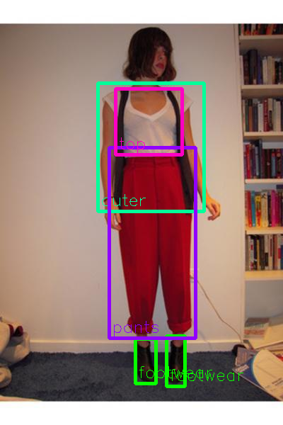
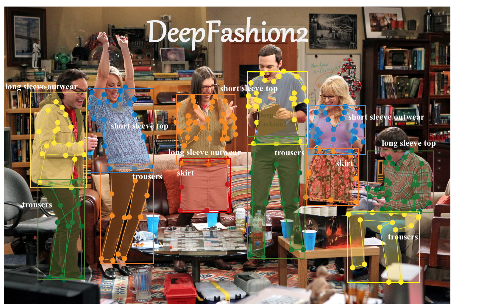

# ClothingDetection : A machine learning model for detecting clothing

# ClothingDetection : A machine learning model for detecting clothing

[](/@cochard-dav?source=post_page---byline--dab99e1492eb---------------------------------------)

[David Cochard](/@cochard-dav?source=post_page---byline--dab99e1492eb---------------------------------------)

2 min read

·

Apr 28, 2021

--

[Listen](/m/signin?actionUrl=https%3A%2F%2Fmedium.com%2Fplans%3Fdimension%3Dpost_audio_button%26postId%3Ddab99e1492eb&operation=register&redirect=https%3A%2F%2Fmedium.com%2Faxinc-ai%2Fclothingdetection-a-machine-learning-model-for-detecting-clothing-dab99e1492eb&source=---header_actions--dab99e1492eb---------------------post_audio_button------------------)

Share

This is an introduction to「ClothingDetection」, a machine learning model that can be used with [ailia SDK](https://ailia.jp/en/). You can easily use this model to create AI applications using [ailia SDK](https://ailia.jp/en/) as well as many other ready-to-use [ailia MODELS](https://github.com/axinc-ai/ailia-models).

---

## Overview

*Clothing Detection* is a clothing recognition model that uses [YOLOv3](/axinc-ai/yolov3-a-machine-learning-model-to-detect-the-position-and-type-of-an-object-60f1c18f8107). It can detect the position of tops and bottoms from an input image.



Source：<https://github.com/simaiden/Clothing-Detection/blob/master/tests/0000003.jpg>

[## simaiden/Clothing-Detection

### All weights and config files are in…

github.com](https://github.com/simaiden/Clothing-Detection?source=post_page-----dab99e1492eb---------------------------------------)

## Recognized categories

ClothingDetection uses `Modanet` and `DeepFashionV2` as datasets, it can detect and calculate bounding boxes for the following categories.

> DATASETS\_CATEGORY = {  
>  ‘modanet’: [  
>  “bag”, “belt”, “boots”, “footwear”, “outer”, “dress”, “sunglasses”,  
>  “pants”, “top”, “shorts”, “skirt”, “headwear”, “scarf/tie”  
>  ],  
>  ‘df2’: [  
>  “short sleeve top”, “long sleeve top”, “short sleeve outwear”, “long sleeve outwear”,  
>  “vest”, “sling”, “shorts”, “trousers”, “skirt”, “short sleeve dress”,  
>  “long sleeve dress”, “vest dress”, “sling dress”  
>  ]  
> }

*ModaNet* is a data set for fashion segmentation provided by *eBay*, which includes 13 fashion categories.

Press enter or click to view image in full size


Source：<https://github.com/eBay/modanet>

[## eBay/modanet

### Table of Contents ModaNet is a street fashion images dataset consisting of annotations related to RGB images. ModaNet…

github.com](https://github.com/eBay/modanet?source=post_page-----dab99e1492eb---------------------------------------)

*DeepFashionV2* is a large dataset for fashion detection, containing 491K images and 13 popular categories, for a total of 801K fashion items.

Press enter or click to view image in full size



Source：<https://github.com/switchablenorms/DeepFashion2>

[## switchablenorms/DeepFashion2

### DeepFashion2 is a comprehensive fashion dataset. It contains 491K diverse images of 13 popular clothing categories from…

github.com](https://github.com/switchablenorms/DeepFashion2?source=post_page-----dab99e1492eb---------------------------------------)

## Usage

You can run *Clothing Detection* on the webcam video stream in ailia SDK with the following command.

```
python3 clothing-detection.py -v 0
```

[## axinc-ai/ailia-models

### (Image above is from https://github.com/richzhang/colorization/tree/master/imgs) Automatically downloads the onnx and…

github.com](https://github.com/axinc-ai/ailia-models/tree/master/image_manipulation/colorization?source=post_page-----dab99e1492eb---------------------------------------)

---

[ax Inc.](https://axinc.jp/en/) has developed [ailia SDK](https://ailia.jp/en/), which enables cross-platform, GPU-based rapid inference.

ax Inc. provides a wide range of services from consulting and model creation, to the development of AI-based applications and SDKs. Feel free to [contact us](https://axinc.jp/en/) for any inquiry.