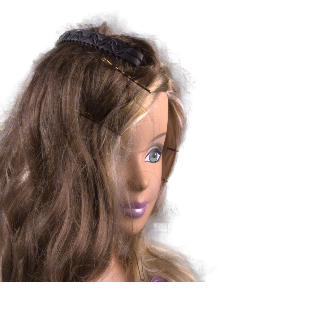

# Deep Image Matting : A machine learning model to perform accurate image matting

# Deep Image Matting : A machine learning model to perform accurate image matting

[](/@cochard-dav?source=post_page---byline--2ff98e0b47d6---------------------------------------)

[David Cochard](/@cochard-dav?source=post_page---byline--2ff98e0b47d6---------------------------------------)

4 min read

·

Apr 29, 2021

--

[Listen](/m/signin?actionUrl=https%3A%2F%2Fmedium.com%2Fplans%3Fdimension%3Dpost_audio_button%26postId%3D2ff98e0b47d6&operation=register&redirect=https%3A%2F%2Fmedium.com%2Faxinc-ai%2Fdeep-image-matting-a-machine-learning-model-to-improve-the-accuracy-of-image-matting-2ff98e0b47d6&source=---header_actions--2ff98e0b47d6---------------------post_audio_button------------------)

Share

This is an introduction to「Deep Image Matting」, a machine learning model that can be used with [ailia SDK](https://ailia.jp/en/). You can easily use this model to create AI applications using [ailia SDK](https://ailia.jp/en/) as well as many other ready-to-use [ailia MODELS](https://github.com/axinc-ai/ailia-models).

---

## Overview

*Image matting* refers to the problem of extracting interesting targets, usually objects in the foreground, from a static image or a video sequence, which has played an important role in many image and video editing applications.

*Deep Image Matting* is a machine learning model to perform highly accurate foreground estimation that was announced in April 2017.

[## Deep Image Matting

### Image matting is a fundamental computer vision problem and has many applications. Previous algorithms have poor…

arxiv.org](https://arxiv.org/abs/1703.03872?source=post_page-----2ff98e0b47d6---------------------------------------)

*Deep Image Matting* performs foreground estimation with high accuracy using `RGB` and `TRIMAP` images as input, where `TRIMAP` is an image with value is set to 255 for foreground objects, 0 for the background, and 127 for areas where it is unclear whether it is part of the foreground or the background.

TRIMAPs are usually created manually or from depth cameras, but in recent years they can also be generated by segmentation models.

[## foamliu/Deep-Image-Matting

### Just in case you are interested, Deep Image Matting v2 is an upgraded version of this. This repository is to reproduce…

github.com](https://github.com/foamliu/Deep-Image-Matting?source=post_page-----2ff98e0b47d6---------------------------------------)

## Input and output of Deep Image Matting

Below is an example of input image.

Press enter or click to view image in full size


（Source：<https://github.com/foamliu/Deep-Image-Matting/tree/master/images>）

The corresponding TRIMAP

Press enter or click to view image in full size


（Source：<https://github.com/foamliu/Deep-Image-Matting/tree/master/images>）

And the final result image.



Since *Deep Image Matting* has been trained on 320x320 resolution images, the resolution of the output will also be 320x320.

## Usage in ailia SDK

You can run *Deep Image Matting* in ailia SDK with the following command, which outputs a PNG with an alpha channel by supplying an RGB image and a TRIMAP image as arguments.

```
python3 deep-image-matting.py -i image.png -t trimap.png
```

[## ailia-models/background\_removal/deep-image-matting at master · axinc-ai/ailia-models

### input image input trimap (from…

github.com](https://github.com/axinc-ai/ailia-models/tree/master/background_removal/deep-image-matting?source=post_page-----2ff98e0b47d6---------------------------------------)

In the ailia SDK, the TRIMAP can also be automatically generated. Provide an empty string as a TRIMAP argument to use *Deep Image Matting* in conjunction with a segmentation model to automatically generate the TRIMAP.

```
python3 deep-image-matting.py -i pixaboy.jpg -t “”
```

Below are the different steps performed internally to generate the TRIMAP on the following input image.


（Source：<https://pixabay.com/ja/photos/%E5%A5%B3%E6%80%A7-%E8%82%96%E5%83%8F%E7%94%BB-%E8%8C%B6-%E3%82%AB%E3%83%83%E3%83%97-%E6%84%9B-5393941/>）

`DeeplabV3` is used to perform the automated segmentation.


Below is the result after binarization.


Then the TRIMAP is generated using `cv2.erode` and `cv2.dilate`


And the final *Deep Image Matting* model output.


## Related topic

[## U2Net : A machine learning model that performs object cropping in a single shot

### Introducing U2Net, a machine learning model that can be used with ailia SDK. You can easily implement AI features in…

medium.com](/axinc-ai/u2net-a-machine-learning-model-that-performs-object-cropping-in-a-single-shot-48adfc158483?source=post_page-----2ff98e0b47d6---------------------------------------)

---

[ax Inc.](https://axinc.jp/en/) has developed [ailia SDK](https://ailia.jp/en/), which enables cross-platform, GPU-based rapid inference.

ax Inc. provides a wide range of services from consulting and model creation, to the development of AI-based applications and SDKs. Feel free to [contact us](https://axinc.jp/en/) for any inquiry.