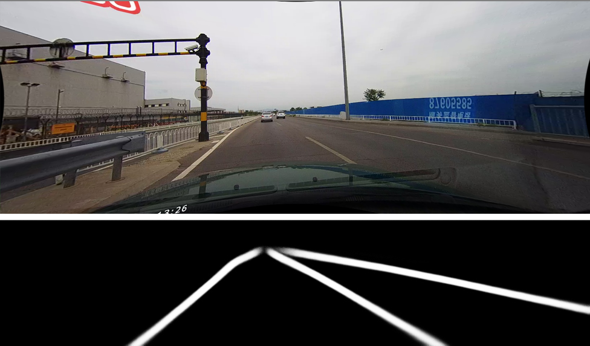
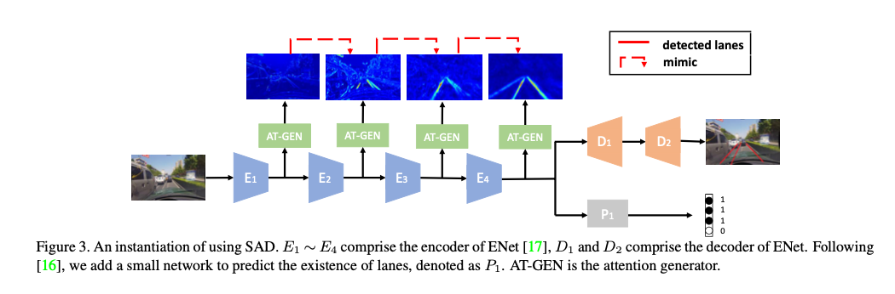
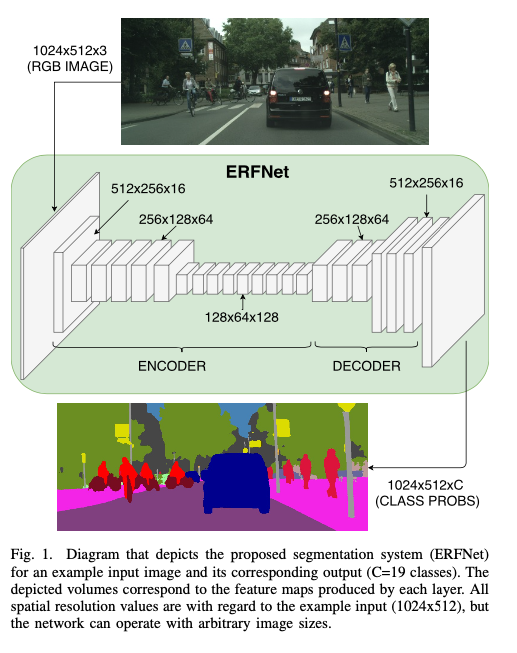

# CodesForLaneDetection : A machine learning model for detecting white lines on roads.

# CodesForLaneDetection : A machine learning model for detecting white lines on roads.

[](/@cochard-dav?source=post_page---byline--7bee3aad818d---------------------------------------)

[David Cochard](/@cochard-dav?source=post_page---byline--7bee3aad818d---------------------------------------)

3 min read

·

May 4, 2021

--

[Listen](/m/signin?actionUrl=https%3A%2F%2Fmedium.com%2Fplans%3Fdimension%3Dpost_audio_button%26postId%3D7bee3aad818d&operation=register&redirect=https%3A%2F%2Fmedium.com%2Faxinc-ai%2Fcodesforlanedetection-a-machine-learning-model-for-detecting-white-lines-on-roads-7bee3aad818d&source=---header_actions--7bee3aad818d---------------------post_audio_button------------------)

Share

This is an introduction to「CodesForLaneDetection」, a machine learning model that can be used with [ailia SDK](https://ailia.jp/en/). You can easily use this model to create AI applications using [ailia SDK](https://ailia.jp/en/) as well as many other ready-to-use [ailia MODELS](https://github.com/axinc-ai/ailia-models).

---

## Overview

*CodesForLaneDetection* is a machine learning model released in August 2019. This model segments white lines on the road at the pixel level for an input image and can be used for applications such as automated driving.

Press enter or click to view image in full size



Source: <https://github.com/czming/RONELD-Lane-Detection/tree/main/example/00000.jpg>

[## Learning Lightweight Lane Detection CNNs by Self Attention Distillation

### Training deep models for lane detection is challenging due to the very subtle and sparse supervisory signals inherent…

arxiv.org](https://arxiv.org/abs/1908.00821?source=post_page-----7bee3aad818d---------------------------------------)

Press enter or click to view image in full size


Source：<https://arxiv.org/abs/1908.00821>

## Architecture

*Lane detection* is a difficult task because the lanes to be recognized might be occluded by objects, be interrupted or discontinued, and have varying lighting conditions. Lanes are also long and thin patterns, therefore the number of annotated pixels is smaller than background segmentation for example, resulting in sparse segmentation. It is possible to make the width of the lanes thicker in the annotated data to overcome the segmentation sparsity, but this will decrease the recognition accuracy.

For performing *sparse segmentation*, techniques called `Multi Task Learning (MTL)` and `Message Passing (MP)` are used. However, MTL requires additional annotations, while MP increases the inference time.

*CodesForLaneDetection* improves accuracy by using `Self Attention Distillation (SAD)` to train the layers closer to the input with information from the layers closer to the output. Specifically, the training is performed by adding constraints such that the output of the Attention Map of each block is close to the Attention Map of the next block.

Press enter or click to view image in full size



Source：<https://arxiv.org/abs/1908.00821>

Since SAD acts on the training, it can be used in combination with any CNN and does not affect the inference speed.

*ENet*, *ResNet*, and *ERFNet* are examples of CNN Backbones. *ERFNet (Efficient Residual Factorized ConvNet for Real-time Semantic Segmentation)* is a model architecture for real-time segmentation that was released in December 2017.



ERFNet architecture (<http://www.robesafe.uah.es/personal/eduardo.romera/pdfs/Romera17tits.pdf>）

CodesForLaneDetection has three models, namely *ENet-TuSimple*, *ERFNet-CULane*, and *ENet-BDD100K*, for each data set, respectively *TuSimple*, *CULane*, and *BDD100K*.

## Usage

You can use the following command to detect the white lines in any video. Currently, only *ERFNet-CULane* is supported.

```
python3 codes-for-lane-detection.py --video VIDEO_PATH
```

[## ailia-models/road\_detection/codes-for-lane-detection at master · axinc-ai/ailia-models

### (Image from https://github.com/czming/RONELD-Lane-Detection/tree/main/example/00000.jpg) Input shape: (1, 3, 208, 976)…

github.com](https://github.com/axinc-ai/ailia-models/tree/master/road_detection/codes-for-lane-detection?source=post_page-----7bee3aad818d---------------------------------------)

Below if an output example.

---

[ax Inc.](https://axinc.jp/en/) has developed [ailia SDK](https://ailia.jp/en/), which enables cross-platform, GPU-based rapid inference.

ax Inc. provides a wide range of services from consulting and model creation, to the development of AI-based applications and SDKs. Feel free to [contact us](https://axinc.jp/en/) for any inquiry.