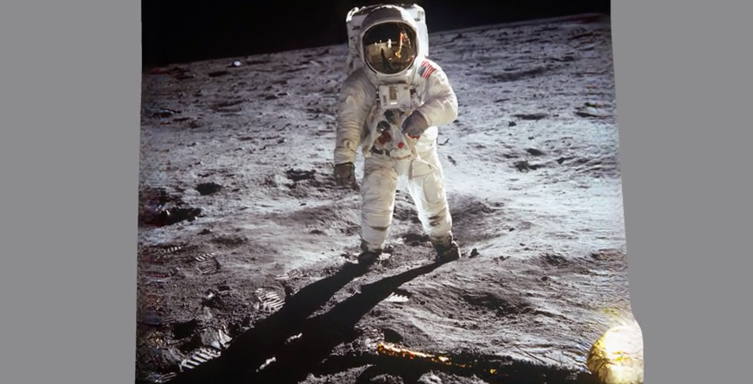

# Released ailia SDK 1.2.7

# Released ailia SDK 1.2.7

[David Cochard](/@cochard-dav?source=post_page---byline--ba221e5c8b52---------------------------------------)

3 min read

·

May 5, 2021

--

[Listen](/m/signin?actionUrl=https%3A%2F%2Fmedium.com%2Fplans%3Fdimension%3Dpost_audio_button%26postId%3Dba221e5c8b52&operation=register&redirect=https%3A%2F%2Fmedium.com%2Faxinc-ai%2Freleased-ailia-sdk-1-2-7-ba221e5c8b52&source=---header_actions--ba221e5c8b52---------------------post_audio_button------------------)

Share

We are pleased to introduce version 1.2.7 of ailia SDK, a cross-platform framework to perform fast AI inference on GPU or CPU. You can find more information about ailia SDK on the [official website](https://ailia.jp/en/).

---

ailia SDK 1.2.7 is a release that focuses on speeding up the inference process.

## Performance increase on CPU

*ConvTransposeND* has benefited a substantial speed up. In particular, the performance of the audio processing system has greatly improved. The CPU performance on Mac M1 has also increased overall.

## Performance increase on GPU

In *Eltwise*, a dedicated process for Tensor Broadcast has been added. The speedup is even more significant with *EfficientNet*. Also, GPU support for Padding has been enhanced. In Vulkan, *MatMul* and *Gemm* kernels have also gained in performance.

## Performance increase of Yolov4

The Detector API now supports YOLOv4. In the past, running YOLOv4 required pre-processing (scale conversion, channel order swap) and post-processing (NMS) in Python, and with the low CPU performance of Jetson for example, the load of pre-processing and post-processing was higher than the inference time on the GPU.

> img = cv2.cvtColor(img, cv2.COLOR\_BGR2RGB)  
> img = np.transpose(img, [2, 0, 1])  
> img = img.astype(np.float32) / 255  
> img = np.expand\_dims(img, 0)  
> （Example of heavy preprocessing）

The Detector API now performs these pre-processing and post-processing on the C++ side of the ailia SDK, which greatly improves performance. With this new flow, the above processing can be calculated in a single operation without going through buffers.

## Addition of new layers

*EyeLike、RandomNormal、RandomNormalLike、RandomUniform、RandomUniformLikeReduceLogSum、ReduceLogSumExp、Size* are now supported. Also, *MatMul* now supports 5D input.

## Improvements of the compression tools

A new *min\_tensor\_size* option has been added to give the possibility to exclude tensors with a small number of elements from quantization.

## Addition of new supported models

[3d-photo-inpainting : Video generation from still images](https://github.com/axinc-ai/ailia-models/tree/master/image_manipulation/3d-photo-inpainting)

Press enter or click to view image in full size

Source：https://github.com/vt-vl-lab/3d-photo-inpainting/blob/master/image/moon.jpg

[PSGAN : Vitual makeup](https://github.com/axinc-ai/ailia-models/tree/master/style_transfer/psgan)

Press enter or click to view image in full size

Source：<https://github.com/wtjiang98/PSGAN>

[GAST : Highly accurate 3D skeletal estimation](https://github.com/axinc-ai/ailia-models/tree/master/pose_estimation/gast)

Press enter or click to view image in full size

Source：https://github.com/fabro66/GAST-Net-3DPoseEstimation/blob/master/data/video/baseball.mp4

[FLAVR : Video frame interpolation](https://github.com/axinc-ai/ailia-models/tree/master/frame_interpolation/flavr)

Source：https://github.com/tarun005/FLAVR

---

[ax Inc.](https://axinc.jp/en/) has developed [ailia SDK](https://ailia.jp/en/), which enables cross-platform, GPU-based rapid inference.

ax Inc. provides a wide range of services from consulting and model creation, to the development of AI-based applications and SDKs. Feel free to [contact us](https://axinc.jp/en/) for any inquiry.