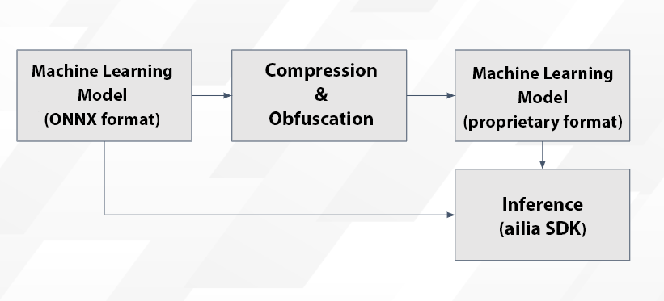

# ailia SDK Tutorial (Compression and Obfuscation)

# ailia SDK Tutorial (Compression and Obfuscation)

[](/@cochard-dav?source=post_page---byline--ba8cfead93a4---------------------------------------)

[David Cochard](/@cochard-dav?source=post_page---byline--ba8cfead93a4---------------------------------------)

3 min read

·

May 10, 2021

--

[Listen](/m/signin?actionUrl=https%3A%2F%2Fmedium.com%2Fplans%3Fdimension%3Dpost_audio_button%26postId%3Dba8cfead93a4&operation=register&redirect=https%3A%2F%2Fmedium.com%2Faxinc-ai%2Failia-sdk-tutorial-compression-and-obfuscation-ba8cfead93a4&source=---header_actions--ba8cfead93a4---------------------post_audio_button------------------)

Share

This is a tutorial on compressing and obfuscating machine learning models usin the ailia SDK, a cross-platform GPU-enabled fast AI inference framework. More information about ailia SDK can be found [here](https://ailia.jp/en/).

---

## Compression of machine learning models

Machine learning models tend to be large in size. For example, ResNet50 is 102.7MB, which puts pressure on communication lines and storage.

The ailia SDK has the ability to compress machine learning models to roughly 1/3 of its original size.

Press enter or click to view image in full size



Workflow for Compression and Obfuscation of Machine Learning Models

As a parameter for compression, the number of bits can be specified in the range of 16 to 12. Specifically, ONNX has a default accuracy of FP32, which consumes 32 bits per coefficient in the model.

In the ailia SDK, this can be quantized with any precision from FP16 to FP12 to reduce the model size. For example, by using FP12, you can reduce the capacity to 12 bits per coefficient, which is 1/2.66. Furthermore, since entropy coding is performed after quantization, the capacity is smaller than if it were simply converted to FP12, which is roughly 1/3 of the capacity.

Below is the `ailia_convert_c` command used to compress ResNet50, the argument 12 stands for FP12.

> *./ailia\_convert\_c resnet50.onnx.prototxt resnet50.onnx resnet50.fp12.onnx 12 0.0  
> Source Size : 102709764  
> Compressed Size : 30968282*

The original 102.7MB model has been compressed to 31MB. For inference, just give the generated `resnet50.fp12.onnx` model instead of the original `resnet50.onnx`.

Let’s check the accuracy by actually making inferences.


Input image

Below is the inference results before compression.

> idx=0  
>  category=963 [ pizza, pizza pie ]  
>  prob=0.8775978088378906  
> + idx=1  
>  category=927 [ trifle ]  
>  prob=0.049756914377212524  
> + idx=2  
>  category=567 [ frying pan, frypan, skillet ]  
>  prob=0.011284342966973782  
> + idx=3  
>  category=923 [ plate ]  
>  prob=0.010335126891732216  
> + idx=4  
>  category=909 [ wok ]  
>  prob=0.007396741304546595

And below is the result after compression.

> + idx=0  
>  category=963 [ pizza, pizza pie ]  
>  prob=0.8633084893226624  
> + idx=1  
>  category=927 [ trifle ]  
>  prob=0.05590188130736351  
> + idx=2  
>  category=567 [ frying pan, frypan, skillet ]  
>  prob=0.01421405654400587  
> + idx=3  
>  category=923 [ plate ]  
>  prob=0.010400247760117054  
> + idx=4  
>  category=909 [ wok ]  
>  prob=0.008665699511766434

We can see that the capacity has been reduced with almost no degradation in accuracy.

In our experience, FP12 is accurate enough for classifier and detection models. It is recommended to try FP12 at first, and then try FP14 or FP16 if the accuracy is not good enough.

During inference, it is restored to FP32 or FP16 according to the GPU before processing, so the inference speed is not affected.

## Obfuscation and protection of machine learning models

Ailia SDK has the ability to obfuscate machine learning models using the AES encryption as a protection measure.

To protect your machine learning models, use `ailia_obfuscate_c`. The following commands can be used to obfuscate prototxt and onnx.

```
$ ailia_obfuscate_c resnet50.prototxt resnet50.obf.prototxt$ ailia_obfuscate_c resnet50.onnx resnet50.obf.onnx
```

An obfuscated machine learning model can be used for inference by simply providing, in the case of resnet50 as an exemple,`resnet50.obf.onnx` instead of `resnet50.onnx`. Obfuscation makes it impossible to use the model with anything other than the ailia SDK, and prevents analysis of the internal structure.

Furthermore, when used in conjunction with the asset encryption feature of *SHALO LICENSING* provided by *Axell Corporation*, a USB dongle can be used to encrypt machine learning models.

[## SHALO LICENSING

### Encrypts apps and prevents decryption without a USB dongle, so you can effortlessly manage licenses without changing…

shalo.jp](https://shalo.jp/en/licensing/?source=post_page-----ba8cfead93a4---------------------------------------)

---

[ax Inc.](https://axinc.jp/en/) has developed [ailia SDK](https://ailia.jp/en/), which enables cross-platform, GPU-based rapid inference.

ax Inc. provides a wide range of services from consulting and model creation, to the development of AI-based applications and SDKs. Feel free to [contact us](https://axinc.jp/en/) for any inquiry.