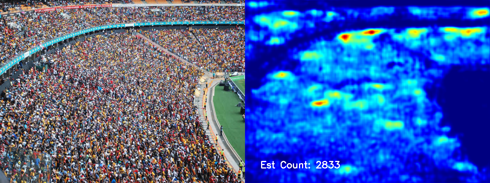
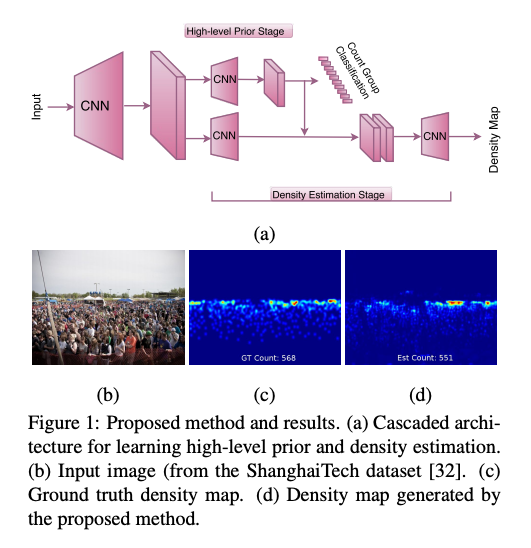
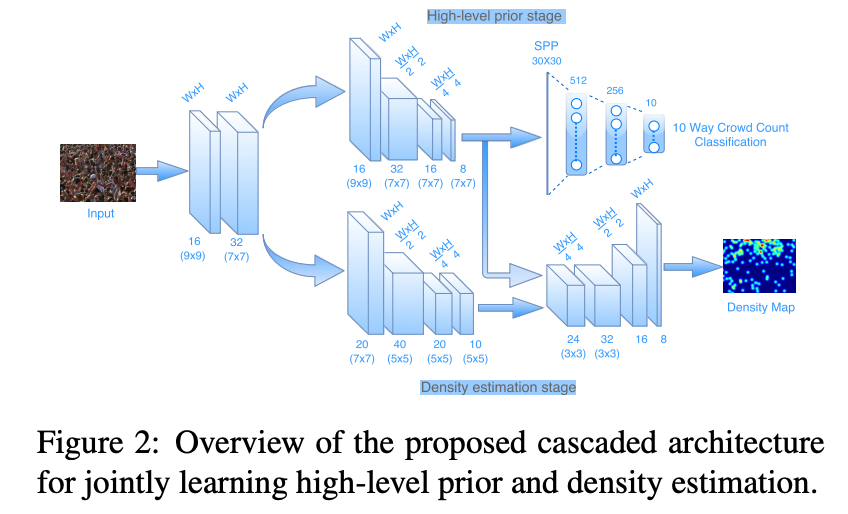
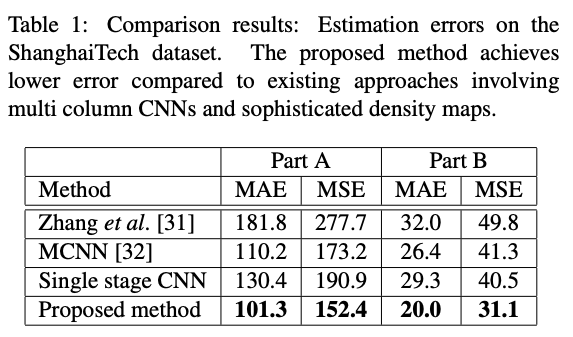
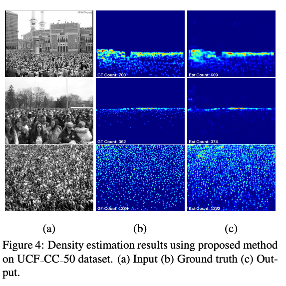

# CrowdCounting : A Machine Learning Model for Counting People

# CrowdCounting : A Machine Learning Model for Counting People

[](/@cochard-dav?source=post_page---byline--a7b274a7c2af---------------------------------------)

[David Cochard](/@cochard-dav?source=post_page---byline--a7b274a7c2af---------------------------------------)

3 min read

·

May 10, 2021

--

1

[Listen](/m/signin?actionUrl=https%3A%2F%2Fmedium.com%2Fplans%3Fdimension%3Dpost_audio_button%26postId%3Da7b274a7c2af&operation=register&redirect=https%3A%2F%2Fmedium.com%2Faxinc-ai%2Fcrowdcounting-a-machine-learning-model-for-counting-people-a7b274a7c2af&source=---header_actions--a7b274a7c2af---------------------post_audio_button------------------)

Share

This is an introduction to「CrowdCounting」, a machine learning model that can be used with [ailia SDK](https://ailia.jp/en/). You can easily use this model to create AI applications using [ailia SDK](https://ailia.jp/en/) as well as many other ready-to-use [ailia MODELS](https://github.com/axinc-ai/ailia-models).

---

## Overview

*CrowdCountCascadedMtl* is a machine learning model released in August 2017 that counts the number of people in an input image. It is suitable for counting attendance in large crowds such as concert halls or stadiums.

Press enter or click to view image in full size



[## CNN-based Cascaded Multi-task Learning of High-level Prior and Density Estimation for Crowd…

### Estimating crowd count in densely crowded scenes is an extremely challenging task due to non-uniform scale variations…

arxiv.org](https://arxiv.org/abs/1707.09605?source=post_page-----a7b274a7c2af---------------------------------------)

[## svishwa/crowdcount-cascaded-mtl

### This is implementation of the paper CNN-based Cascaded Multi-task Learning of High-level Prior and Density Estimation…

github.com](https://github.com/svishwa/crowdcount-cascaded-mtl?source=post_page-----a7b274a7c2af---------------------------------------)

## Architecture

*CrowdCounting* calculates a `DensityMap` that shows the distribution of the crowd, and predicts the number of people by making estimation based on this Density Map.



Source：<https://arxiv.org/pdf/1707.09605.pdf>

The output of the `high-level prior stage`, which is trained using the Classifier model to count the number of people, is input to the Density estimation stage to increase the accuracy.

Press enter or click to view image in full size



Source：<https://arxiv.org/pdf/1707.09605.pdf>

The `Shanghai Tech dataset` and `UCF_CC_50` were used for training and evaluation, and both showed high performance.


Source：<https://arxiv.org/pdf/1707.09605.pdf>



Source：<https://arxiv.org/pdf/1707.09605.pdf>



Source：<https://arxiv.org/pdf/1707.09605.pdf>


Source：<https://arxiv.org/pdf/1707.09605.pdf>

## Usage

To use *CrowdCounting* with the ailia SDK, use the following command to measure the number of people seen by the webcam.

```
$ python3 crowdcount-cascaded-mtl.py -v 0
```

[## axinc-ai/ailia-models

### Ailia input shape: (1, 1, 480, 640) Automatically downloads the onnx and prototxt files on the first run. It is…

github.com](https://github.com/axinc-ai/ailia-models/tree/master/crowd_counting/crowdcount-cascaded-mtl?source=post_page-----a7b274a7c2af---------------------------------------)

An example of the processing result is shown below.

---

[ax Inc.](https://axinc.jp/en/) has developed [ailia SDK](https://ailia.jp/en/), which enables cross-platform, GPU-based rapid inference.

ax Inc. provides a wide range of services from consulting and model creation, to the development of AI-based applications and SDKs. Feel free to [contact us](https://axinc.jp/en/) for any inquiry.