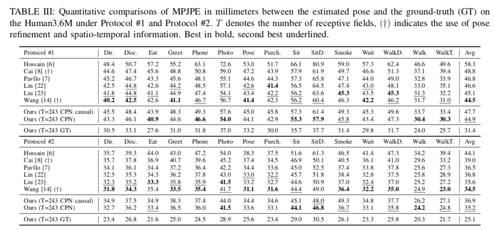

# GAST : A machine learning model that predicts a 3D skeleton from a 2D skeleton

# GAST : A machine learning model that predicts a 3D skeleton from a 2D skeleton

[](/@cochard-dav?source=post_page---byline--44449d1ff78d---------------------------------------)

[David Cochard](/@cochard-dav?source=post_page---byline--44449d1ff78d---------------------------------------)

4 min read

·

May 10, 2021

--

[Listen](/m/signin?actionUrl=https%3A%2F%2Fmedium.com%2Fplans%3Fdimension%3Dpost_audio_button%26postId%3D44449d1ff78d&operation=register&redirect=https%3A%2F%2Fmedium.com%2Faxinc-ai%2Fgast-a-machine-learning-model-that-predicts-a-3d-skeleton-from-a-2d-skeleton-44449d1ff78d&source=---header_actions--44449d1ff78d---------------------post_audio_button------------------)

Share

This is an introduction to「GAST」, a machine learning model that can be used with [ailia SDK](https://ailia.jp/en/). You can easily use this model to create AI applications using [ailia SDK](https://ailia.jp/en/) as well as many other ready-to-use [ailia MODELS](https://github.com/axinc-ai/ailia-models).

---

## Overview

*GAST (A Graph Attention Spatio-temporal Convolutional Network for 3D Human Pose Estimation in Video)* is a model for predicting 3D skeletons from 2D skeletons that was released in October 2020.


Source：<https://github.com/fabro66/GAST-Net-3DPoseEstimation>

[## A Graph Attention Spatio-temporal Convolutional Network for 3D Human Pose Estimation in Video

### Spatio-temporal information is key to resolve occlusion and depth ambiguity in 3D pose estimation. Previous methods…

arxiv.org](https://arxiv.org/abs/2003.14179?source=post_page-----44449d1ff78d---------------------------------------)

## Architecture

GAST takes a time series of 2D skeletons as input and outputs 3D skeletons. `YOLOv3` and `pose_hrnet_w48_384x288` are used for 2D skeleton detection. The tracking of the person is done using SORT algorithm with Kalman filter.

The input format is (27,17,2), each components being the 27 input frames, and the 2 components (x,y) of 17 keypoints converted from COCO format of `pose_hrnet` to `Human36M` format. The output format is (1,17,3), which constitutes the (x,y,z) of the 17 keypoints. There is a padding of 13 frames, the 3D keypoints of the 14th frame being the output.

Press enter or click to view image in full size


Source：<https://arxiv.org/pdf/2003.14179>

In 2D-to-3D skeletal estimation, there are three issues:

1. The ambiguity of depth information in terms of mapping from the lower dimension of 2D to the higher dimension of 3D
2. Self-occlusion, where key points are hidden by the subject’s own body
3. Accuracy of AI estimation

In particular, there is a problem that jitter (discontinuity) tends to occur between frames due to self-occlusion. GAST tries to fix this issue by applying *Graph Convolution Networks (GCN)* to the time series information of the skeleton.

Press enter or click to view image in full size


Source：<https://arxiv.org/pdf/2003.14179>

*Graph Convolution Networks (GCN)* is a model architecture used in skeletal-based action detection and classification of 3D models, and is a generalization of 2D CNNs extended to Graph structures.

For a given node, convolution is performed by referring to the surrounding nodes that are connected to it. 2D CNNs can be represented as a Graph structure with nodes (pixels) arranged in a grid. In the case of skeletons, each key point of the skeleton is treated as a node.

Press enter or click to view image in full size


Source：<https://arxiv.org/pdf/2003.14179>

In addition, *Global Attention* was introduced to propagate information of unconnected nodes. For example, for the action of running, it is more desirable to use the wrist and ankle associations.

For training, the `Human3.6M dataset` (17 keypoints) and the `HumanEva-I dataset` (15 keypoints) were used. The output GAST model size is 31.6MB.

The number of frames used for inference is evaluated at T=27 and 243. The proposed method performs particularly well on HumanEva-I.

Press enter or click to view image in full size



Source：<https://arxiv.org/pdf/2003.14179>


## Usage

The following commands can be used to evaluate 3D keypoints for a given input video. GAST does not support input from a web camera because it parses all frames before processing them.

```
$ python3 gast.py --input VIDEO_PATH --savepath SAVE_VIDEO_PATH
```

[## ailia-models/pose\_estimation\_3d/gast at master · axinc-ai/ailia-models

### (Video from https://github.com/fabro66/GAST-Net-3DPoseEstimation/blob/master/data/video/baseball.mp4) Automatically…

github.com](https://github.com/axinc-ai/ailia-models/tree/master/pose_estimation_3d/gast?source=post_page-----44449d1ff78d---------------------------------------)

An example of the processing result is shown below.

By default, it will add 13 padding frames before and after the input video and batch process all frames.

> input\_shape = (frames, keypoint, xy) = (13 + frames + 13, 17, 2）

Since the longer the video, the more memory is consumed, it is possible to process one frame at a time by adding the `--lowmemory` argument.

> input\_shape = (frames, keypoint, xy) = (13 + 1 + 13, 17, 2）

Since the processing results are calculated by referring to the 13 frames around the calculation processing frame, the processing results are equivalent whether they are calculated together or processed one frame at a time.

---

## Related topics

[## PoseResnet : A Top-down Machine Learning Model for Skeletal Detection

medium.com](/axinc-ai/poseresnet-a-top-down-machine-learning-model-for-skeletal-detection-9454f391ae4d?source=post_page-----44449d1ff78d---------------------------------------)

[## LightWeightHumanPose : A Machine Learning Model for Fast Multi-person Skeleton Detection.

### This is an introduction to「LightWeightHumanPose」, a machine learning model that can be used with ailia SDK. You can…

medium.com](/axinc-ai/lightweighthumanpose-a-machine-learning-model-for-fast-multi-person-skeleton-detection-631c042bed50?source=post_page-----44449d1ff78d---------------------------------------)

---

[ax Inc.](https://axinc.jp/en/) has developed [ailia SDK](https://ailia.jp/en/), which enables cross-platform, GPU-based rapid inference.

ax Inc. provides a wide range of services from consulting and model creation, to the development of AI-based applications and SDKs. Feel free to [contact us](https://axinc.jp/en/) for any inquiry.