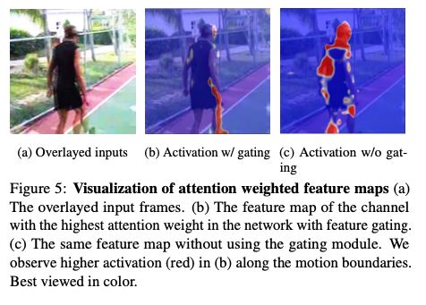
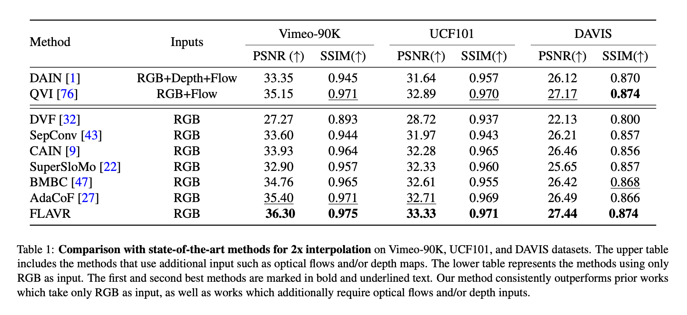
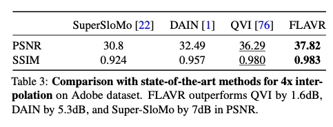

# FLAVR : A Machine Learning Model to Increase Video Frame Rate

# FLAVR : A Machine Learning Model to Increase Video Frame Rate

[](/@cochard-dav?source=post_page---byline--758fe8132818---------------------------------------)

[David Cochard](/@cochard-dav?source=post_page---byline--758fe8132818---------------------------------------)

5 min read

·

May 11, 2021

--

[Listen](/m/signin?actionUrl=https%3A%2F%2Fmedium.com%2Fplans%3Fdimension%3Dpost_audio_button%26postId%3D758fe8132818&operation=register&redirect=https%3A%2F%2Fmedium.com%2Faxinc-ai%2Fflavr-a-machine-learning-model-to-increase-video-frame-rate-758fe8132818&source=---header_actions--758fe8132818---------------------post_audio_button------------------)

Share

This is an introduction to「FLAVR」, a machine learning model that can be used with [ailia SDK](https://ailia.jp/en/). You can easily use this model to create AI applications using [ailia SDK](https://ailia.jp/en/) as well as many other ready-to-use [ailia MODELS](https://github.com/axinc-ai/ailia-models).

---

## Overview

*FLAVR* is a machine learning model released in December 2020 that can increase the frame rate of an input video by adding frames.


Source：<https://github.com/tarun005/FLAVR>

[## FLAVR: Flow-Agnostic Video Representations for Fast Frame Interpolation

### A majority of methods for video frame interpolation compute bidirectional optical flow between adjacent frames of a…

arxiv.org](https://arxiv.org/abs/2012.08512?source=post_page-----758fe8132818---------------------------------------)

## Architecture

*Frame generation* relies on *video frame interpolation*, and is generally used in the following three ways

・Phase based  
・Flow based  
・Kernel based

In the *Phase based* method, each frame is viewed as a [linear combination](https://en.wikipedia.org/wiki/Linear_combination) of `wavelets`, and the phase and magnitude of the wavelets are complemented using classical algorithms or CNNs.

The *Flow based* method calculates and completes the `optical flow`, which expresses the motion vector between frames. The optical flow can be computed using for example [*PWC-Net*](https://github.com/NVlabs/PWC-Net). However, the problem with the flow based approach is that the final output strongly depends on the prediction performance of the optical flow. As a result, noise artifacts are more noticeable when the prediction performance of the optical flow is low. The quality is also lower when dealing with non-linear motion.

In the *Kernel based* method, interpolated frames are obtained by applying a spatial adaptive filter to the input image and resampling it. However, conventional methods sample only from local neighborhoods due to computational complexity issues. For example, [CAIN](https://github.com/myungsub/CAIN) introduced the concept of *channel attention*, but it is unable to capture the complex spatial and temporal dependencies between input images.

*FLAVR* solves these problems by introducing `3D space-time convolution`, a technique that is widely used in the field of action detection. *3D space-time convolution* is applied to the problem of frame completion, which enables abstract modeling of temporal information between complex input frames for accurate and sharp prediction.

*FLAVR* is faster and more accurate than conventional technologies.


Source：<https://arxiv.org/pdf/2012.08512>

FLAVR is based on *U-Net* and introduces `3D space-time convolution`. It generates interpolated frames by using a total of 4 frames as reference, 2 forward and 2 backward. When the frame rate is quadrupled (4x interpolation), 4 frames are taken as input and 3 interpolated frames are generated.

Press enter or click to view image in full size


Source：<https://arxiv.org/pdf/2012.08512>

In *3D space-time convolution*, each 3D filter has a 5-dimensional weight, `ci*co*t*h*w`, where `t` is the time direction. The 3D space-time convolution (commonly called *3D Convolution*) is an extension of the normal Convolution, which has a weight of 4 dimensions, to 5 dimensions.

The U-Net encoder is based on `ResNet-3D 18`, and the decoder is upsampling with `3DTransConv`.

A self-attention mechanism using *Spatio-Temporal Feature Gating* is also introduced. Simply put, *gating module* is introduced in all *Conv3D* outputs. The gating module consists of a spatio-temporal pooling layer and trainable weights and bias.

Below is a visualization of the output of the *gating module*, where self-attention makes it possible to properly extract motion boundaries.



Source：<https://arxiv.org/pdf/2012.08512>

The *gating module* is based on [Learnable pooling with Context Gating for video classification](https://arxiv.org/abs/1706.06905). *Context gating* is based on *GLU (Graded Linear Unit)* for natural language processing, and prevents gradient loss while allowing control of the information to be passed through each layer.

[## Learnable pooling with Context Gating for video classification

### Current methods for video analysis often extract frame-level features using pre-trained convolutional neural networks…

arxiv.org](https://arxiv.org/abs/1706.06905?source=post_page-----758fe8132818---------------------------------------)

*FLAVR* achieves better performance than *DAIN* and *CAIN* on the *Video-90K*, *UCF101* and *DAVIS* datasets.

Press enter or click to view image in full size



Source：<https://arxiv.org/pdf/2012.08512>

Below is a comparison of FLAVR output images against [SSM：Super slomo: High quality estimation of multiple intermediate frames for video interpolation](https://github.com/avinashpaliwal/Super-SloMo) and [QVI：Quadratic video interpolation. In Advances in Neural Information Processing Systems](https://github.com/xuxy09/QVI).

Press enter or click to view image in full size


Source：<https://arxiv.org/pdf/2012.08512>

Below is a performance comparison indicating the effectiveness of the FLAVR architecture.



Source：<https://arxiv.org/pdf/2012.08512>

## Usage

The following command can be used to expand the frame rate of any video by a factor of 4. The argument `hw` is the resolution of the video you want to output. The argument `ip` specifies how much the frame rate should be increased, suitable values are 2, 4, or 8.

To run the model on GPU

```
$ python3 flavr.py -v puppy.mp4 -ip 4 -s output.mp4 -hw 360,640
```

To run the model on CPU (faster for MacBookPro’s built-in graphics)

```
$ python3 flavr.py -v puppy.mp4 -e 0 -ip 4 -s output.mp4 -hw 360,640
```

[## axinc-ai/ailia-models

### (Image from Vimeo-90K dataset http://data.csail.mit.edu/tofu/dataset/vimeo\_septuplet.zip) Automatically downloads the…

github.com](https://github.com/axinc-ai/ailia-models/tree/master/frame_interpolation/flavr?source=post_page-----758fe8132818---------------------------------------)

An example of the processing result is shown below.

---

[ax Inc.](https://axinc.jp/en/) has developed [ailia SDK](https://ailia.jp/en/), which enables cross-platform, GPU-based rapid inference.

ax Inc. provides a wide range of services from consulting and model creation, to the development of AI-based applications and SDKs. Feel free to [contact us](https://axinc.jp/en/) for any inquiry.