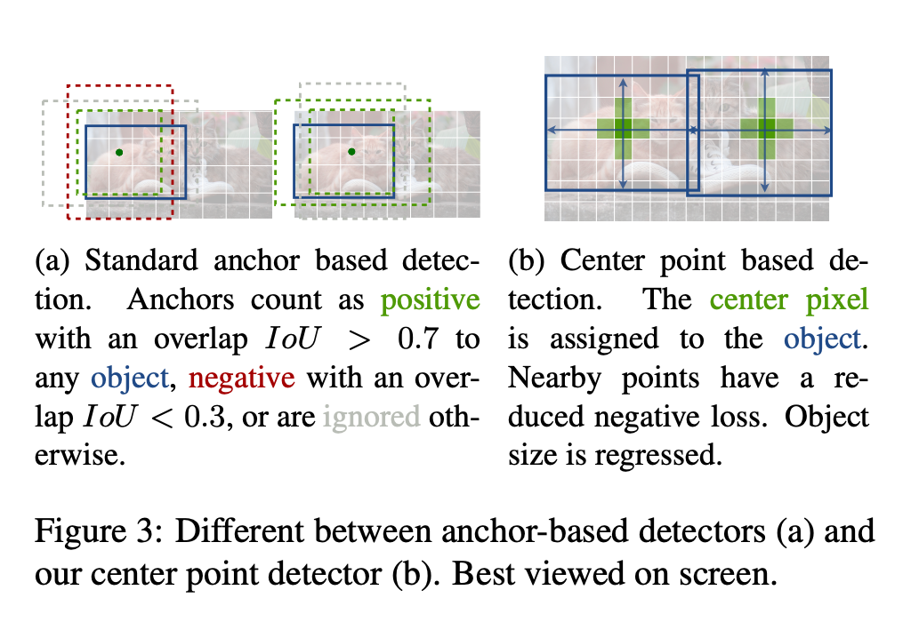
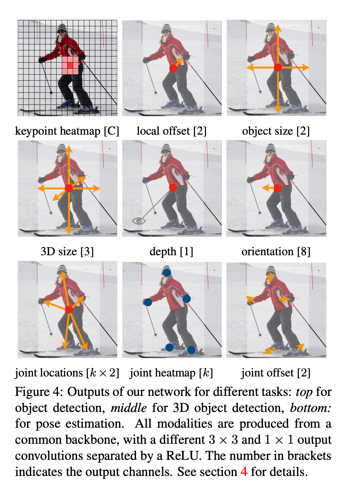
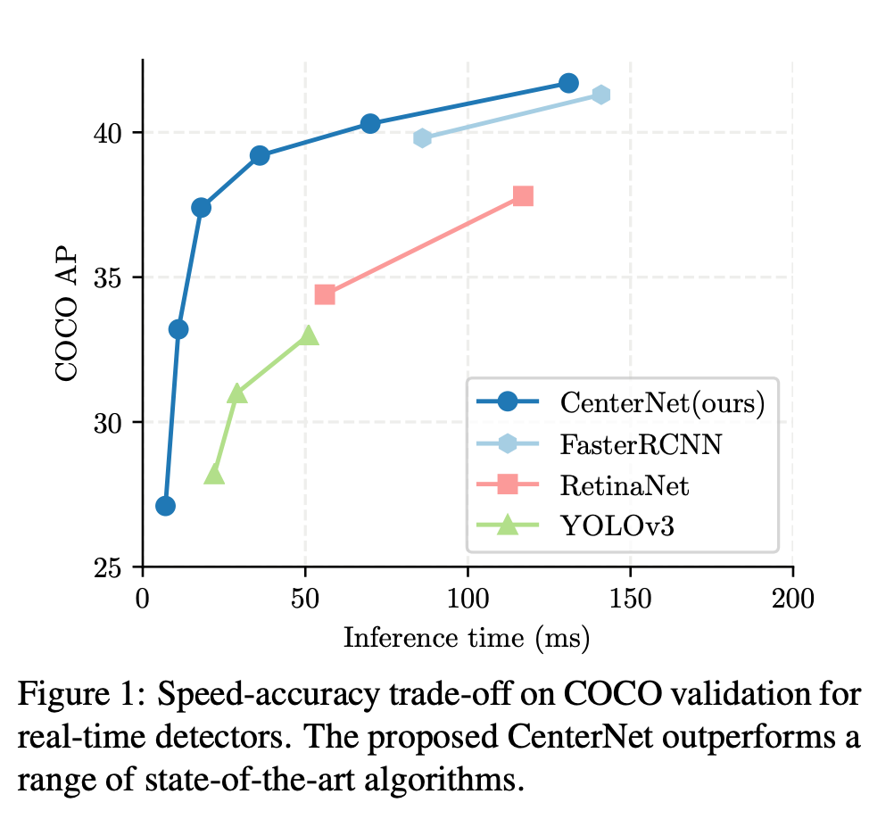

# CenterNet : A Machine Learning Model for Anchorless Object Detection

# CenterNet : A Machine Learning Model for Anchorless Object Detection

[](/@cochard-dav?source=post_page---byline--462c48483cfe---------------------------------------)

[David Cochard](/@cochard-dav?source=post_page---byline--462c48483cfe---------------------------------------)

2 min read

·

May 12, 2021

--

[Listen](/m/signin?actionUrl=https%3A%2F%2Fmedium.com%2Fplans%3Fdimension%3Dpost_audio_button%26postId%3D462c48483cfe&operation=register&redirect=https%3A%2F%2Fmedium.com%2Faxinc-ai%2Fcenternet-a-machine-learning-model-for-anchorless-object-detection-462c48483cfe&source=---header_actions--462c48483cfe---------------------post_audio_button------------------)

Share

This is an introduction to「CenterNet」, a machine learning model that can be used with [ailia SDK](https://ailia.jp/en/). You can easily use this model to create AI applications using [ailia SDK](https://ailia.jp/en/) as well as many other ready-to-use [ailia MODELS](https://github.com/axinc-ai/ailia-models).

---

## Overview

*CenterNet* is a machine learning model for anchorless object detection published in April 2019.

[## Objects as Points

### Detection identifies objects as axis-aligned boxes in an image. Most successful object detectors enumerate a nearly…

arxiv.org](https://arxiv.org/abs/1904.07850?source=post_page-----462c48483cfe---------------------------------------)

CenterNet can be used to calculate the bounding boxes for 80 categories of the [COCO dataset](https://cocodataset.org/#home).

By using *heatmaps,* as in other systems such as *OpenPose,* for object detection, CenterNet can perform detection without using *anchors* used in YOLOv2 and later.

## About anchors

An *anchor* is a bounding box, defined by several boxes with different aspect ratios. Object detection for each bounding box increases the number of objects that can be detected simultaneously. Introduced in *YOLOv2*, it increases the number of objects that can be detected simultaneously by performing object detection for each bounding box.

Press enter or click to view image in full size



（Source：<https://arxiv.org/abs/1904.07850>）

## Architecture

*CenterNet* infers a heatmap of the object’s center coordinates, the offset of the center coordinates, and the object’s size.

Press enter or click to view image in full size



（Source：<https://arxiv.org/abs/1904.07850>）

## CenterNet performance

*CenterNet* is capable of more accurate inference than [*YOLOv3*](/axinc-ai/yolov3-a-machine-learning-model-to-detect-the-position-and-type-of-an-object-60f1c18f8107) and *RetinaNet*.

Press enter or click to view image in full size



（Source：<https://arxiv.org/abs/1904.07850>）

## Usage

You can run *CenterNet* on the webcam video stream in ailia SDK with the following command.

```
python3 centernet.py -v 0
```

[## axinc-ai/ailia-models

### Shape : (1, 3, 512, 512) Range : [0.0, 1.0] category : [0,79] probablity : [0.0,1.0] position : x, y, w, h [0,1]…

github.com](https://github.com/axinc-ai/ailia-models/tree/master/object_detection/centernet?source=post_page-----462c48483cfe---------------------------------------)

---

[ax Inc.](https://axinc.jp/en/) has developed [ailia SDK](https://ailia.jp/en/), which enables cross-platform, GPU-based rapid inference.

ax Inc. provides a wide range of services from consulting and model creation, to the development of AI-based applications and SDKs. Feel free to [contact us](https://axinc.jp/en/) for any inquiry.