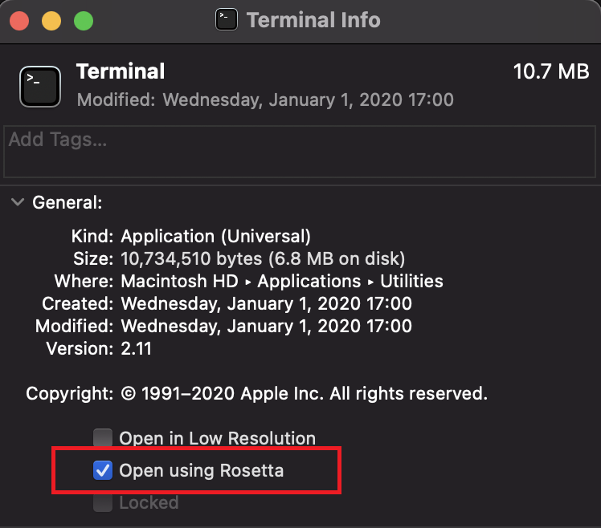

# ailia SDK on Apple Silicon

# ailia SDK on Apple Silicon

[](/@cochard-dav?source=post_page---byline--c66f9101b94a---------------------------------------)

[David Cochard](/@cochard-dav?source=post_page---byline--c66f9101b94a---------------------------------------)

2 min read

·

May 17, 2021

--

[Listen](/m/signin?actionUrl=https%3A%2F%2Fmedium.com%2Fplans%3Fdimension%3Dpost_audio_button%26postId%3Dc66f9101b94a&operation=register&redirect=https%3A%2F%2Fmedium.com%2Faxinc-ai%2Failia-sdk-on-apple-silicon-c66f9101b94a&source=---header_actions--c66f9101b94a---------------------post_audio_button------------------)

Share

This article is an introduction to using [ailia SDK](https://ailia.jp/en/), a cross-platform, high-speed AI inference framework, with Apple Silicon.

---

## About Apple Silicon

AppleSilicon is the name of the System on a Chip (SoC) developed by Apple. Combining ARM-based CPU and a GPU, the first generation of Apple Silicon M1 chip has a GeForce GTX1060-class GPU, which enables fast GPU-based AI inference using the ailia SDK. [YOLOv3](/axinc-ai/yolov3-a-machine-learning-model-to-detect-the-position-and-type-of-an-object-60f1c18f8107) full runs nearly five times faster than the Intel-architecture MacBookPro.

Press enter or click to view image in full size


Source：<https://www.apple.com/jp/mac/m1/>

## Runnin Python on Apple Silicon

macOS Big Sur comes preinstalled with Python 3.8, which is a universal binary. The *site-packages* that contain the libraries are common, and the universal binary can be used from either x86\_64 or arm64. However, if one of the libraries you depend on is x86\_64, you will need to run it on x86\_64.

ailia SDK is a universal binary for x86\_64 and arm64. However, since the OpenCV arm64 binary is not currently available, it currently needs to be run in Rosetta2 x86\_64 emulation. Even though it is an emulation, ailia SDK works with Metal shaders, which provides significant speedup.

To run Python 3.8 in x86\_64 mode, copy *Terminal* in the `Applications/Utilities` folder, right-click, go to Info, and check `Open with Rosetta`.

Press enter or click to view image in full size



Then you can run Python in x86\_64 mode and install opencv-python with pip3.

```
pip3 install opencv-python
```

## Installing ailia SDK on Apple Silicon

You can install the ailia SDK in either x86\_64 mode or arm mode by using the following command in either terminal.

```
cd ailia_sdk/python  
python3 bootstrap.py  
pip3 install ./
```

[## ailia SDK Tutorial (Python)

### Here is a tutorial on how to use ailia SDK in Python. ailia SDK allows you to perform deep learning inference using…

medium.com](/axinc-ai/ailia-sdk-tutorial-python-ea29ae990cf6?source=post_page-----c66f9101b94a---------------------------------------)

## Running ailia models on Apple Silicon

Clone the ailia MODELS repository on github.

[## axinc-ai/ailia-models

### The collection of pre-trained, state-of-the-art models. ailia SDK is a cross-platform high speed inference SDK. The…

github.com](https://github.com/axinc-ai/ailia-models?source=post_page-----c66f9101b94a---------------------------------------)

Execute the following from a terminal in x86\_64 mode.

```
python3 launch.py
```

---

[ax Inc.](https://axinc.jp/en/) has developed [ailia SDK](https://ailia.jp/en/), which enables cross-platform, GPU-based rapid inference.

ax Inc. provides a wide range of services from consulting and model creation, to the development of AI-based applications and SDKs. Feel free to [contact us](https://axinc.jp/en/) for any inquiry.