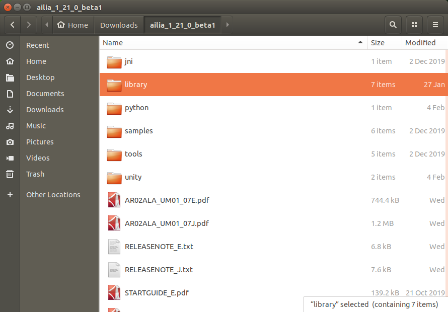

# ailia SDK on JetsonNano and ChromeBook

# ailia SDK on JetsonNano and ChromeBook

[](/@cochard-dav?source=post_page---byline--592989181ff7---------------------------------------)

[David Cochard](/@cochard-dav?source=post_page---byline--592989181ff7---------------------------------------)

4 min read

·

May 17, 2021

--

[Listen](/m/signin?actionUrl=https%3A%2F%2Fmedium.com%2Fplans%3Fdimension%3Dpost_audio_button%26postId%3D592989181ff7&operation=register&redirect=https%3A%2F%2Fmedium.com%2Faxinc-ai%2Failia-sdk-on-jetsonnano-and-chromebook-592989181ff7&source=---header_actions--592989181ff7---------------------post_audio_button------------------)

Share

The article explains how to run ailia SDK on JetsonNano and ChromeBook. ailia SDK allows you to perform cross-platform deep learning inference. MOre details about ailia SDK can be found [here](https://ailia.jp/en/).

Press enter or click to view image in full size


---

## JetsonNano

### ailia SDK 1.2.3 and later

We have added details about the setup procedure in Jetson to the following tutorials.

[## ailia SDK Tutorial (Python)

### Here is a tutorial on how to use ailia SDK in Python. ailia SDK allows you to perform deep learning inference using…

medium.com](/axinc-ai/ailia-sdk-tutorial-python-ea29ae990cf6?source=post_page-----592989181ff7---------------------------------------)

### For ailia SDK 1.2.3

*JetsonNano* can run Jetson binaries from the ailia SDK. It can perform GPU inference directly from ONNX format and use the wide variety of models available in ailia-models.

[## axinc-ai/ailia-models

### The collection of pre-trained, state-of-the-art AI models. ailia SDK is a cross-platform high speed inference SDK. The…

github.com](https://github.com/axinc-ai/ailia-models?source=post_page-----592989181ff7---------------------------------------)

Jetson binaries are included in `library/experimental/jetson` with ailia SDK 1.2.1 or later. The following tutorial is for Ubuntu 18.04 LTS.

First, you need to download ailia SDK.

Press enter or click to view image in full size



Copy the files from `python/ailia` to `/usr/local/lib/python3.6/dist-packages` , then the files `library/experimental/jetson/libailia.so`, `library/experimental/jetson/libailia_pose_estimate.so` and `library/experimental/jetson/libailia_cuda.so` to `/usr/local/lib/python3.6/dist-packages/ailia`.

```
cd ailia_sdk_1_21  
sudo cp -r python/ailia /usr/local/lib/python3.6/dist-packages  
sudo cp library/experimental/jetson/libailia.so /usr/local/lib/python3.6/dist-packages/ailia  
sudo cp library/experimental/jetson/libailia_pose_estimate.so /usr/local/lib/python3.6/dist-packages/ailia  
sudo cp library/experimental/jetson/libailia_cuda.so /usr/local/lib/python3.6/dist-packages/ailia
```

If *dist-packages* does not exist, use the following command to check the path.

```
python3 -c “import site; print (site.getsitepackages())”
```

Grant execute permission to the ailia folder.

```
sudo chmod 757 /usr/local/lib/python3.6/dist-packages/ailia
```

*opencv-python* is preinstalled.

[## install OpenCV for python3 in Jetson Nano — NVIDIA Developer Forums

### Edit description

devtalk.nvidia.com](https://devtalk.nvidia.com/default/topic/1051160/jetson-nano/install-opencv-for-python3-in-jetson-nano/?source=post_page-----592989181ff7---------------------------------------)

You can install *numpy* via *apt*.

```
sudo apt install python3-numpy
```

[## Problem installing numpy for python3 on fresh JetPack install — NVIDIA Developer Forums

### Edit description

devtalk.nvidia.com](https://devtalk.nvidia.com/default/topic/1032957/problem-installing-numpy-for-python3-on-fresh-jetpack-install/?source=post_page-----592989181ff7---------------------------------------)

Run `samples/models/download_model.sh` to download the model. Install *curl*, which is required for the download.

```
sudo apt install curl
```

Download the models.

```
cd samples/models  
chmod +x download_model.sh  
./download_model.sh
```

Run the samples.

```
cd ../../samples/python  
python3 ailia_classifier.py
```

You should get the inference results below.

```
class_count=3  
+ idx=0  
 category=409[ analog clock ]  
 prob=0.7738379836082458  
+ idx=1  
 category=892[ wall clock ]  
 prob=0.1796753704547882  
+ idx=2  
 category=826[ stopwatch, stop watch ]  
 prob=0.03009628877043724
```

This inference was performed on CPU.

To use faster GPU inference with cuDNN, copy `library/experimental/jetson/libailia_cuda.so` to the `samples/python` folder.

```
cp library/experimental/jetson/libailia_cuda.so samples/python
```

Enumerate the inference environments.

```
python3 ailia_environment.py
```

If cuDNN is available, the following will be listed:

```
env[1]=Environment(id=1, type=’GPU’, name=’cuDNN-NVIDIA Tegra X1 (5.3)’, backend=’CUDA’, props=’NORMAL’)
```

In this state, run `ailia_classifier.py` for fast GPU inference using cuDNN.

---

## ChromeBook

*ChromeBook* (Intel CPU) can run Linux binaries of ailia SDK. ailia SDK on ChromeBook can be used for educational purposes as well as for deep learning.

First, follow the official instructions to enable Linux mode.

[## Set up Linux (Beta) on your Chromebook

### Linux (Beta) is a feature that lets you develop software using your Chromebook. You can install Linux command line…

support.google.com](https://support.google.com/chromebook/answer/9145439?hl=en&source=post_page-----592989181ff7---------------------------------------)

Download the ailia SDK and copy the contents to a Linux file.

Press enter or click to view image in full size


Copy the files from `python/ailia` to `/usr/local/lib/python3.5/dist-packages` , then the files `library/linux/libailia.so` and `library/linux/libailia_pose_estimate.so` to `/usr/local/lib/python3.5/dist-packages/ailia`.

```
cd ailia_sdk_1_21  
sudo cp -r python/ailia /usr/local/lib/python3.5/dist-packages  
sudo cp library/linux/libailia.so /usr/local/lib/python3.5/dist-packages/ailia  
sudo cp library/linux/libailia_pose_estimate.so /usr/local/lib/python3.5/dist-packages/ailia
```

Grant execution permission to the ailia folder.

```
sudo chmod 755 /usr/local/lib/python3.5/dist-packages/ailia
```

The ChromeBook comes with Python 3.5 installed by default, but pip is not installed, so we will install it using the following command.

```
curl -O https://bootstrap.pypa.io/get-pip.py   
sudo python3 get-pip.py
```

Install the necessary dependencies.

```
pip3 install opencv-python numpy
```

Run `samples/models/download_model.sh` to download the model.

```
cd samples/models  
chmod +x download_model.sh  
./download_model.sh
```

Run the ailia SDK sample.

```
cd ../../samples/python  
python3 ailia_classifier.py
```

You should get the inference results below.

```
class_count=3  
+ idx=0  
 category=409[ analog clock ]  
 prob=0.7738379836082458  
+ idx=1  
 category=892[ wall clock ]  
 prob=0.1796753704547882  
+ idx=2  
 category=826[ stopwatch, stop watch ]  
 prob=0.03009628877043724
```

Currently, only CPU mode inference can be executed on ChromeBook. We are planning to add GPU support in the future when ChromeOS supports Vulkan and OpenCL.

---

[ax Inc.](https://axinc.jp/en/) has developed [ailia SDK](https://ailia.jp/en/), which enables cross-platform, GPU-based rapid inference.

ax Inc. provides a wide range of services from consulting and model creation, to the development of AI-based applications and SDKs. Feel free to [contact us](https://axinc.jp/en/) for any inquiry.