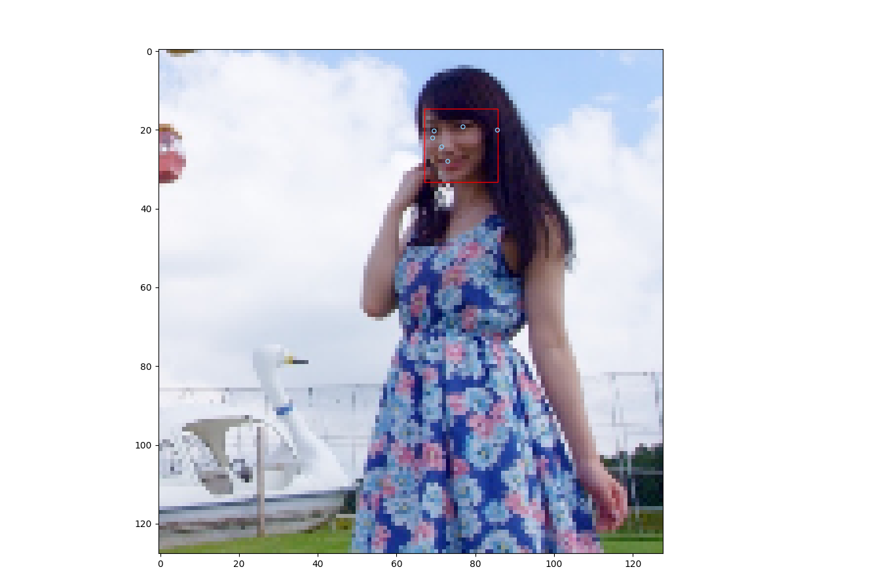
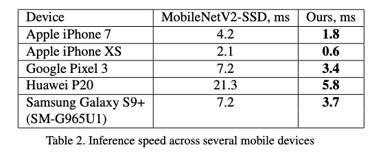
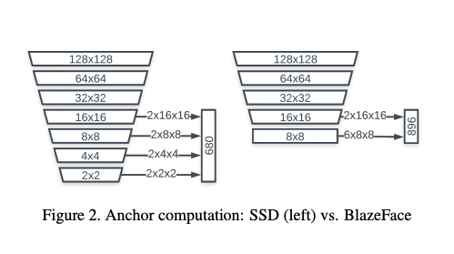

# BlazeFace : A Machine Learning Model for Fast Detection of Face Positions and Key Points

# BlazeFace : A Machine Learning Model for Fast Detection of Face Positions and Key Points

[](/@cochard-dav?source=post_page---byline--5dcfb9429d72---------------------------------------)

[David Cochard](/@cochard-dav?source=post_page---byline--5dcfb9429d72---------------------------------------)

3 min read

·

May 18, 2021

--

[Listen](/m/signin?actionUrl=https%3A%2F%2Fmedium.com%2Fplans%3Fdimension%3Dpost_audio_button%26postId%3D5dcfb9429d72&operation=register&redirect=https%3A%2F%2Fmedium.com%2Faxinc-ai%2Fblazeface-a-machine-learning-model-for-fast-detection-of-face-positions-and-key-points-5dcfb9429d72&source=---header_actions--5dcfb9429d72---------------------post_audio_button------------------)

Share

This is an introduction to「BlazeFace」, a machine learning model that can be used with [ailia SDK](https://ailia.jp/en/). You can easily use this model to create AI applications using [ailia SDK](https://ailia.jp/en/) as well as many other ready-to-use [ailia MODELS](https://github.com/axinc-ai/ailia-models).

---

## Overview

*BlazeFace* is a machine learning model developed by Google to rapidly detect the location and keypoints of faces.

[## BlazeFace: Sub-millisecond Neural Face Detection on Mobile GPUs

### We present BlazeFace, a lightweight and well-performing face detector tailored for mobile GPU inference. It runs at a…

arxiv.org](https://arxiv.org/abs/1907.05047?source=post_page-----5dcfb9429d72---------------------------------------)

The position of the face and the keypoints of the face can be obtained simultaneously. There are six key points: eyes, nose, ears, and mouth. It is also possible to detect multiple people at the same time.

Press enter or click to view image in full size



BlazeFace inference result

Originally the model was for [MediaPipe](https://mediapipe.dev/) provided by Google, but a version converted to Pytorch that ailia SDK can use is also provided in the repository below.

[## hollance/BlazeFace-PyTorch

### BlazeFace is a fast, light-weight face detector from Google Research. Read more, Paper on arXiv A pretrained model is…

github.com](https://github.com/hollance/BlazeFace-PyTorch?source=post_page-----5dcfb9429d72---------------------------------------)

## Architecture

*BlazeFace* is designed to perform very fast inference on mobile GPUs. Specifically, it runs nearly 2.3 times faster than *MobileNetV2-SSD*.



（Source：<https://arxiv.org/abs/1907.05047>）

*BlazeFace* uses an improved network based on *MobileNet*. Given the fact that a 3x3 depthwise convolution of a 56x56x128 tensor takes 0.07ms on iPhoneX, while the subsequent 1x1 convolution from 128 to 128 channels is 4.3× slower at 0.3ms, it shows that increasing the kernel size of the depthwise part is relatively cheap. Therefore the authors propose to replace 3x3 depthwise convolution with 5x5 depthwise convolution, making the model shallower to speed up the process.


（Source：<https://arxiv.org/abs/1907.05047>）

In addition, there is a fixed cost for dispatching a particular layer computation for shaders on GPUs. For example with *MobileNetV1,* out of 4.9 ms of inference time, only 3.9 ms are spent in actual GPU shader computation. In order to reduce this cost of dispatch for anchor computation, the authors adopted an alternative anchor scheme to reduce the number of layers.



（Source：<https://arxiv.org/abs/1907.05047>）

## Usage

To use *BlazeFace* with ailia SDK, use the following sample.

[## axinc-ai/ailia-models

### (Image from https://github.com/hollance/BlazeFace-PyTorch/blob/master/3faces.png) Ailia input shape: (1, 3, 128, 128)…

github.com](https://github.com/axinc-ai/ailia-models/tree/master/face_detection/blazeface?source=post_page-----5dcfb9429d72---------------------------------------)

You can use the following command to run *BlazeFace* on the web camera video stream.

```
$ python3 blazeface.py -v 0
```

The command below can be used to run *BlazeFace* on an image.

```
$ python3 blazeface.py -i person.jpg
```

## Related topic

[## FaceAlignment : A Machine Learning Model For Recognizing Key Points On a Face

medium.com](/axinc-ai/facealignment-a-machine-learning-model-for-recognizing-key-points-on-a-face-956f5e796efa?source=post_page-----5dcfb9429d72---------------------------------------)

[## FaceMesh : Detecting Key Points on Faces in Real Time

### This is an introduction to「FaceMesh」, a machine learning model that can be used with ailia SDK. You can easily use this…

medium.com](/axinc-ai/facemesh-detecting-key-points-on-faces-in-real-time-977c03f1bab?source=post_page-----5dcfb9429d72---------------------------------------)

---

[ax Inc.](https://axinc.jp/en/) has developed [ailia SDK](https://ailia.jp/en/), which enables cross-platform, GPU-based rapid inference.

ax Inc. provides a wide range of services from consulting and model creation, to the development of AI-based applications and SDKs. Feel free to [contact us](https://axinc.jp/en/) for any inquiry.