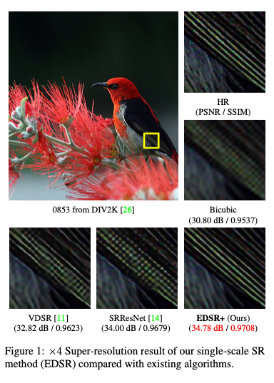
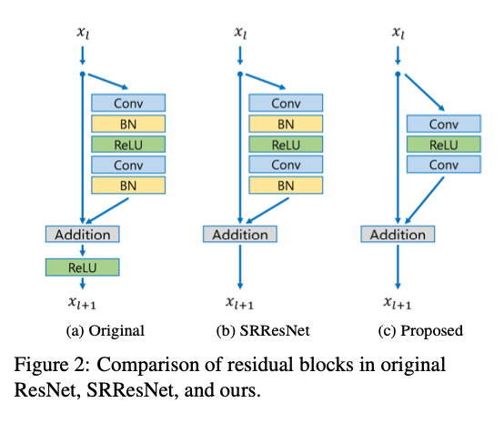
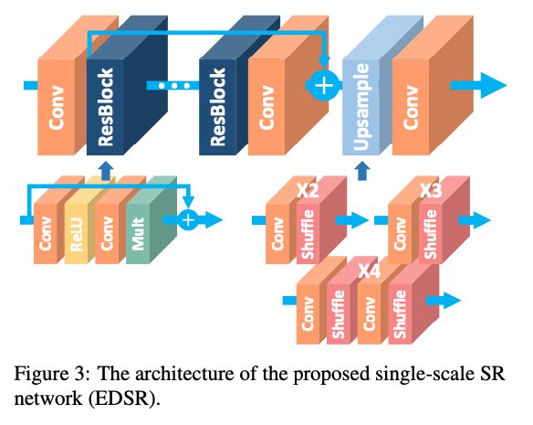

# EDSR : A Machine Learning Model for Super-resolution Image Processing

# EDSR : A Machine Learning Model for Super-resolution Image Processing

[](/@cochard-dav?source=post_page---byline--9deaf36b24ed---------------------------------------)

[David Cochard](/@cochard-dav?source=post_page---byline--9deaf36b24ed---------------------------------------)

3 min read

·

May 18, 2021

--

[Listen](/m/signin?actionUrl=https%3A%2F%2Fmedium.com%2Fplans%3Fdimension%3Dpost_audio_button%26postId%3D9deaf36b24ed&operation=register&redirect=https%3A%2F%2Fmedium.com%2Faxinc-ai%2Fedsr-a-machine-learning-model-for-super-resolution-image-processing-9deaf36b24ed&source=---header_actions--9deaf36b24ed---------------------post_audio_button------------------)

Share

This is an introduction to「EDSR」, a machine learning model that can be used with [ailia SDK](https://ailia.jp/en/). You can easily use this model to create AI applications using [ailia SDK](https://ailia.jp/en/) as well as many other ready-to-use [ailia MODELS](https://github.com/axinc-ai/ailia-models).

---

## Overview

*EDSR (Enhanced Deep Residual Networks for Single Image Super-Resolution)* is a machine learning model released in July 2017 which can be used to increase the resolution of an image.



Source：<https://arxiv.org/pdf/1707.02921>

[## Enhanced Deep Residual Networks for Single Image Super-Resolution

### Recent research on super-resolution has progressed with the development of deep convolutional neural networks (DCNN)…

arxiv.org](https://arxiv.org/abs/1707.02921?source=post_page-----9deaf36b24ed---------------------------------------)

## Architecture

*EDSR* is a super-resolution model proposed after *SRResNet*. *SRResNet* successfully solved the problems of processing time and memory consumption, but *ResNet* used in *SRResNet* is a model architecture for image classification, which is not optimal for super-resolution.

Therefore, *EDSR* builds a more optimal model for super-resolution by removing unnecessary modules from *ResNet*. For example, *BatchNormalization* is removed because it loses range flexibility, based on the research of [*Deep Multi-scale Convolutional Neural Network for Dynamic Scene Deblurring*](https://arxiv.org/abs/1612.02177).



Source：<https://arxiv.org/pdf/1707.02921>

*ResNet* also has a problem that learning becomes unstable when the number of feature maps is increased. To address this problem, the residuals is scaled down with a factor of 0.1 as proposed in *Inception-v4*.

> 3.3. Scaling of the Residuals
>
> Also we found that if the number of filters exceeded 1000, the residual variants started to exhibit instabilities and the network has just “died” early in the training, meaning that the last layer before the average pooling started to produce only zeros after a few tens of thousands of iterations. This could not be prevented, neither by lowering the learning rate, nor by adding an extra batch-normalization to this layer.
>
> We found that scaling down the residuals before adding them to the previous layer activation seemed to stabilize the training. In general we picked some scaling factors between 0.1 and 0.3 to scale the residuals before their being added to the accumulated layer activations (cf. Figure 20).

[## Inception-v4, Inception-ResNet and the Impact of Residual Connections on Learning

### Very deep convolutional networks have been central to the largest advances in image recognition performance in recent…

arxiv.org](https://arxiv.org/abs/1602.07261?source=post_page-----9deaf36b24ed---------------------------------------)

*EDSR* introduces a constant scaling layer of 0.1 at the output of the last convolution layer for the redisual block to make the training more stable.



Source：<https://arxiv.org/pdf/1707.02921>

In addition, conventional machine learning models for super-resolution are learning-sensitive, and a small change in architecture can have a large impact on image quality. Therefore, even if the same model is used, a large difference in image quality can appear depending on the initial value of the weights and the technique used during training. EDSR achieves stable learning by learning at x2 and then learning at x3 and x4 with the weights of x2.

The *DIV2K* data set was used for training.

[## DIV2K Dataset

### If you are using the DIV2K dataset please add a reference to the introductory dataset paper and to one of the following…

data.vision.ee.ethz.ch](https://data.vision.ee.ethz.ch/cvl/DIV2K/?source=post_page-----9deaf36b24ed---------------------------------------)

## Usage

You can use the following command to apply super-resolution processing to a video, specifying a scale factor of 2 to 4.

```
$ python3 edsr.py -v input.mp4 -s output.mp4 --scale 3
```

Here is an example of the result.

[## axinc-ai/ailia-models

### (Image from https://github.com/sanghyun-son/EDSR-PyTorch/blob/master/test/0853x4.png) Ailia input shape : (1, 3…

github.com](https://github.com/axinc-ai/ailia-models/tree/master/super_resolution/edsr?source=post_page-----9deaf36b24ed---------------------------------------)

Due to its nature, EDSR tends to emphasize noise when the image contains noise. Therefore, when reducing an image for evaluation, make sure to use a high quality reduction method.

---

[ax Inc.](https://axinc.jp/en/) has developed [ailia SDK](https://ailia.jp/en/), which enables cross-platform, GPU-based rapid inference.

ax Inc. provides a wide range of services from consulting and model creation, to the development of AI-based applications and SDKs. Feel free to [contact us](https://axinc.jp/en/) for any inquiry.