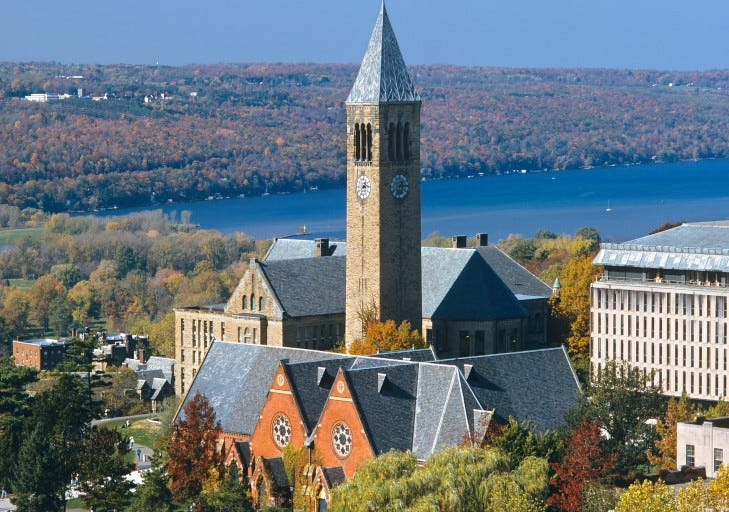
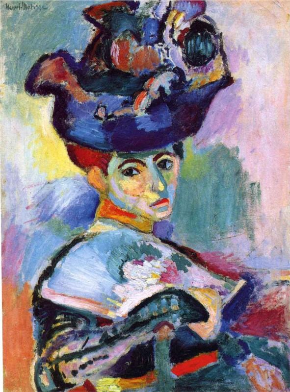
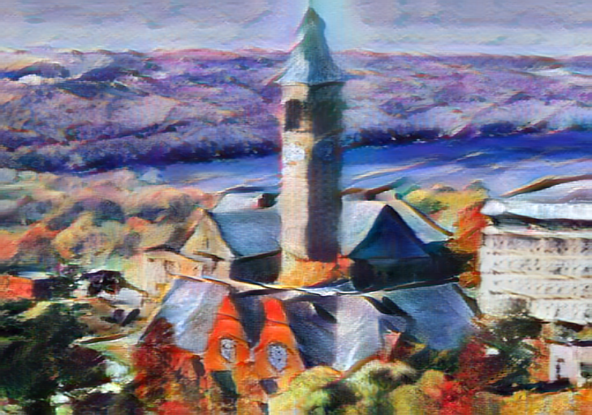
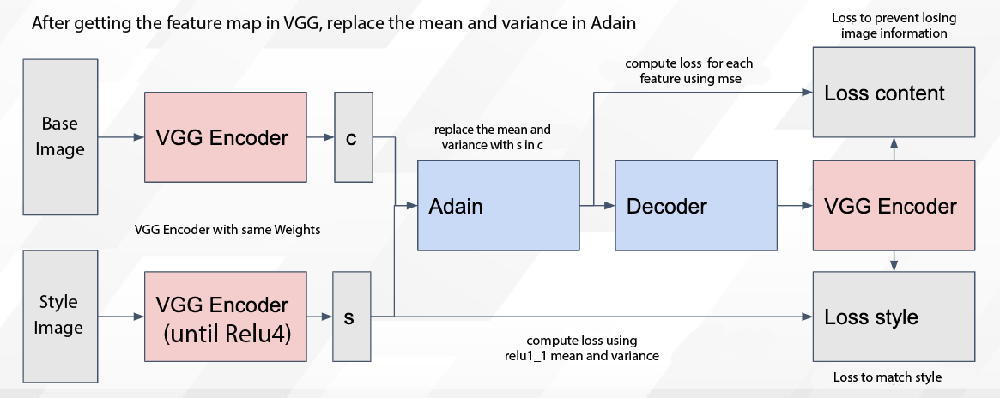
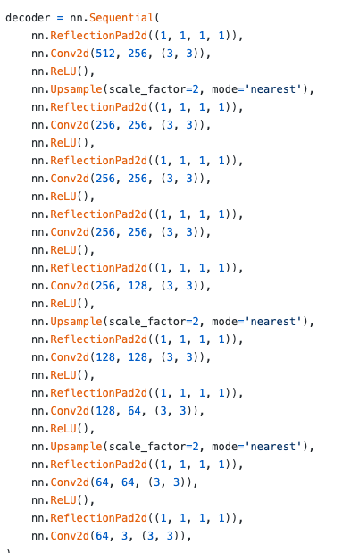

# Adain : A Machine Learning Model for Style Transfer

# Adain : A Machine Learning Model for Style Transfer

[](/@cochard-dav?source=post_page---byline--341b242c554b---------------------------------------)

[David Cochard](/@cochard-dav?source=post_page---byline--341b242c554b---------------------------------------)

3 min read

·

May 19, 2021

--

[Listen](/m/signin?actionUrl=https%3A%2F%2Fmedium.com%2Fplans%3Fdimension%3Dpost_audio_button%26postId%3D341b242c554b&operation=register&redirect=https%3A%2F%2Fmedium.com%2Faxinc-ai%2Fadain-a-machine-learning-model-for-style-transfer-341b242c554b&source=---header_actions--341b242c554b---------------------post_audio_button------------------)

Share

This is an introduction to「Adain」, a machine learning model that can be used with [ailia SDK](https://ailia.jp/en/). You can easily use this model to create AI applications using [ailia SDK](https://ailia.jp/en/) as well as many other ready-to-use [ailia MODELS](https://github.com/axinc-ai/ailia-models).

---

## Overview

*Adain* is a machine learning model that transforms the style of an image.

[## Arbitrary Style Transfer in Real-time with Adaptive Instance Normalization

### Gatys et al. recently introduced a neural algorithm that renders a content image in the style of another image…

arxiv.org](https://arxiv.org/abs/1703.06868?source=post_page-----341b242c554b---------------------------------------)

Conventional style transfer requires learning for each new style, but *Adain* is able to perform style transformation for any image without relearning.

*Adain* takes an base image and a style reference image as input, and transforms the style of the base image.

Press enter or click to view image in full size



Base input image（Source：<https://github.com/naoto0804/pytorch-AdaIN/tree/master/input>）



Style reference image（Source：<https://github.com/naoto0804/pytorch-AdaIN/tree/master/input>）

Press enter or click to view image in full size



Result image（Source：<https://github.com/naoto0804/pytorch-AdaIN/tree/master/input>）

## Architecture

*Adain* stands for *Adaptive Instance Normalization*, and the architecture of Adain is as follows.

Press enter or click to view image in full size



In the study of style transfer, it is known that the style of an image can be transformed by rewriting the mean and variance of VGG’s feature maps.

Adain applies VGG to the base and style reference images to obtain the feature maps, and then replaces the mean and variance of the feature maps up to *Relu4* of the base image with the mean and variance of the style reference image. The final image is then generated by passing it through a decoder.

*Adaptive Instance Normalization* is an improved version of *Instance Normalization* that calculates the mean and variance using the same operations as regular *Instance Normalization*, and then replaces them with the style mean and variance.

For the actual network definition, please refer to the repository below.

[## naoto0804/pytorch-AdaIN

### This is an unofficial pytorch implementation of a paper, Arbitrary Style Transfer in Real-time with Adaptive Instance…

github.com](https://github.com/naoto0804/pytorch-AdaIN?source=post_page-----341b242c554b---------------------------------------)

*ReflectionPad2d* is used in the decoder, and the output ONNX is rather complex.



*MSCOCO* and *Wikiart* were used for training.

## Usage

You can refer to the following sample to run Adain with ailia SDK.

[## axinc-ai/ailia-models

### (These images from https://github.com/naoto0804/pytorch-AdaIN/tree/master/input) Ailia input shape: (1, 3, 512, 512)…

github.com](https://github.com/axinc-ai/ailia-models/tree/master/style_transfer/adain?source=post_page-----341b242c554b---------------------------------------)

Use the command below to apply Adain to a style image.

```
$ python3 adain.py
```

Use the command below to apply Adain to the webcam video stream.

```
$ python3 adain.py -v 0
```

---

[ax Inc.](https://axinc.jp/en/) has developed [ailia SDK](https://ailia.jp/en/), which enables cross-platform, GPU-based rapid inference.

ax Inc. provides a wide range of services from consulting and model creation, to the development of AI-based applications and SDKs. Feel free to [contact us](https://axinc.jp/en/) for any inquiry.