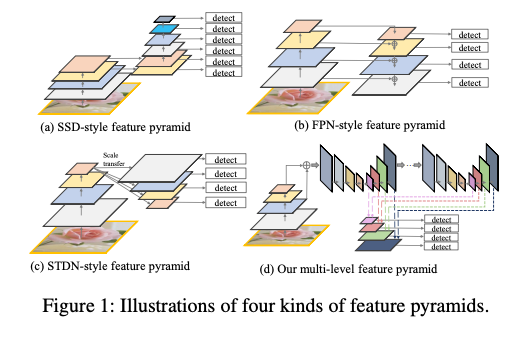
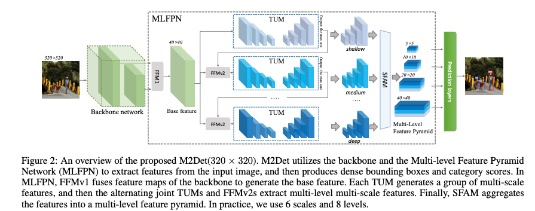

# M2Det : Highly Accurate Object Detection Model

# M2Det : Highly Accurate Object Detection Model

[](/@cochard-dav?source=post_page---byline--b5c5bff27970---------------------------------------)

[David Cochard](/@cochard-dav?source=post_page---byline--b5c5bff27970---------------------------------------)

3 min read

·

May 19, 2021

--

[Listen](/m/signin?actionUrl=https%3A%2F%2Fmedium.com%2Fplans%3Fdimension%3Dpost_audio_button%26postId%3Db5c5bff27970&operation=register&redirect=https%3A%2F%2Fmedium.com%2Faxinc-ai%2Fm2det-highly-accurate-object-detection-model-b5c5bff27970&source=---header_actions--b5c5bff27970---------------------post_audio_button------------------)

Share

This is an introduction to「M2Det」, a machine learning model that can be used with [ailia SDK](https://ailia.jp/en/). You can easily use this model to create AI applications using [ailia SDK](https://ailia.jp/en/) as well as many other ready-to-use [ailia MODELS](https://github.com/axinc-ai/ailia-models).

---

## Overview

*M2Det* is a highly accurate object detection model proposed in November 2018. It can detect bounding boxes of objects from the 80 categories in COCO.

[## M2Det: A Single-Shot Object Detector based on Multi-Level Feature Pyramid Network

### Feature pyramids are widely exploited by both the state-of-the-art one-stage object detectors (e.g., DSSD, RetinaNet…

arxiv.org](https://arxiv.org/abs/1811.04533?source=post_page-----b5c5bff27970---------------------------------------)

Conventional object detection uses an image classification backbone (*Mobilenet*, *VGG*, *ResNet*, etc.) to compute bounding boxes. For example, in SSD, after extracting features with the image classification backbone, the bounding box is calculated by adding a similar backbone in the later stage.

The same was true for *ReinaDet*, which uses *Feature Pyramids*, and although it uses more hierarchical features than SSD, the backbone of object detection was based on image classification.

In M2Det, after extracting features with the image classification backbone, a specialized backbone is used for object detection to achieve higher accuracy.



（Source：<https://arxiv.org/abs/1811.04533>）

This backbone specialized for object detection is called MLFPN (*Multi-Level Feature Pyramid Network*), which uses TUM (*Thinned U-shape Module*) in a hierarchical manner.

Press enter or click to view image in full size



（Source：<https://arxiv.org/abs/1811.04533>）

TUM has the following structure.

Press enter or click to view image in full size


（Source：<https://arxiv.org/abs/1811.04533>）

## Performance of M2Det

M2Det performs better than [YOLOv3](/axinc-ai/yolov3-a-machine-learning-model-to-detect-the-position-and-type-of-an-object-60f1c18f8107) and RetinaDet.


（Source：<https://arxiv.org/abs/1811.04533>）

*VGG-16* and *ResNet-101* are used as backbone for M2Det. VGG-16 is faster and ResNet-101 is more accurate.

Press enter or click to view image in full size


（Source：<https://arxiv.org/abs/1811.04533>）

## Usage

The ailia SDK sample below allows you to use M2Det, with a VGG-16 based M2Det that takes 3x512x512 as input.

[## axinc-ai/ailia-models

### Shape : (1, 3, 448, 448) Range : [0.0, 1.0] category : [0,80] (coco dataset classes, 0 is reserved for backgrounds)…

github.com](https://github.com/axinc-ai/ailia-models/tree/master/object_detection/m2det?source=post_page-----b5c5bff27970---------------------------------------)

You can use the following command to perform object detection using M2Det on a web camera.

```
$ python3 m2det.py -v 0
```

---

## Related topics

[## YOLOv3 : A machine learning model to detect the position and type of an object

### This is an introduction to「YOLOv3」, a machine learning model that can be used with ailia SDK. You can easily use this…

medium.com](/axinc-ai/yolov3-a-machine-learning-model-to-detect-the-position-and-type-of-an-object-60f1c18f8107?source=post_page-----b5c5bff27970---------------------------------------)

[## YOLOv4 : A Machine Learning Model to Detect the Position and Type of an Object

### This is an introduction to「YOLOv4」, a machine learning model that can be used with ailia SDK. You can easily use this…

medium.com](/axinc-ai/yolov4-a-machine-learning-model-to-detect-the-position-and-type-of-an-object-4f108ed0507b?source=post_page-----b5c5bff27970---------------------------------------)

[## YOLOv5 : The Latest Model for Object Detection

### This is an introduction to「YOLOv5」, a machine learning model that can be used with ailia SDK. You can easily use this…

medium.com](/axinc-ai/yolov5-the-latest-model-for-object-detection-b13320ec516b?source=post_page-----b5c5bff27970---------------------------------------)

[## MobilenetSSD : A Machine Learning Model for Fast Object Detection

medium.com](/axinc-ai/mobilenetssd-a-machine-learning-model-for-fast-object-detection-37352ce6da7d?source=post_page-----b5c5bff27970---------------------------------------)

---

[ax Inc.](https://axinc.jp/en/) has developed [ailia SDK](https://ailia.jp/en/), which enables cross-platform, GPU-based rapid inference.

ax Inc. provides a wide range of services from consulting and model creation, to the development of AI-based applications and SDKs. Feel free to [contact us](https://axinc.jp/en/) for any inquiry.