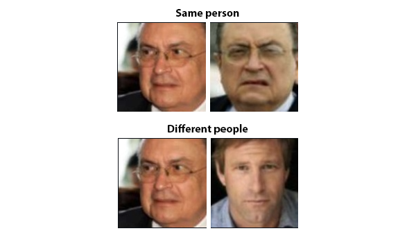
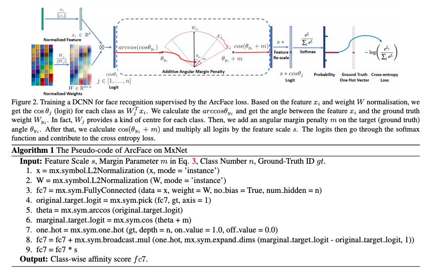
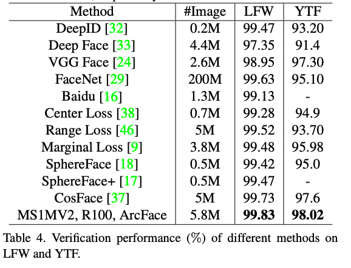
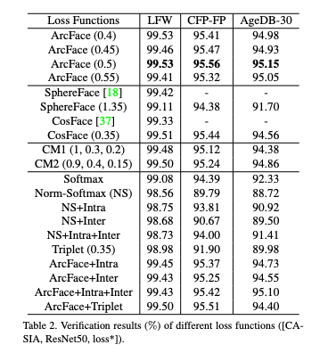

# ArcFace : A Machine Learning Model for Face Recognition.

# ArcFace : A Machine Learning Model for Face Recognition.

[](/@cochard-dav?source=post_page---byline--5f743cdac6fa---------------------------------------)

[David Cochard](/@cochard-dav?source=post_page---byline--5f743cdac6fa---------------------------------------)

3 min read

·

May 21, 2021

--

1

[Listen](/m/signin?actionUrl=https%3A%2F%2Fmedium.com%2Fplans%3Fdimension%3Dpost_audio_button%26postId%3D5f743cdac6fa&operation=register&redirect=https%3A%2F%2Fmedium.com%2Faxinc-ai%2Farcface-a-machine-learning-model-for-face-recognition-5f743cdac6fa&source=---header_actions--5f743cdac6fa---------------------post_audio_button------------------)

Share

This is an introduction to「ArcFace」, a machine learning model that can be used with [ailia SDK](https://ailia.jp/en/). You can easily use this model to create AI applications using [ailia SDK](https://ailia.jp/en/) as well as many other ready-to-use [ailia MODELS](https://github.com/axinc-ai/ailia-models).

---

## Overview

*ArcFace* is a machine learning model that takes two face images as input and outputs the distance between them to see how likely they are to be the same person. It can be used for face recognition and face search.



[## ArcFace: Additive Angular Margin Loss for Deep Face Recognition

### One of the main challenges in feature learning using Deep Convolutional Neural Networks (DCNNs) for large-scale face…

arxiv.org](https://arxiv.org/abs/1801.07698?source=post_page-----5f743cdac6fa---------------------------------------)

*ArcFace* uses a *similarity learning* mechanism that allows *distance metric learning* to be solved in the classification task by introducing *Angular Margin Loss* to replace *Softmax Loss*.

The distance between faces is calculated using *cosine distance*, which is a method used by search engines and can be calculated by the inner product of two normalized vectors. If the two vectors are the same, θ will be 0 and cosθ=1. If they are orthogonal, θ will be π/2 and cosθ=0. Therefore, it can be used as a similarity measure.

Press enter or click to view image in full size



（Source：<https://arxiv.org/abs/1801.07698>）

In a typical classification task, after calculating features, the Fully Connected (FC) layer takes the inner product of features and weights and applies *Softmax* to the output.

In *ArcFace*, cosθ is calculated by normalizing features and FC layer weights and taking the inner product. The loss is calculated by applying *Softmax* to cosθ. At this point, we apply *arccos* to the cosθ values after taking the inner product, and add an angular margin of *+m* only for the correct labels. In this way, we prevent the weight of the FC layer from being overly dependent on the input data set.

## ArcFace inference process

During inference, the features of the two faces are normalized and the inner-product is computed to determine if both pictures are the same person.

After the input face image is converted to grayscale, it is input as is in batch 1, and the same image horizontally flipped as in put in batch 2, and features are concatenated.

[## why image is converted to gray-scale？ · Issue #14 · ronghuaiyang/arcface-pytorch

### Dismiss GitHub is home to over 50 million developers working together to host and review code, manage projects, and…

github.com](https://github.com/ronghuaiyang/arcface-pytorch/issues/14?source=post_page-----5f743cdac6fa---------------------------------------)

## ArcFace accuracy

*ArcFace* performed best on the *LFW Dataset*.



（Source：<https://arxiv.org/abs/1801.07698>）

[## LFW Face Database : Main

### New results page: We have recently updated and changed the format and content of our results page. Please refer to the…

vis-www.cs.umass.edu](http://vis-www.cs.umass.edu/lfw/?source=post_page-----5f743cdac6fa---------------------------------------)



（Source：<https://arxiv.org/abs/1801.07698>）

We can see that the accuracy changes depending on the margins that is used. We can also see that introducing a margin into *CosFace* improves the accuracy.

## Usage

The following sample demonstrates how to use ArcFace with ailia SDK.

[## axinc-ai/ailia-models

### (Image from https://github.com/ronghuaiyang/arcface-pytorch/issues/63) Input the original image1 and its inversion, and…

github.com](https://github.com/axinc-ai/ailia-models/tree/master/face_identification/arcface?source=post_page-----5f743cdac6fa---------------------------------------)

When inputing two face images, it will determine if they are the same person or not.

```
$ python3 arcface.py — inputs IMAGE_PATH1 IMAGE_PATH2
```

When a video is input, [*YOLOv3Face*](/axinc-ai/yolov3-a-machine-learning-model-to-detect-the-position-and-type-of-an-object-60f1c18f8107)is used to cut out the face and *ArcFace* is used to determine if it is the same person and assign an ID to the face.

```
$ python3 arcface.py -v 0
```

---

[ax Inc.](https://axinc.jp/en/) has developed [ailia SDK](https://ailia.jp/en/), which enables cross-platform, GPU-based rapid inference.

ax Inc. provides a wide range of services from consulting and model creation, to the development of AI-based applications and SDKs. Feel free to [contact us](https://axinc.jp/en/) for any inquiry.