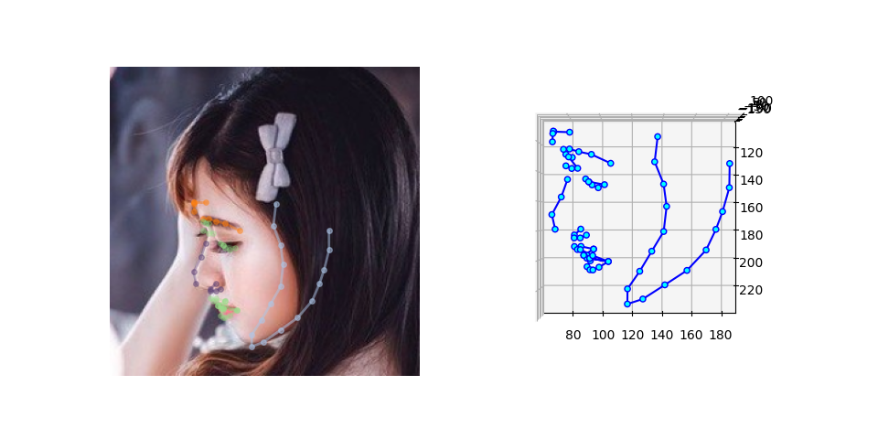
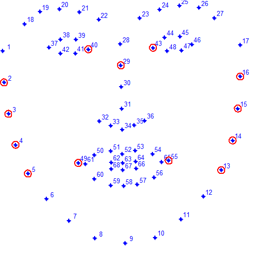
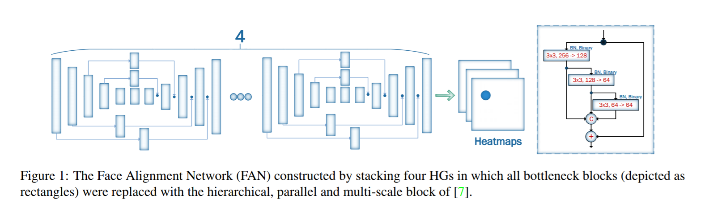

# FaceAlignment : A Machine Learning Model For Recognizing Key Points On a Face

# FaceAlignment : A Machine Learning Model For Recognizing Key Points On a Face

[](/@cochard-dav?source=post_page---byline--956f5e796efa---------------------------------------)

[David Cochard](/@cochard-dav?source=post_page---byline--956f5e796efa---------------------------------------)

3 min read

·

May 21, 2021

--

[Listen](/m/signin?actionUrl=https%3A%2F%2Fmedium.com%2Fplans%3Fdimension%3Dpost_audio_button%26postId%3D956f5e796efa&operation=register&redirect=https%3A%2F%2Fmedium.com%2Faxinc-ai%2Ffacealignment-a-machine-learning-model-for-recognizing-key-points-on-a-face-956f5e796efa&source=---header_actions--956f5e796efa---------------------post_audio_button------------------)

Share

This is an introduction to「FaceAlignment」, a machine learning model that can be used with [ailia SDK](https://ailia.jp/en/). You can easily use this model to create AI applications using [ailia SDK](https://ailia.jp/en/) as well as many other ready-to-use [ailia MODELS](https://github.com/axinc-ai/ailia-models).

---

## Overview

*FaceAlignment* takes a face image as input and outputs 68 keypoints. The input resolution is (1,3,256,256) and the output of the model is a heatmap of (1,68,64,64). For each of the 68 keypoints, a confidence of (64,64) resolution is output. The input images are normalized to (0–1.0) in BGR order.

[## How far are we from solving the 2D & 3D Face Alignment problem? (and a dataset of 230,000 3D facial…

### Abstract This paper investigates how far a very deep neural network is from attaining close to saturating performance…

www.adrianbulat.com](https://www.adrianbulat.com/face-alignment?source=post_page-----956f5e796efa---------------------------------------)

## FaceAlignment results

Considering the input image shown below.


Source：<https://pixabay.com/ja/photos/%E3%83%95%E3%82%A1%E3%83%83%E3%82%B7%E3%83%A7%E3%83%B3-%E3%82%A2%E3%82%B8%E3%82%A2-%E6%97%A5%E6%9C%AC-3179178/>

*FaceAlignment* works on the face area, so it first cuts out the face area and then performs the recognition process.


Cut out of the face

*FaceAlignment* can extract 2D keypoints with high accuracy even for profile faces.

Press enter or click to view image in full size


FaceAlignment output in 2D

You can also use the 3D mode to extract key points in 3D.

Press enter or click to view image in full size



FaceAlignment output in 3D

The output of the model will be a heat map like the one below.


FaceAlignment heatmap output

The coordinates of the key points are computed by detecting the maximum value in each heatmap.

For the computation of the 3D keypoints, the 2D keypoints are first calculated from the heatmaps. Then the 3 channels of the input image and the 68 channels of the 2D keypoint heatmap are concatenated, making a (71,256,256) input, and then fed to the depth estimation model. The output of the depth estimation model will be (1,68) z-values.

The assignment of the 68 keypoints conforms to the *Multi-PIE* format.



The 68 Multi-PIE landmarks scheme and the landmarks selected for our method marked by the circles.（Source:[https://www.researchgate.net/publication/311741971\_Automatic\_cheek\_detection\_in\_digital\_image)s](https://www.researchgate.net/publication/311741971_Automatic_cheek_detection_in_digital_images)）

## Architecture

*FaceAlignment* uses *The Face Alignment Network (FAN)*, which is a stack of HG (*Hourglass*) in structure.

Press enter or click to view image in full size



Source：<https://www.adrianbulat.com/downloads/FaceAlignment/FaceAlignment.pdf>

## Usage

The following sample demonstrates how to use FaceAlignement with ailia SDK.

[## axinc-ai/ailia-models

### (from https://github.com/1adrianb/face-alignment/tree/master/test/assets) Ailia input shape : (1, 3, 256, 256) Range …

github.com](https://github.com/axinc-ai/ailia-models/tree/master/face_recognition/face_alignment?source=post_page-----956f5e796efa---------------------------------------)

You can use the following command to get the 2D keypoints of a face for any image.

```
$ python3 face_alignment.py -i input.png -s output.png
```

You can use the following command to get the 3D keypoints.

```
$ python3 face_alignment.py -i input.png -s output.png — active-3d
```

## Related topic

[## BlazeFace : A Machine Learning Model for Fast Detection of Face Positions and Key Points

medium.com](/axinc-ai/blazeface-a-machine-learning-model-for-fast-detection-of-face-positions-and-key-points-5dcfb9429d72?source=post_page-----956f5e796efa---------------------------------------)

[## FaceMesh : Detecting Key Points on Faces in Real Time

### This is an introduction to「FaceMesh」, a machine learning model that can be used with ailia SDK. You can easily use this…

medium.com](/axinc-ai/facemesh-detecting-key-points-on-faces-in-real-time-977c03f1bab?source=post_page-----956f5e796efa---------------------------------------)

---

[ax Inc.](https://axinc.jp/en/) has developed [ailia SDK](https://ailia.jp/en/), which enables cross-platform, GPU-based rapid inference.

ax Inc. provides a wide range of services from consulting and model creation, to the development of AI-based applications and SDKs. Feel free to [contact us](https://axinc.jp/en/) for any inquiry.