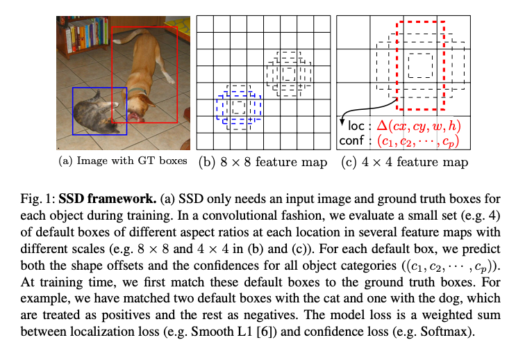
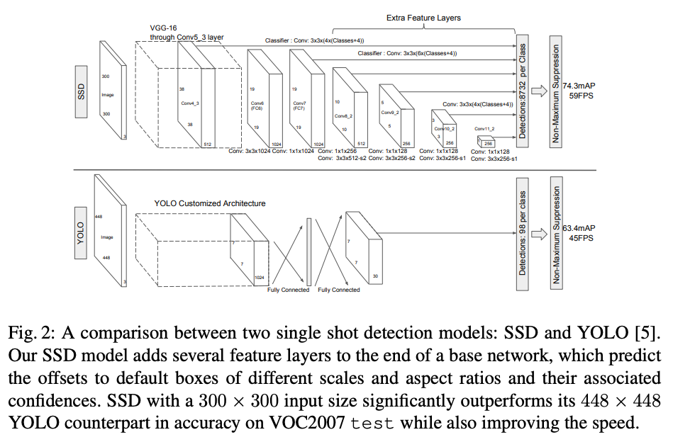
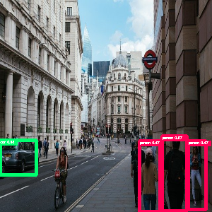

# MobilenetSSD : A Machine Learning Model for Fast Object Detection

# MobilenetSSD : A Machine Learning Model for Fast Object Detection

[](/@cochard-dav?source=post_page---byline--37352ce6da7d---------------------------------------)

[David Cochard](/@cochard-dav?source=post_page---byline--37352ce6da7d---------------------------------------)

5 min read

·

May 24, 2021

--

[Listen](/m/signin?actionUrl=https%3A%2F%2Fmedium.com%2Fplans%3Fdimension%3Dpost_audio_button%26postId%3D37352ce6da7d&operation=register&redirect=https%3A%2F%2Fmedium.com%2Faxinc-ai%2Fmobilenetssd-a-machine-learning-model-for-fast-object-detection-37352ce6da7d&source=---header_actions--37352ce6da7d---------------------post_audio_button------------------)

Share

This is an introduction to「MobilenetSSD」, a machine learning model that can be used with [ailia SDK](https://ailia.jp/en/). You can easily use this model to create AI applications using [ailia SDK](https://ailia.jp/en/) as well as many other ready-to-use [ailia MODELS](https://github.com/axinc-ai/ailia-models).

---

## Overview

*MobilenetSSD* is an object detection model that computes the bounding box and category of an object from an input image. This *Single Shot Detector* (SSD) object detection model uses *Mobilenet* as backbone and can achieve fast object detection optimized for mobile devices.

[## SSD: Single Shot MultiBox Detector

### We present a method for detecting objects in images using a single deep neural network. Our approach, named SSD…

arxiv.org](https://arxiv.org/abs/1512.02325?source=post_page-----37352ce6da7d---------------------------------------)

[## MobileNets: Efficient Convolutional Neural Networks for Mobile Vision Applications

### We present a class of efficient models called MobileNets for mobile and embedded vision applications. MobileNets are…

arxiv.org](https://arxiv.org/abs/1704.04861?source=post_page-----37352ce6da7d---------------------------------------)

## Architecture

*MobilenetSSD*takes a (3,300,300) image as input and outputs (1,3000,4) *boxes* and (1,3000,21) *scores*. *Boxes* contains offset values (cx,cy,w,h) from the default box. *Scores* contains confidence values for the presence of each of the 20 object categories, the value 0 being reserved for the background.

Press enter or click to view image in full size



Source：<https://arxiv.org/pdf/1512.02325.pdf>

In SSD, after extracting the features using an arbitrary backbone, the bounding boxes are calculated at each resolution while reducing the resolution with *Extra Feature Layers*. *MobilenetSSD* will concatenate the output of the six levels of resolution and calculate a total of 3000 bounding boxes, and finally, filter out bounding boxes using non-maximum suppression (nms).

Press enter or click to view image in full size



Source：<https://arxiv.org/pdf/1512.02325.pdf>

The configuration of *MobilenetSSD* is shown below. A default box size is defined in *SSDSpec* for each resolution.

> image\_size = 300  
> image\_mean = np.array([127, 127, 127]) # RGB layout  
> image\_std = 128.0  
> iou\_threshold = 0.45  
> center\_variance = 0.1  
> size\_variance = 0.2
>
> specs = [  
>  SSDSpec(19, 16, SSDBoxSizes(60, 105), [2, 3]),  
>  SSDSpec(10, 32, SSDBoxSizes(105, 150), [2, 3]),  
>  SSDSpec(5, 64, SSDBoxSizes(150, 195), [2, 3]),  
>  SSDSpec(3, 100, SSDBoxSizes(195, 240), [2, 3]),  
>  SSDSpec(2, 150, SSDBoxSizes(240, 285), [2, 3]),  
>  SSDSpec(1, 300, SSDBoxSizes(285, 330), [2, 3])  
> ]

[## qfgaohao/pytorch-ssd

### MobileNetV1, MobileNetV2, VGG based SSD/SSD-lite implementation in Pytorch 1.0 / Pytorch 0.4. Out-of-box support for…

github.com](https://github.com/qfgaohao/pytorch-ssd/blob/master/vision/ssd/config/mobilenetv1_ssd_config.py?source=post_page-----37352ce6da7d---------------------------------------)

*SSDSpec* is defined as follows.

> SSDSpec = collections.namedtuple(‘SSDSpec’, [‘feature\_map\_size’, ‘shrinkage’, ‘box\_sizes’, ‘aspect\_ratios’])

In the case of `SSDSpec(19, 16, SSDBoxSizes(60, 105), [2, 3])`, a total of six boxes are defined with sizes 60x60, 105x105, as well as sizes 120x60, 60x120, 210x105 and 105x210 for the aspect ratio of 2.

[## qfgaohao/pytorch-ssd

### You can’t perform that action at this time. You signed in with another tab or window. You signed out in another tab or…

github.com](https://github.com/qfgaohao/pytorch-ssd/blob/master/vision/utils/box_utils.py?source=post_page-----37352ce6da7d---------------------------------------)

Six levels of recognition results are concatenated, producing a total of 3000 bounding boxes.

## Usage

The sample below demonstrates how to use *MobilenetSSD* with ailia SDK.

[## axinc-ai/ailia-models

### Ailia input shape(1, 3, 300, 300) Range:[0, 1] Automatically downloads the onnx and prototxt files on the first run. It…

github.com](https://github.com/axinc-ai/ailia-models/tree/master/object_detection/mobilenet_ssd?source=post_page-----37352ce6da7d---------------------------------------)

The following command runs the model on the web camera video stream.

```
$ python3 mobilenet_ssd.py -v 0
```


Input image (Source: <https://pixabay.com/ja/photos/%E3%83%AD%E3%83%B3%E3%83%89%E3%83%B3%E5%B8%82-%E9%8A%80%E8%A1%8C-%E3%83%AD%E3%83%B3%E3%83%89%E3%83%B3-4481399/>)



Inference result

## Train MobilenetSSD on your own data

`pytorch-ssd` can be used to train *MobilenetSSD* on your own data.

[## qfgaohao/pytorch-ssd

### This repo implements SSD (Single Shot MultiBox Detector). The implementation is heavily influenced by the projects…

github.com](https://github.com/qfgaohao/pytorch-ssd?source=post_page-----37352ce6da7d---------------------------------------)

Since `pytorch-ssd` uses lambda objects in *DataLoader*, it cannot be used on Windows, only Mac or Linux are supported.

[## Can’t pickle local object ‘DataLoader.\_\_init\_\_. . ‘

### Hi all, I hope everybody reading this is having a great day. So I have a problem with torchvision.transforms.Lambda()…

discuss.pytorch.org](https://discuss.pytorch.org/t/cant-pickle-local-object-dataloader-init-locals-lambda/31857/8?source=post_page-----37352ce6da7d---------------------------------------)

The data format for training follows the open-image-dataset format. The following four files are required for training.

> /dataset/open\_images\_mixed/sub-test-annotations-bbox.csv  
> /dataset/open\_images\_mixed/sub-train-annotations-bbox.csv  
> /dataset/open\_images\_mixed/train/images.jpg  
> /dataset/open\_images\_mixed/test/images.jpg

The format of the csv is as follows.

> ImageID,Source,LabelName,Confidence,XMin,XMax,YMin,YMax,IsOccluded,IsTruncated,IsGroupOf,IsDepiction,IsInside,id,ClassName

*ImageId* is the file name of the image (without extension), *Xmin* to *YMax* is the bounding box from 0 to 1, and *ClassName* is the category. Here is an example.

> img\_591,xclick,/m/0gxl3,1,0.40920866666666667,0.08862621809744783,0.7894286666666666,0.6620986078886312,0,0,0,0,0,/m/0gxl3,Handgun

Place the training image in the `train` folder, where it will be referenced as `ImageId.jpg`

Training is done by transfer learning, so first download the trained model.

> wget -P models <https://storage.googleapis.com/models-hao/mb2-ssd-lite-mp-0_686.pth>

And run the training script.

> python3 train\_ssd.py — dataset\_type open\_images — datasets ./dataset — net mb2-ssd-lite — pretrained\_ssd models/mb2-ssd-lite-mp-0\_686.pth — scheduler cosine — lr 0.001 — t\_max 100 — validation\_epochs 5 — num\_epochs 100 — base\_net\_lr 0.001 — batch\_size 5

The results of the training and `open-images-model-labels.txt` will be output to the `models` folder, which will take about 38 hours to train on a MacBookPro13 CPU.

Finally, check your training results.

> python3 run\_ssd\_example.py mb2-ssd-lite models/mb2-ssd-lite-Epoch-80-Loss-2.4882763324521524.pth models/open-images-model-labels.txt input.jpg

Since ailia SDK requires export with `opset=10`, add `opset_version=10` to `torch.onnx.export` in `convert_to_caffe2_models.py`

> torch.onnx.export(net, dummy\_input, model\_path, verbose=False, output\_names=[‘scores’, ‘boxes’], opset\_version=10)

Export to ONNX so that it can be used with ailia SDK.

> python3 convert\_to\_caffe2\_models.py mb2-ssd-lite models/mb2-ssd-lite-Epoch-80-Loss-2.4882763324521524.pth models/open-images-model-labels.txt

See below for a sample that goes from training to conversion to ONNX.

[## axinc-ai/mobilenetssd-face

### Pytorch 1.0 Windows is not working…

github.com](https://github.com/axinc-ai/mobilenetssd-face?source=post_page-----37352ce6da7d---------------------------------------)

## Related topics

[## YOLOv3 : A machine learning model to detect the position and type of an object

### This is an introduction to「YOLOv3」, a machine learning model that can be used with ailia SDK. You can easily use this…

medium.com](/axinc-ai/yolov3-a-machine-learning-model-to-detect-the-position-and-type-of-an-object-60f1c18f8107?source=post_page-----37352ce6da7d---------------------------------------)

[## YOLOv4 : A Machine Learning Model to Detect the Position and Type of an Object

### This is an introduction to「YOLOv4」, a machine learning model that can be used with ailia SDK. You can easily use this…

medium.com](/axinc-ai/yolov4-a-machine-learning-model-to-detect-the-position-and-type-of-an-object-4f108ed0507b?source=post_page-----37352ce6da7d---------------------------------------)

[## YOLOv5 : The Latest Model for Object Detection

### This is an introduction to「YOLOv5」, a machine learning model that can be used with ailia SDK. You can easily use this…

medium.com](/axinc-ai/yolov5-the-latest-model-for-object-detection-b13320ec516b?source=post_page-----37352ce6da7d---------------------------------------)

[## M2Det : Highly Accurate Object Detection Model

medium.com](/axinc-ai/m2det-highly-accurate-object-detection-model-b5c5bff27970?source=post_page-----37352ce6da7d---------------------------------------)

---

[ax Inc.](https://axinc.jp/en/) has developed [ailia SDK](https://ailia.jp/en/), which enables cross-platform, GPU-based rapid inference.

ax Inc. provides a wide range of services from consulting and model creation, to the development of AI-based applications and SDKs. Feel free to [contact us](https://axinc.jp/en/) for any inquiry.