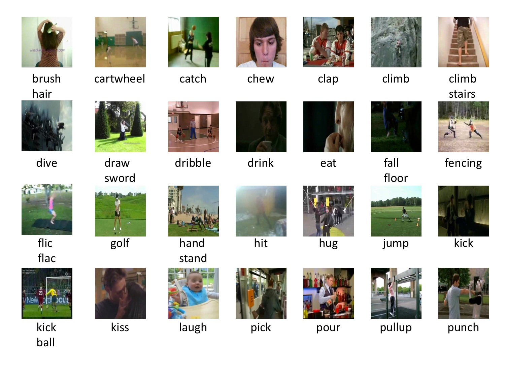
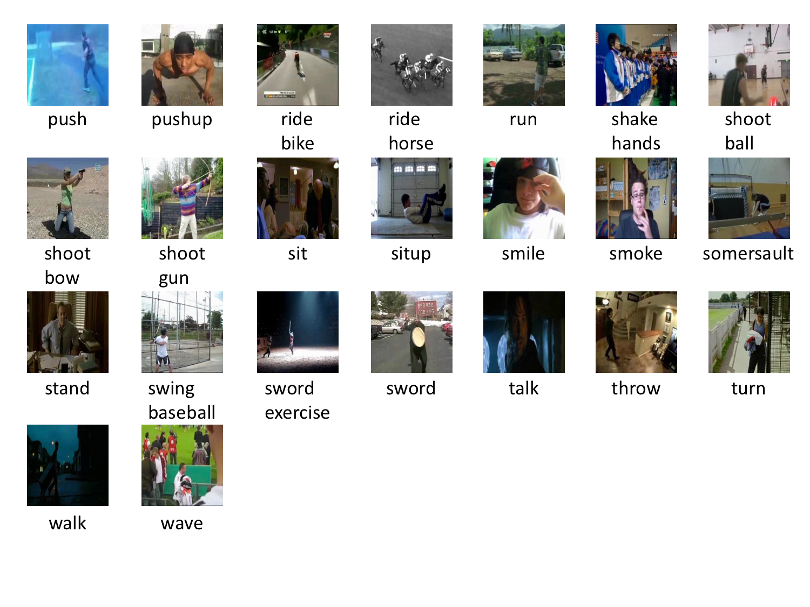
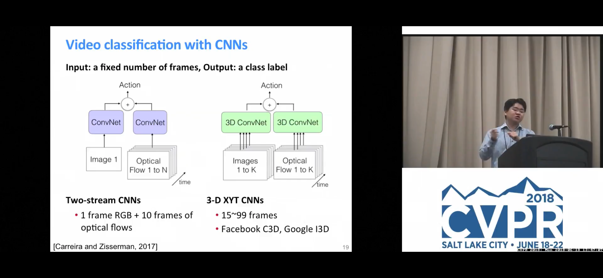
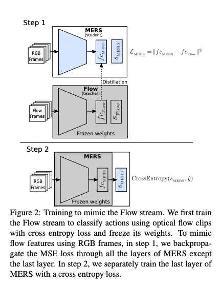
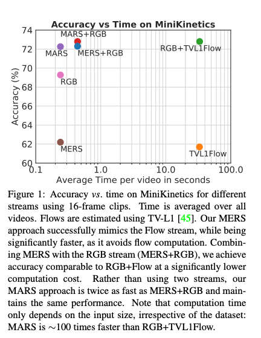

# MARS : A Machine Learning Model for Identifying Actions from Videos

# MARS : A Machine Learning Model for Identifying Actions from Videos

[](/@cochard-dav?source=post_page---byline--6b93c06ac6a5---------------------------------------)

[David Cochard](/@cochard-dav?source=post_page---byline--6b93c06ac6a5---------------------------------------)

3 min read

·

May 25, 2021

--

[Listen](/m/signin?actionUrl=https%3A%2F%2Fmedium.com%2Fplans%3Fdimension%3Dpost_audio_button%26postId%3D6b93c06ac6a5&operation=register&redirect=https%3A%2F%2Fmedium.com%2Faxinc-ai%2Fmars-a-machine-learning-model-for-identifying-actions-from-videos-6b93c06ac6a5&source=---header_actions--6b93c06ac6a5---------------------post_audio_button------------------)

Share

This is an introduction to「MARS」, a machine learning model that can be used with [ailia SDK](https://ailia.jp/en/). You can easily use this model to create AI applications using [ailia SDK](https://ailia.jp/en/) as well as many other ready-to-use [ailia MODELS](https://github.com/axinc-ai/ailia-models).

---

## Overview

*MARS (Motion-Augmented RGB Stream for Action Recognition)* is a model proposed in May 2019, which detects actions taking place in an input video.

[## craston/MARS

### By Nieves Crasto, Philippe Weinzaepfel, Karteek Alahari and Cordelia Schmid MARS is a strategy to learn a stream that…

github.com](https://github.com/craston/MARS?source=post_page-----6b93c06ac6a5---------------------------------------)

*MARS* has been trained using *HMDB51* and is capable of recognizing the following 51 actions.

Press enter or click to view image in full size



Press enter or click to view image in full size



Source：<https://serre-lab.clps.brown.edu/resource/hmdb-a-large-human-motion-database/#Downloads>

## Features of MARS

There are two types of detecting actions from video: one is skeleton-based, which uses LSTM or CNN after detecting the skeleton with *OpenPose*, and the other is 3D Convolution, which uses RGB and optical flow of the video. MARS is a direct detection architecture.

There are also two types of action detection methods directly from video: *two-stream CNNs*, which use a single frame of RGB and multiple optical flows, and *3-D XYT CNN*s, which use multiple frames of RGB and multiple optical flows.

Press enter or click to view image in full size



Source：<https://www.youtube.com/watch?v=Flm-kkCqACM&feature=youtu.be>

*MARS* is an improvement of *3-D XYT CNN*s.

*3-D XYT CNN*s detect actions by providing both multiple RGB images and a Flow stream consisting of motion vectors for each pixel. The problem is that the computation of the motion vectors for each pixel is very demanding.

*MARS* uses Flow stream during training, but only RGB images during inference. This makes it possible to detect actions much faster.



Source：<https://hal.inria.fr/hal-02140558/document>

Using *MARS*, actions can be recognized at high speed and with high accuracy. For example, it is 100 times faster and more accurate than *RGB+TVL1Flow*, which uses Flow along with RGB. Running on a TitanX, it takes 30 seconds to calculate *TVL1 Flow* for one video. Since 99% of the cost of action detection is spent to compute optical flow, *MARS* can infer 100 times faster since it does not need this computation.



Source：<https://hal.inria.fr/hal-02140558/document>

*MARS* takes 16 frames of images as input and uses 3D CNN for inference. *resnet50*, *resnet101* and *resnet152* are used as backbone.

## Usage

3D convolutions required to run Mars are supported since ailia SDK 1.2.4.

[## axinc-ai/ailia-models

### (Video from HMDB51 : https://serre-lab.clps.brown.edu/resource/hmdb-a-large-human-motion-database/) Shape : (1, 3…

github.com](https://github.com/axinc-ai/ailia-models/tree/master/action_recognition/mars?source=post_page-----6b93c06ac6a5---------------------------------------)

Use the following command to detect the action of any video.

```
$ python3 mars.py -v input_video.mp4
```

---

[ax Inc.](https://axinc.jp/en/) has developed [ailia SDK](https://ailia.jp/en/), which enables cross-platform, GPU-based rapid inference.

ax Inc. provides a wide range of services from consulting and model creation, to the development of AI-based applications and SDKs. Feel free to [contact us](https://axinc.jp/en/) for any inquiry.