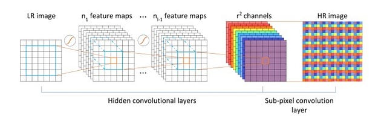
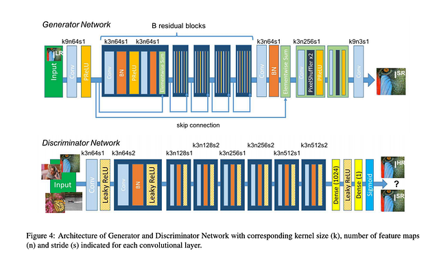

# SRResNet : A Machine Learning Model to Increase Image Resolution

# SRResNet : A Machine Learning Model to Increase Image Resolution

[](/@cochard-dav?source=post_page---byline--9efc478f2674---------------------------------------)

[David Cochard](/@cochard-dav?source=post_page---byline--9efc478f2674---------------------------------------)

3 min read

·

May 25, 2021

--

[Listen](/m/signin?actionUrl=https%3A%2F%2Fmedium.com%2Fplans%3Fdimension%3Dpost_audio_button%26postId%3D9efc478f2674&operation=register&redirect=https%3A%2F%2Fmedium.com%2Faxinc-ai%2Fsrresnet-a-machine-learning-model-to-increase-image-resolution-9efc478f2674&source=---header_actions--9efc478f2674---------------------post_audio_button------------------)

Share

This is an introduction to「SRResNet」, a machine learning model that can be used with [ailia SDK](https://ailia.jp/en/). You can easily use this model to create AI applications using [ailia SDK](https://ailia.jp/en/) as well as many other ready-to-use [ailia MODELS](https://github.com/axinc-ai/ailia-models).

---

## Overview

*SRResNet* is a super-resolution model that increases image resolution with high quality. It takes an image of size (1,3,64,64) as input and outputs an image (1,3,256,256) enlarged by a factor of 4.

Conventional bilinear and bicubic enlargements have the problem of jaggy diagonal lines and blurry output. By using AI super-resolution, the enlarged image stays sharp.

Press enter or click to view image in full size


Source: <https://arxiv.org/pdf/1609.04802.pdf>

By using *PixelShuffler*, *SRResNet* produces images with less noise than traditional AI super-resolution models using Deconvolution.

[## Photo-Realistic Single Image Super-Resolution Using a Generative Adversarial Network

### Despite the breakthroughs in accuracy and speed of single image super-resolution using faster and deeper convolutional…

arxiv.org](https://arxiv.org/abs/1609.04802?source=post_page-----9efc478f2674---------------------------------------)

## History of AI Super Resolution

### SRCNN

Introduced in [*Image Super-Resolution Using Deep Convolutional Networks*](https://arxiv.org/abs/1501.00092)and used for example in [*Waifu2x*](https://github.com/nagadomi/waifu2x), the image is first increased in resolution, then extracted features are convolved with multiple layers, and finally reconstructed to give the final high-resolution image.

Press enter or click to view image in full size


Source: <https://arxiv.org/pdf/1501.00092.pdf>

### FSRCNN

*Fast Super-Resolution Convolutional Neural Network (FSRCNN)* was proposed to speed up SRCNN. *Deconvolution* is used to increase the resolution at the end of the pipeline to speed up the process.

Press enter or click to view image in full size


Source: <http://mmlab.ie.cuhk.edu.hk/projects/FSRCNN.html>

### ESPCN

Deconvolution has the issue to generate checkerboard noise, and ESPCN (*SRResNet*) is the solution to this problem. It uses *PixelShuffler* (Sub Pixel Convolution) to suppress this noise issue.

Press enter or click to view image in full size



Source: <https://nuit-blanche.blogspot.com/2016/09/real-time-single-image-and-video-super.html>

### SRGAN

There are two methods of optimization during training using the SRResNet model architecture: training based on PSNR and SSIM, and using GAN. With PSNR and SSIM, there is a problem that although the numerical performance is high, the result is not.

Using the *SRResNet* model, it is possible to build a model that performs high quality super-resolution by training the AI (the *discriminator*) to determine whether the image is generated by the AI (the *generator*)or the original image. This method is called *SRGAN*.

Press enter or click to view image in full size



Source: <https://openaccess.thecvf.com/content_cvpr_2017/papers/Ledig_Photo-Realistic_Single_Image_CVPR_2017_paper.pdf>

## Usage

Use the following command to run *SRResNet (SRGAN)* with ailia SDK. By using the `-p` option, the input image can be enlarged to 4 times the resolution by tiling it in 64x64 pixel units.

```
$ python3 srresnet.py -i input.jpg -o output.jpg -p
```

[## axinc-ai/ailia-models

### Ailia input shape : (1,3,64,64) Range : [0.0, 1.0] Ailia output shape : (1,3,256,256) Range : [0, 1.0] Automatically…

github.com](https://github.com/axinc-ai/ailia-models/tree/master/super_resolution/srresnet?source=post_page-----9efc478f2674---------------------------------------)

---

## Related product (ailia AI Refiner)

[ax Inc.](https://axinc.jp/en/) and [RADIUS5 Inc.](https://www.radius5.co.jp/) published an AI super-resolution plug-in that can be used with *Adobe After Effects*. The product is a combination of a super-resolution model originally developed by RADIUS5 Inc. and ailia SDK originally developed by ax Inc.

[## ailia AI Refiner converts videos and animations to high resolution | cre8tiveAI

### What is ailia AI Refiner? It is a plug-in for Adobe After Effects®. It makes your photos and illustrations beautiful…

cre8tiveai.com](https://cre8tiveai.com/aar?_ga=2.1228401.1775604059.1621933427-163481225.1619479237&source=post_page-----9efc478f2674---------------------------------------)

---

[ax Inc.](https://axinc.jp/en/) has developed [ailia SDK](https://ailia.jp/en/), which enables cross-platform, GPU-based rapid inference.

ax Inc. provides a wide range of services from consulting and model creation, to the development of AI-based applications and SDKs. Feel free to [contact us](https://axinc.jp/en/) for any inquiry.