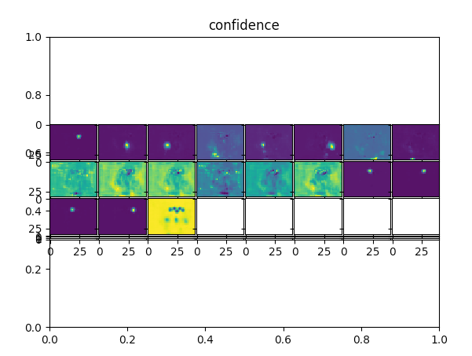
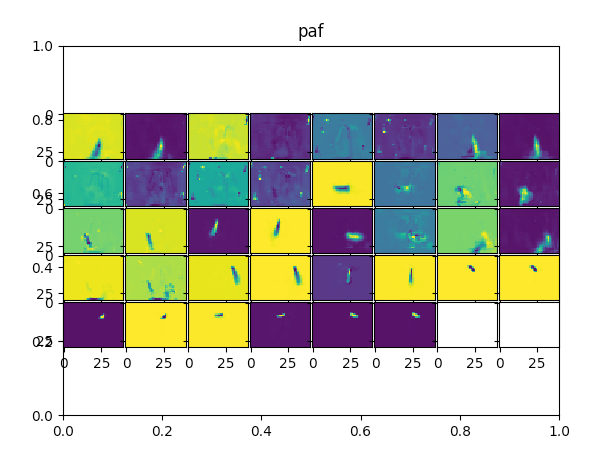
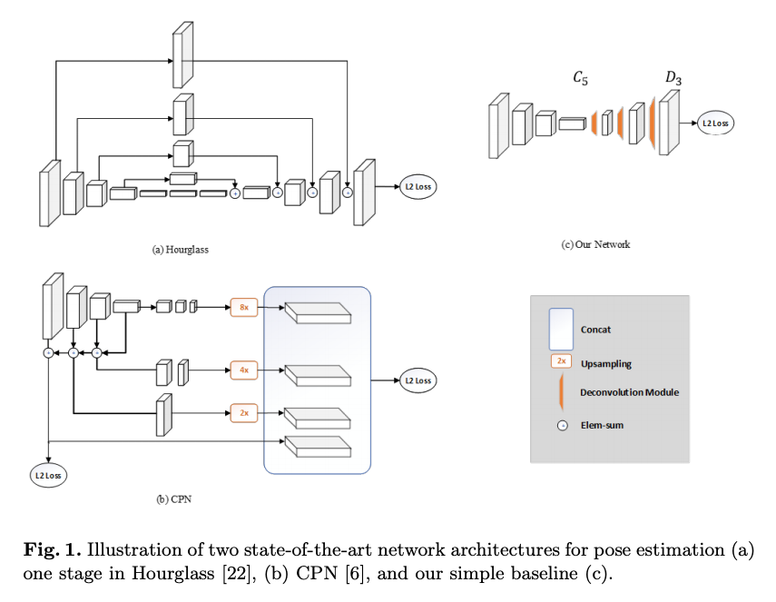

# PoseResnet : A Top-down Machine Learning Model for Pose Estimation

# PoseResnet : A Top-down Machine Learning Model for Pose Estimation

[](/@cochard-dav?source=post_page---byline--9454f391ae4d---------------------------------------)

[David Cochard](/@cochard-dav?source=post_page---byline--9454f391ae4d---------------------------------------)

4 min read

·

May 26, 2021

--

[Listen](/m/signin?actionUrl=https%3A%2F%2Fmedium.com%2Fplans%3Fdimension%3Dpost_audio_button%26postId%3D9454f391ae4d&operation=register&redirect=https%3A%2F%2Fmedium.com%2Faxinc-ai%2Fposeresnet-a-top-down-machine-learning-model-for-skeletal-detection-9454f391ae4d&source=---header_actions--9454f391ae4d---------------------post_audio_button------------------)

Share

This is an introduction to「PoseResnet」, a machine learning model that can be used with [ailia SDK](https://ailia.jp/en/). You can easily use this model to create AI applications using [ailia SDK](https://ailia.jp/en/) as well as many other ready-to-use [ailia MODELS](https://github.com/axinc-ai/ailia-models).

---

## Overview

*PoseResnet* is a machine learning model developed by Microsoft Research as a baseline for single person pose estimation. After detecting a person, with for example [YOLOv3](/axinc-ai/yolov3-a-machine-learning-model-to-detect-the-position-and-type-of-an-object-60f1c18f8107), *PoseResnet* can be used to compute the skeleton of this person.

[## Simple Baselines for Human Pose Estimation and Tracking

### There has been significant progress on pose estimation and increasing interests on pose tracking in recent years. At…

arxiv.org](https://arxiv.org/abs/1804.06208?source=post_page-----9454f391ae4d---------------------------------------)

[## microsoft/human-pose-estimation.pytorch

### This is an official pytorch implementation of Simple Baselines for Human Pose Estimation and Tracking . This work…

github.com](https://github.com/microsoft/human-pose-estimation.pytorch?source=post_page-----9454f391ae4d---------------------------------------)

## Top-down vs. bottom-up

Machine learning models to detect multi person skeletons can work in either a top-down approach or a bottom-up approach.

In the *top-down approach*, the person is detected using [YOLOv3](/axinc-ai/yolov3-a-machine-learning-model-to-detect-the-position-and-type-of-an-object-60f1c18f8107) or another similar model, and the key points are calculated using a single person skeleton detection model. It is highly accurate, but the load increases depending on the number of people.

The b*ottom-up approach* recognizes multiple people at the same time by calculating keypoints and then grouping them together using PAF (Part Affinity Field) and other methods. *OpenPose* or[*LightWeightHumanPose*](/axinc-ai/lightweighthumanpose-a-machine-learning-model-for-fast-multi-person-skeleton-detection-631c042bed50)are a typical examples, they provide stable performances, but it may connect wrong keypoints in some cases.

## Confidence and *Part Affinity Fields*

Whether you use the top-down or bottom-up approach, the machine learning model will output a heat map of *confidence* for key points. The heat map is designed to have a large value at the location of the key point and one can compute the location of keypoints by calculating the location of the largest values.


Input image (standard image database)



Confidence

In the case of the top-down approach, only one person is in the picture, so key points can be calculated from confidence only.

In contrast, in the bottom-up approach, multiple people are in the picture at the same time, and multiple set of keypoints are detected simultaneously. Therefore, each keypoint needs to be grouped and assigned to multiple people.

In the bottom-up approach, keypoints are grouped together based on *Part Affinity Fields (PAF)*. PAF contains information that regarding the connections between keypoints. The keypoint assignment problem is solved by integrating the PAF values between keypoints and selecting the combination with the highest value.



*Part Affinity Fields*

## Architecture

Since *PoseResnet* is a top-down approach, it computes the skeleton only using confidence data. *PoseResnet* was developed to serve as a baseline and has a simple architecture that combines a *ResNet* backbone combined with *Deconvolution*.

Press enter or click to view image in full size



Source: <https://arxiv.org/pdf/1804.06208.pdf>

*PoseResnet* performs better than traditional architectures such as *Hourglass* and *CPN* on the COCO dataset.

Press enter or click to view image in full size


Source: <https://arxiv.org/pdf/1804.06208.pdf>

*CMU-Pose* in the table below refers to the popular *OpenPose*.

Press enter or click to view image in full size


Source: <https://arxiv.org/pdf/1804.06208.pdf>

## Keypoint definition

*PoseResnet*, like *OpenPose*, outputs 18 keypoints in COCO format.


Source: <https://github.com/CMU-Perceptual-Computing-Lab/openpose/blob/master/doc/media/keypoints_pose_18.png>

## Usage

In ailia SDK, you can apply person detection using [YOLOv3 Tiny](/axinc-ai/yolov3-a-machine-learning-model-to-detect-the-position-and-type-of-an-object-60f1c18f8107) and pose estimation by *PoseResnet* to a web camera video stream with the following sample code. The model to be converted is `pose_resnet_50_256x192.pth.tar`

```
$ python3 pose_resnet.py -v 0
```

[## axinc-ai/ailia-models

### Ailia input shape: (1, 3, 256, 192) Range: [-2.0, 2.0] Automatically downloads the onnx and prototxt files on the first…

github.com](https://github.com/axinc-ai/ailia-models/tree/master/pose_estimation/pose_resnet?source=post_page-----9454f391ae4d---------------------------------------)

Below is an example of the result you can expect from *PoseResnet.*

---

## Related topics

[## BlazePose : A 3D Pose Estimation Model

### This is an introduction to「BlazePose」, a machine learning model that can be used with ailia SDK. You can easily use…

medium.com](/axinc-ai/blazepose-a-3d-pose-estimation-model-d8689d06b7c4?source=post_page-----9454f391ae4d---------------------------------------)

[## LightWeightHumanPose : A Machine Learning Model for Fast Multi-person Pose Estimation

### This is an introduction to「LightWeightHumanPose」, a machine learning model that can be used with ailia SDK. You can…

medium.com](/axinc-ai/lightweighthumanpose-a-machine-learning-model-for-fast-multi-person-skeleton-detection-631c042bed50?source=post_page-----9454f391ae4d---------------------------------------)

[## GAST : A machine learning model that predicts a 3D skeleton from a 2D skeleton

medium.com](/axinc-ai/gast-a-machine-learning-model-that-predicts-a-3d-skeleton-from-a-2d-skeleton-44449d1ff78d?source=post_page-----9454f391ae4d---------------------------------------)

[## AnimalPose : Pose Esimation for Animals

### This is an introduction to「AnimalPose」, a machine learning model that can be used with ailia SDK. You can easily use…

medium.com](/axinc-ai/animalpose-pose-esimation-for-animals-700603e0dbae?source=post_page-----9454f391ae4d---------------------------------------)

---

[ax Inc.](https://axinc.jp/en/) has developed [ailia SDK](https://ailia.jp/en/), which enables cross-platform, GPU-based rapid inference.

ax Inc. provides a wide range of services from consulting and model creation, to the development of AI-based applications and SDKs. Feel free to [contact us](https://axinc.jp/en/) for any inquiry.