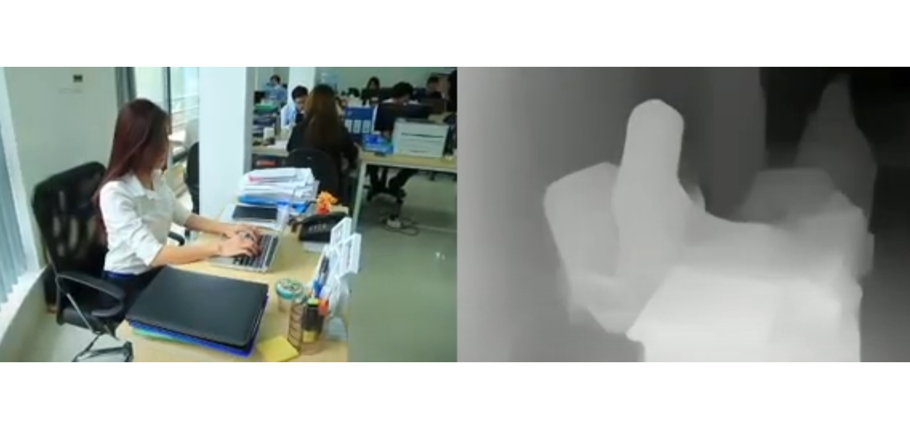
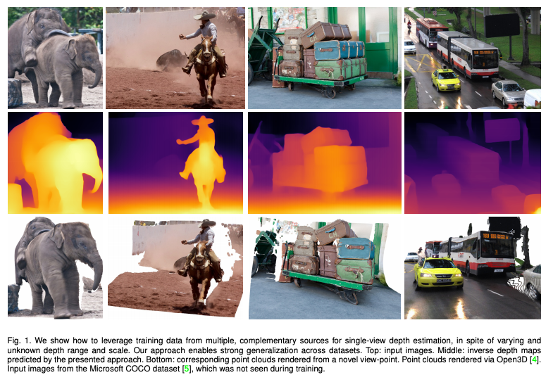
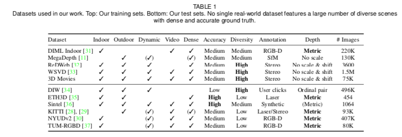

# Midas : A Machine Learning Model for Depth Estimation

# Midas : A Machine Learning Model for Depth Estimation

[](/@cochard-dav?source=post_page---byline--e96119cc1a3c---------------------------------------)

[David Cochard](/@cochard-dav?source=post_page---byline--e96119cc1a3c---------------------------------------)

3 min read

·

May 28, 2021

--

2

[Listen](/m/signin?actionUrl=https%3A%2F%2Fmedium.com%2Fplans%3Fdimension%3Dpost_audio_button%26postId%3De96119cc1a3c&operation=register&redirect=https%3A%2F%2Fmedium.com%2Faxinc-ai%2Fmidas-a-machine-learning-model-for-depth-estimation-e96119cc1a3c&source=---header_actions--e96119cc1a3c---------------------post_audio_button------------------)

Share

This is an introduction to「Midas」, a machine learning model that can be used with [ailia SDK](https://ailia.jp/en/). You can easily use this model to create AI applications using [ailia SDK](https://ailia.jp/en/) as well as many other ready-to-use [ailia MODELS](https://github.com/axinc-ai/ailia-models).

---

## Overview

*Midas* is a machine learning model that estimates depth from an arbitrary input image.

Press enter or click to view image in full size



Press enter or click to view image in full size



Source: <https://arxiv.org/pdf/1907.01341v3.pdf>

[## Towards Robust Monocular Depth Estimation: Mixing Datasets for Zero-shot Cross-dataset Transfer

### The success of monocular depth estimation relies on large and diverse training sets. Due to the challenges associated…

arxiv.org](https://arxiv.org/abs/1907.01341v3?source=post_page-----e96119cc1a3c---------------------------------------)

[## intel-isl/MiDaS

### This repository contains code to compute depth from a single image. It accompanies our paper: Towards Robust Monocular…

github.com](https://github.com/intel-isl/MiDaS?source=post_page-----e96119cc1a3c---------------------------------------)

## Architecture

Various datasets containing depth information are not compatible in terms of scale and bias. This is due to the diversity of measuring tools, including stereo cameras, laser scanners, and light sensors. *Midas* introduces a new loss function that absorbs these diversities, thereby eliminating compatibility issues and allowing multiple data sets to be used for training simultaneously.

*Midas* uses multiple datasets for training, as shown in the table below. Therefore, it can estimate the depth of images in various conditions and environments.

Press enter or click to view image in full size



Source: <https://arxiv.org/pdf/1907.01341v3.pdf>

In addition, 3D movies were also used for training to complement the existing data set.


Source: <https://arxiv.org/pdf/1907.01341v3.pdf>

Below is the loss function introduced by *Midas*.


Source: <https://arxiv.org/pdf/1907.01341v3.pdf>

The architecture of the network is based on *ResNet*.

Press enter or click to view image in full size


Source: <https://arxiv.org/pdf/1907.01341v3.pdf>

## Usage

You can use the following command to run *Midas* on the webcam video stream in ailia SDK.

```
$ python3 midas.py -v 0
```

[## axinc-ai/ailia-models

### (Image from kitti dataset http://www.cvlibs.net/datasets/kitti/raw\_data.php) Shape : (1, 3, 128, 384) Shape : (1, 128…

github.com](https://github.com/axinc-ai/ailia-models/tree/master/depth_estimation/midas?source=post_page-----e96119cc1a3c---------------------------------------)

You can also choose the higher precision `v2.1` or the faster `v2.1 small` model, which runs five times faster than the regular model and enables real-time processing.

```
$ python3 midas.py -v 0 -v21  
$ python3 midas.py -v 0 -v21 -t small
```

Here are some results.

## Related topic

[## DPT : Segmentation Model Using Vision Transformer

### This is an introduction to「DPT」, a machine learning model that can be used with ailia SDK. You can easily use this…

medium.com](/axinc-ai/dpt-segmentation-model-using-vision-transformer-b479f3027468?source=post_page-----e96119cc1a3c---------------------------------------)

---

[ax Inc.](https://axinc.jp/en/) has developed [ailia SDK](https://ailia.jp/en/), which enables cross-platform, GPU-based rapid inference.

ax Inc. provides a wide range of services from consulting and model creation, to the development of AI-based applications and SDKs. Feel free to [contact us](https://axinc.jp/en/) for any inquiry.