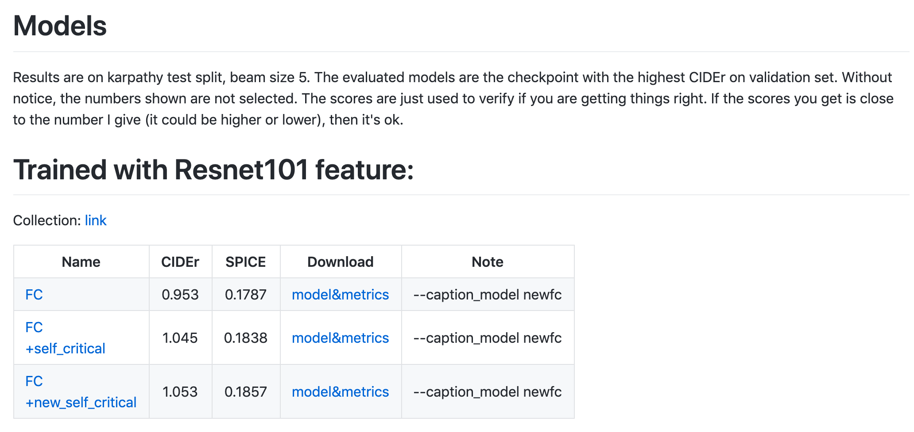

# Image Captioning Pytorch : A Machine Learning Model for Describing Images

# Image Captioning Pytorch : A Machine Learning Model for Describing Images

[](/@cochard-dav?source=post_page---byline--d27562b6f15b---------------------------------------)

[David Cochard](/@cochard-dav?source=post_page---byline--d27562b6f15b---------------------------------------)

3 min read

·

Jun 9, 2021

--

[Listen](/m/signin?actionUrl=https%3A%2F%2Fmedium.com%2Fplans%3Fdimension%3Dpost_audio_button%26postId%3Dd27562b6f15b&operation=register&redirect=https%3A%2F%2Fmedium.com%2Faxinc-ai%2Fimage-captioning-pytorch-a-machine-learning-model-for-describing-images-d27562b6f15b&source=---header_actions--d27562b6f15b---------------------post_audio_button------------------)

Share

This is an introduction to「Image Captioning Pytorch」, a machine learning model that can be used with [ailia SDK](https://ailia.jp/en/). You can easily use this model to create AI applications using [ailia SDK](https://ailia.jp/en/) as well as many other ready-to-use [ailia MODELS](https://github.com/axinc-ai/ailia-models).

---

## Overview

*Image Captioning Pytorch* is a machine learning model producing text describing what’s visible in the input image. *Image classification* consists in classifying the input image using predefined labels, whereas *Image Captioning* consists in describing the image content using natural language.


Input image (Source: http://images.cocodataset.org/train2017/000000505539.jpg）

Here is the output image caption.

> a giraffe and a zebra standing in a field (FC model)
>
> a group of zebras and a giraffe in a field（FC＋RL＋SelfCritical model）
>
> a group of zebras and a giraffe standing on a dirt road（FC＋RL＋new SelfCritical model）

[## ruotianluo/ImageCaptioning.pytorch

### This is a codebase for image captioning research. It supports: A simple demo colab notebook is available here Python 3…

github.com](https://github.com/ruotianluo/ImageCaptioning.pytorch?source=post_page-----d27562b6f15b---------------------------------------)

*Image Captioning Pytorch* has been implemented based on the following paper.

[## Self-critical Sequence Training for Image Captioning

### Recently it has been shown that policy-gradient methods for reinforcement learning can be utilized to train deep…

arxiv.org](https://arxiv.org/abs/1612.00563?source=post_page-----d27562b6f15b---------------------------------------)

## Architecture

There are two approaches to image captioning: *TopDown* and *BottomUp*.

In the *TopDown* approach, captions are generated from feature vectors computed using image classification backbone network such as *ResNet50*.

In the *BottomUp* approach, captions are generated from feature vectors computed using object detection backbone network such as *Faster R-CNN*.


Example of BottomUp approach (Source: <https://arxiv.org/pdf/1707.07998.pdf>）

*Image Captioning Pytorch* uses the *TopDown* approach, which consists of an *encoder* to compute the feature vector and a *decoder* to output the caption. The encoder uses *ResNet101* and outputs a feature vector of dimension 2048, while the decoder uses LSTM to produce a word sequence.

*Reinforcement Learning* (RL) has traditionally been proposed as a countermeasure to bias and serves as a baseline for learning image captioning. *Self Critical Sequence Training (SCST)* is also proposed, which improves the stability of reinforcement learning and provide best accuracy.

Press enter or click to view image in full size


Source: <https://arxiv.org/abs/1612.00563>

*Image Captioning Pytorch* uses an improved version Self Critical which is called *new Self Critical*.

> This “new self critical” is borrowed from “Variational inference for monte carlo objectives”. The only difference from the original self critical, is the definition of baseline.
>
> In the original self critical, the baseline is the score of greedy decoding output. In new self critical, the baseline is the average score of the other samples (this requires the model to generate multiple samples for each image).

[## ruotianluo/ImageCaptioning.pytorch

### Current ensemble only supports models which are subclass of AttModel. Here is example of the script to run ensemble…

github.com](https://github.com/ruotianluo/ImageCaptioning.pytorch/blob/master/ADVANCED.md?source=post_page-----d27562b6f15b---------------------------------------)

## Training datasets

*Image Captioning Pytorch* has been trained on the *MSCOCO* and *Flickr 30k* datasets.

[## COCO — Common Objects in Context

### Edit description

cocodataset.org](https://cocodataset.org/?source=post_page-----d27562b6f15b---------------------------------------#home)

[## BryanPlummer/flickr30k\_entities

### If you use our dataset, please cite our paper: @article{flickrentitiesijcv, title={Flickr30K Entities: Collecting…

github.com](https://github.com/BryanPlummer/flickr30k_entities?source=post_page-----d27562b6f15b---------------------------------------)

## Image Captioning Pytorch accuracy

Accuracy measurements are presented in `MODEL_ZOO.md`

Press enter or click to view image in full size



Source: <https://github.com/ruotianluo/ImageCaptioning.pytorch/blob/master/MODEL_ZOO.md>

## Usage

Use the following command to use *Image Captioning Pytorch* to generate caption of images from the webcam video stream.

```
$ python3 image_captioning_pytorch.py -v 0
```

The models `FC`, `FC+RL+SelfCritical`, and `FC+RL+NewSelfCritical` can be selected by respectively specifying `fc`, `fc_rl`, and `fc_nsc` in the model option.

*Image Captioning Pytorch* is available with ailia SDK 1.2.5 or newer.

[## axinc-ai/ailia-models

### (Image from http://images.cocodataset.org/train2017/000000505539.jpg) a giraffe and a zebra standing in a field…

github.com](https://github.com/axinc-ai/ailia-models/tree/master/image_captioning/image_captioning_pytorch?source=post_page-----d27562b6f15b---------------------------------------)

---

[ax Inc.](https://axinc.jp/en/) has developed [ailia SDK](https://ailia.jp/en/), which enables cross-platform, GPU-based rapid inference.

ax Inc. provides a wide range of services from consulting and model creation, to the development of AI-based applications and SDKs. Feel free to [contact us](https://axinc.jp/en/) for any inquiry.