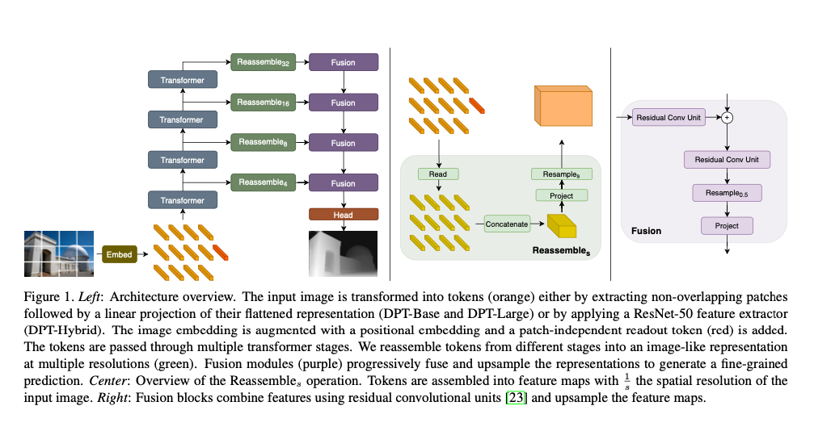
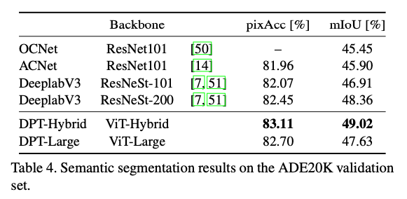
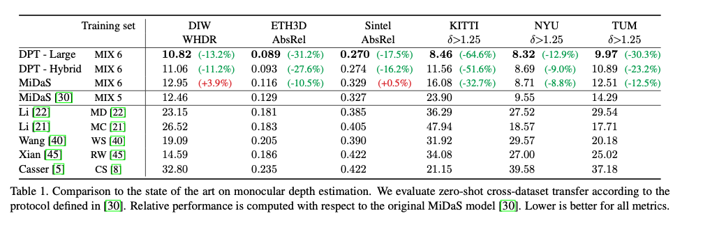
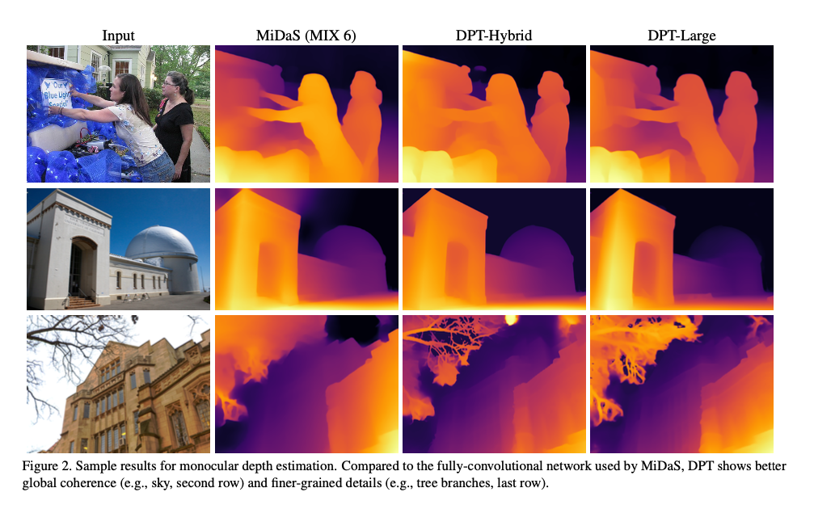
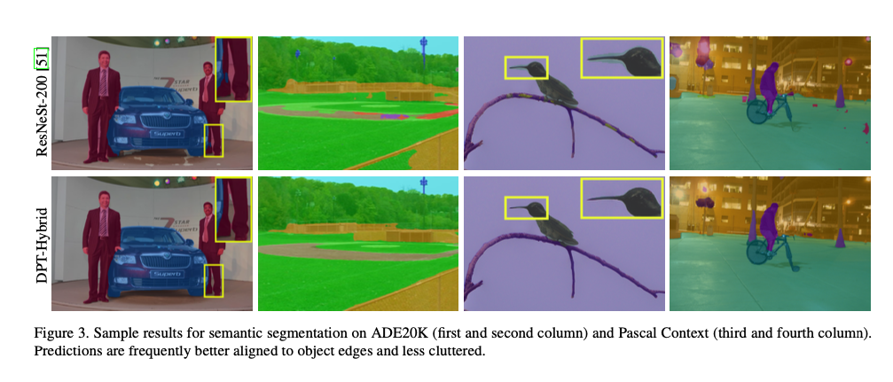

# DPT : Segmentation Model Using Vision Transformer

# DPT : Segmentation Model Using Vision Transformer

[](/@cochard-dav?source=post_page---byline--b479f3027468---------------------------------------)

[David Cochard](/@cochard-dav?source=post_page---byline--b479f3027468---------------------------------------)

3 min read

·

Jun 10, 2021

--

[Listen](/m/signin?actionUrl=https%3A%2F%2Fmedium.com%2Fplans%3Fdimension%3Dpost_audio_button%26postId%3Db479f3027468&operation=register&redirect=https%3A%2F%2Fmedium.com%2Faxinc-ai%2Fdpt-segmentation-model-using-vision-transformer-b479f3027468&source=---header_actions--b479f3027468---------------------post_audio_button------------------)

Share

This is an introduction to「DPT」, a machine learning model that can be used with [ailia SDK](https://ailia.jp/en/). You can easily use this model to create AI applications using [ailia SDK](https://ailia.jp/en/) as well as many other ready-to-use [ailia MODELS](https://github.com/axinc-ai/ailia-models).

---

## Overview

*DPT (DensePredictionTransformers)* is a segmentation model released by Intel in March 2021 that applies *vision transformers* to images. It can perform image semantic segmentation with 49.02% mIoU on ADE20K, and it can also be used for monocular depth estimation with an improvement of up to 28% in relative performance when compared to a state-of-the-art fully-convolutional network.

[## Vision Transformers for Dense Prediction

### We introduce dense vision transformers, an architecture that leverages vision transformers in place of convolutional…

arxiv.org](https://arxiv.org/abs/2103.13413?source=post_page-----b479f3027468---------------------------------------)

## Architecture

In *DPT*, v*ision transformers (ViT)*are used instead of convolutional network. Using transformers allows to make more detailed and globally consistent predictions compared to convolutional networks. In particular, performance is improved when a large amount of training data is available.

Press enter or click to view image in full size



Source: <https://arxiv.org/pdf/2103.13413>

The *encoder* divides the image into tiles, which are then tokenized (*Embed* in the graph above), and transformers process it. The process marked as *Embed* is a patch-based method to divide image into tiles, and tokenize the pixel feature map obtained by applying *ResNet50* to the input image.

The *decoder* in DPT converts the output of each resolution of the transformer into an image like representation and uses a convolutional network to generate the segmentation image.

There are three model architectures defined in DPT: *ViT-Base, ViT-Large*, and *ViT-Hybrid*. *ViT-Base* performs patch-based embedding and has 12 transformer layers. *ViT-Large* performs the same embedding as *ViT-Base*, but has 24 transformer layers and a larger feature size. *ViT-Hybrid* performs embedding using *ResNet50* and has 12 transformer layers.

## DPT accuracy

*DPT* sets a new state of the art for the semantic segmentation task on ADE20K, a large data set with 150 classes.



Source: <https://arxiv.org/pdf/2103.13413>

It is also the state of the art after some fine-tuning on smaller datasets such as *NYUv2*, *KITTI*, and *Pascal Context*.

Press enter or click to view image in full size



Source: <https://arxiv.org/pdf/2103.13413>

Below is a comparison of [*MiDaS*](/axinc-ai/midas-a-machine-learning-model-for-depth-estimation-e96119cc1a3c)and *DPT* for depth estimation. DPT is able to predict the depth inmore detail. It can also improve the accuracy of large homogeneous regions and relative positioning within an image, which is a shortcoming of convolution networks.

Press enter or click to view image in full size



Source: <https://arxiv.org/pdf/2103.13413>

Below is a comparison for the segmentation task. DPT tends to produce more detailed output at object boundaries, and it tends to produce less cluttered output in some cases.

Press enter or click to view image in full size



Source: <https://arxiv.org/pdf/2103.13413>

## Usage

You can use the following commands to perform segmentation and depth estimation on the input images with ailia SDK.

```
$ python3 dense_prediction_transformers.py -i input.jpg -s output.png --task=segmentation -e 0$ python3 dense_prediction_transformers.py -i input.jpg -s output.png--task=monodepth -e 0
```

[## axinc-ai/ailia-models

### image file (576x384) (Image from…

github.com](https://github.com/axinc-ai/ailia-models/tree/master/image_segmentation/dense_prediction_transformers?source=post_page-----b479f3027468---------------------------------------)

Here is a result you can expect.

## Related topics

[## Midas : A Machine Learning Model for Depth Estimation

medium.com](/axinc-ai/midas-a-machine-learning-model-for-depth-estimation-e96119cc1a3c?source=post_page-----b479f3027468---------------------------------------)

[## HumanPartSegmentation : A Machine Learning Model for Segmenting Human Parts

medium.com](/axinc-ai/humanpartsegmentation-a-machine-learning-model-for-segmenting-human-parts-cd7e39480714?source=post_page-----b479f3027468---------------------------------------)

---

[ax Inc.](https://axinc.jp/en/) has developed [ailia SDK](https://ailia.jp/en/), which enables cross-platform, GPU-based rapid inference.

ax Inc. provides a wide range of services from consulting and model creation, to the development of AI-based applications and SDKs. Feel free to [contact us](https://axinc.jp/en/) for any inquiry.