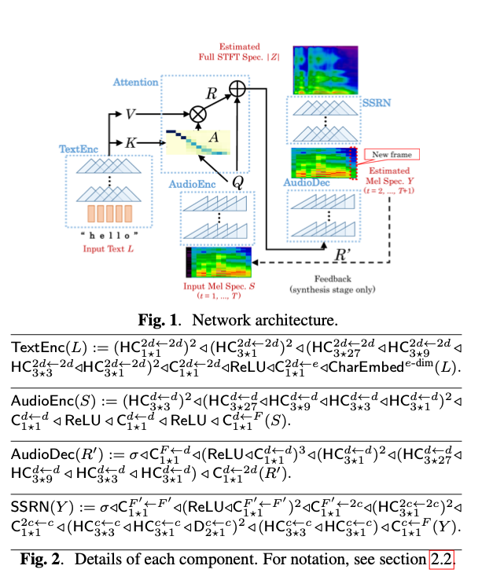
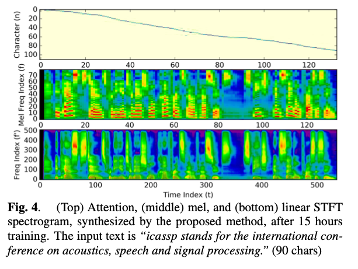

# PytorchDcTts : A Machine Learning Model for Text-to-speech Synthesis

# PytorchDcTts : A Machine Learning Model for Text-to-speech Synthesis

[](/@cochard-dav?source=post_page---byline--2273e269b480---------------------------------------)

[David Cochard](/@cochard-dav?source=post_page---byline--2273e269b480---------------------------------------)

3 min read

·

Jun 10, 2021

--

[Listen](/m/signin?actionUrl=https%3A%2F%2Fmedium.com%2Fplans%3Fdimension%3Dpost_audio_button%26postId%3D2273e269b480&operation=register&redirect=https%3A%2F%2Fmedium.com%2Faxinc-ai%2Fpytorchdctts-a-machine-learning-model-for-text-to-speech-synthesis-2273e269b480&source=---header_actions--2273e269b480---------------------post_audio_button------------------)

Share

This is an introduction to「PytorchDcTts」, a machine learning model that can be used with [ailia SDK](https://ailia.jp/en/). You can easily use this model to create AI applications using [ailia SDK](https://ailia.jp/en/) as well as many other ready-to-use [ailia MODELS](https://github.com/axinc-ai/ailia-models).

---

## Overview

*PytorchDcTts (Pytorch Deep Convolutional Text-to-Speech)* is a machine learning model released in October 2017. It is capable of generating an audio file of a voice pronouncing a given input text.

[## Efficiently Trainable Text-to-Speech System Based on Deep Convolutional Networks with Guided…

### This paper describes a novel text-to-speech (TTS) technique based on deep convolutional neural networks (CNN), without…

arxiv.org](https://arxiv.org/abs/1710.08969?source=post_page-----2273e269b480---------------------------------------)

## Architecture

*Recursive Neural Networks (RNN)* are commonly used for speech synthesis tasks, but they have the problem of taking a long time to learn. To address this problem, *PytorchDcTts* uses CNNs to construct speech synthesis, which can be learned in about 15 hours on a typical gaming PC.

Speech synthesis without deep learning relies on a complex system with multiple components such as text analyzer, F0 generator, spectrum generator, pause estimator, and vocoder.

With deep learning, these multiple components can be aggregated into a single end-to-end model, allowing input to output to be computed directly.

The model architecture of *PytorchDcTts* works as follows.



Source: <https://arxiv.org/pdf/1710.08969>

In the flow diagram above, the input text is vectorized using *TextEnc.* *Attention* creates pairs of text and melspectogram with weigths. Then *AudioDec* compute the melspectrum and the *SSRN (Spectrogram Super-resolution Netrowk)* is used to improve the audio quality.

Below is an example of speech synthesis. From the top, we can see *Attention*, mel spectrogram, and linear STFT spectrogram.

Press enter or click to view image in full size



Source: <https://arxiv.org/pdf/1710.08969>

The *LJ Speech Dataset* was used for training, which consists of 13K pairs of text and associated speeches, for a total of 24 hours of data.

[## The LJ Speech Dataset

### This is a public domain speech dataset consisting of 13,100 short audio clips of a single speaker reading passages from…

keithito.com](https://keithito.com/LJ-Speech-Dataset/?source=post_page-----2273e269b480---------------------------------------)

## Usage

You can use the following command to output a wav file from any English text.

```
$ python3 pytorch-dc-tts.py -i "Hello world" -s output.wav
```

Here is an example of the output speech of an input text introducing ailia SDK.

[## axinc-ai/ailia-models

### A sentence which is defined as SENTENCE in pytorch-dc-tts.py. The Voice file is output as .wav which path is defined as…

github.com](https://github.com/axinc-ai/ailia-models/tree/master/audio_processing/pytorch-dc-tts?source=post_page-----2273e269b480---------------------------------------)

---

[ax Inc.](https://axinc.jp/en/) has developed [ailia SDK](https://ailia.jp/en/), which enables cross-platform, GPU-based rapid inference.

ax Inc. provides a wide range of services from consulting and model creation, to the development of AI-based applications and SDKs. Feel free to [contact us](https://axinc.jp/en/) for any inquiry.