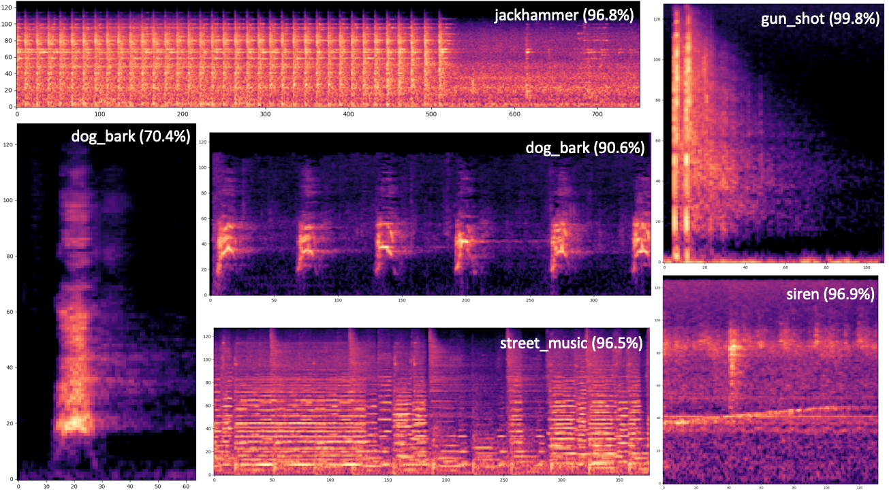
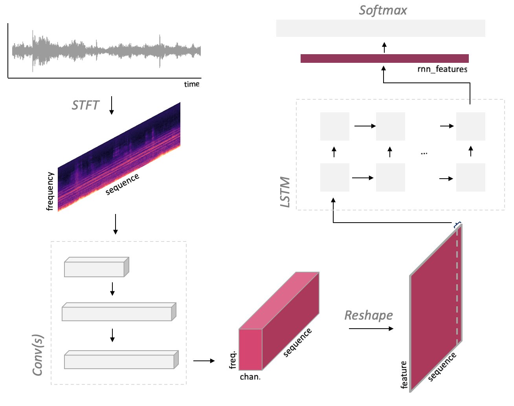

# CrnnSoundClassification : A Machine Learning Model for Classifying Sound

# CrnnSoundClassification : A Machine Learning Model for Classifying Sound

[](/@cochard-dav?source=post_page---byline--8e45d1f22fa---------------------------------------)

[David Cochard](/@cochard-dav?source=post_page---byline--8e45d1f22fa---------------------------------------)

3 min read

·

Jun 23, 2021

--

[Listen](/m/signin?actionUrl=https%3A%2F%2Fmedium.com%2Fplans%3Fdimension%3Dpost_audio_button%26postId%3D8e45d1f22fa&operation=register&redirect=https%3A%2F%2Fmedium.com%2Faxinc-ai%2Fcrnnsoundclassification-a-machine-learning-model-for-classifying-sound-8e45d1f22fa&source=---header_actions--8e45d1f22fa---------------------post_audio_button------------------)

Share

This is an introduction to「CrnnSoundClassification」, a machine learning model that can be used with [ailia SDK](https://ailia.jp/en/). You can easily use this model to create AI applications using [ailia SDK](https://ailia.jp/en/) as well as many other ready-to-use [ailia MODELS](https://github.com/axinc-ai/ailia-models).

---

## Overview

*CrnnSoundClassification* is a machine learning model that takes an audio file as input and classifies it into 10 categories.

Press enter or click to view image in full size



Source: <https://github.com/ksanjeevan/crnn-audio-classification>

The following categories of sound can be recognized.

> air\_conditioner, car\_horn, children\_playing, dog\_bark, drilling, enginge\_idling, gun\_shot, jackhammer, siren, and street\_music

[## ksanjeevan/crnn-audio-classification

### UrbanSound classification using Convolutional Recurrent Networks in PyTorch — ksanjeevan/crnn-audio-classification

github.com](https://github.com/ksanjeevan/crnn-audio-classification?source=post_page-----8e45d1f22fa---------------------------------------)

## Architecture

*CrnnSoundClassification* performs a *mel spectrogram transformation* on the input audio to convert it into a spectrum, then uses Convolutional Neural Network (CNN) and Long Short-Term Memory (LSTM) to compute features, and classifies it using FC and Softmax.

Press enter or click to view image in full size



Source: <https://github.com/ksanjeevan/crnn-audio-classification>

The parameters for the spectral transformation are defined in `net/model.py`

> self.spec = MelspectrogramStretch(hop\_length=None, num\_mels=128, fft\_length=2048, norm=’whiten’, stretch\_param=[0.4, 0.4])

The input has a variable size defined by `(1,2,num_seconds * sample_rate)`. For example, given a 2-channel and 66026-sample wav file (66026, 2) as input, it will be converted to (1,66026,1), components being respectively (*batch, samples, channel*), by `AudioInference.infer`. This is then converted to a Mel spectrum, and the result (1, 1, 128, 65), components being respectively (*batch, padding, bins, times*), becomes the input of the CNN. Following the same logic, a wav file (99225, 2) will be transformed to (1,1,128,97) as input to Conv(s).

The CNN executes 3x3 maxpool once and 4x4 maxpools twice. If the width is (128,65), the given input size is (64x8x2) and the computed output size is (64x2x0), and an error `*Output size is too small`* occurs. This is the reason why padding is required for short samples.

*CrnnSoundClassification* has been trained using the *UrbanSound8K* dataset, a collection of field recordings uploaded to [www.freesound.org](http://www.freesound.org/)

[## UrbanSound8K

### This dataset contains 8732 labeled sound excerpts (<=4s) of urban sounds from 10 classes: air\_conditioner, car\_horn…

urbansounddataset.weebly.com](https://urbansounddataset.weebly.com/urbansound8k.html?source=post_page-----8e45d1f22fa---------------------------------------)

## CrnnSoundClassification inference using Pytorch

You can use the trained model from the following Issue to run inference with Pytorch.

[## Model · Issue #2 · ksanjeevan/crnn-audio-classification

### You can’t perform that action at this time. You signed in with another tab or window. You signed out in another tab or…

github.com](https://github.com/ksanjeevan/crnn-audio-classification/issues/2?source=post_page-----8e45d1f22fa---------------------------------------)

`config.json` specifies the training configuration, `model.cfg` defines the model architecture, and `model_best.pth` contains the weights.

Use the following command to run the inference.

```
$ python3 run.py dog.wav -r downloaded_model/model_best.pth
```

By default, `model.cfg` is loaded from the full path contained in the pth file (see `run.py`, line 168). If you want to use a different path on your machine, you need to rewrite the path to `model.cfg` after `config = checkpoint[‘config’]` in `args.resume` as follows.

```
config[“cfg”] = “./downloaded_model/model.cfg”
```

Internally, the network is built from `model.cfg` using *torchparse*. If this path is wrong, the following error will occur.

> File “/crnn-audio-classification/net/model.py”, line 55, in forward  
>  xt = [self.net](http://self.net/)[‘convs’](xt)  
> KeyError: ‘convs’

## Retraining of CrnnSoundClassification

By creating a csv file following the format of *UrbanSound8K*, it is possible to retrain the model with your own data set.

```
./run.py train -c config.json — cfg arch.cfg
```

The layout of the data set is shown below.

> UrbanSound8K/audio/fold1/\*.wav  
> UrbanSound8K/audio/fold2/\*.wav  
> UrbanSound8K/metadata/UrbanSound8K.csv

The csv file follow the following format.

> slice\_file\_name , fsID , start , end , salience , fold , classID , class  
> 100032–3–0–0.wav , 100032 , 0.0 , 0.317551 , 1 , 5 , 3 , dog\_bark

## Usage in ailia SDK

You can classify any input audio file using ailia SDK with the following command.

```
$ python3 crnn_sound_classification.py -i dog.wav
```

In this example, `dog.wav` will be classified as `dog_bark`.

> dog\_bark  
> 0.8683825731277466

[## axinc-ai/ailia-models

### Pretrained models for ailia SDK. Contribute to axinc-ai/ailia-models development by creating an account on GitHub.

github.com](https://github.com/axinc-ai/ailia-models/tree/master/audio_processing/crnn_audio_classification?source=post_page-----8e45d1f22fa---------------------------------------)

---

[ax Inc.](https://axinc.jp/en/) has developed [ailia SDK](https://ailia.jp/en/), which enables cross-platform, GPU-based rapid inference.

ax Inc. provides a wide range of services from consulting and model creation, to the development of AI-based applications and SDKs. Feel free to [contact us](https://axinc.jp/en/) for any inquiry.