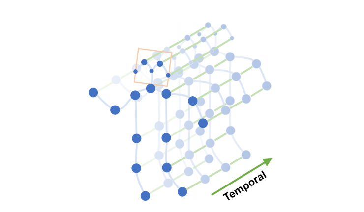
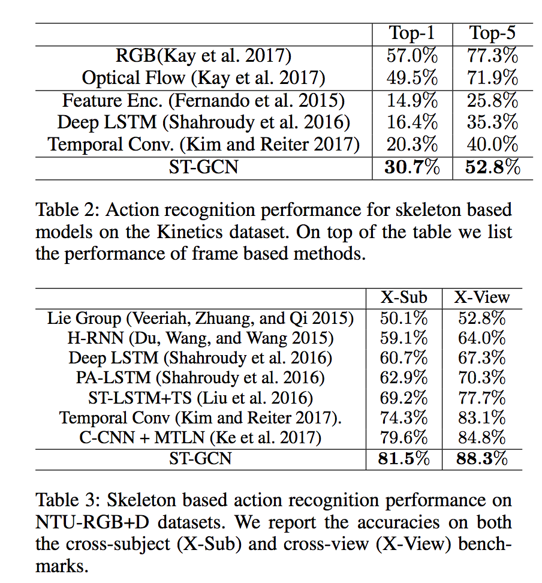

# ST-GCN : A Machine Learning Model for Detecting Human Actions from Skeletons

# ST-GCN : A Machine Learning Model for Detecting Human Actions from Skeletons

[](/@cochard-dav?source=post_page---byline--46a95b31b5db---------------------------------------)

[David Cochard](/@cochard-dav?source=post_page---byline--46a95b31b5db---------------------------------------)

7 min read

·

Jun 23, 2021

--

2

[Listen](/m/signin?actionUrl=https%3A%2F%2Fmedium.com%2Fplans%3Fdimension%3Dpost_audio_button%26postId%3D46a95b31b5db&operation=register&redirect=https%3A%2F%2Fmedium.com%2Faxinc-ai%2Fst-gcn-a-machine-learning-model-for-detecting-human-actions-from-skeletons-46a95b31b5db&source=---header_actions--46a95b31b5db---------------------post_audio_button------------------)

Share

This is an introduction to「ST-GCN」, a machine learning model that can be used with [ailia SDK](https://ailia.jp/en/). You can easily use this model to create AI applications using [ailia SDK](https://ailia.jp/en/) as well as many other ready-to-use [ailia MODELS](https://github.com/axinc-ai/ailia-models).

---

## Overview

*ST-GCN* (*Spatial-Temporal Graph Convolutional Network*s) is a machine learning model that detects human actions based on skeletal information obtained from *OpenPose* and other sources proposed in January 2018.

[## Spatial Temporal Graph Convolutional Networks for Skeleton-Based Action Recognition

### Dynamics of human body skeletons convey significant information for human action recognition. Conventional approaches…

arxiv.org](https://arxiv.org/abs/1801.07455?source=post_page-----46a95b31b5db---------------------------------------)

[## yysijie/st-gcn

### ST-GCN has transferred to MMSkeleton, and keep on developing as an flexible open source toolbox for skeleton-based…

github.com](https://github.com/yysijie/st-gcn?source=post_page-----46a95b31b5db---------------------------------------)

It is trained on *NTU RGB-D* or *Kinetics* datasets and can detect the following 60 categories of actions.

> The dataset consists of 60 labelled actions. Specifically: drink water, eat meal/snack, brushing teeth, brushing hair, drop, pickup, throw, sitting down, standing up (from sitting position), clapping, reading, writing, tear up paper, wear jacket, take off jacket, wear a shoe, take off a shoe, wear on glasses, take off glasses, put on a hat/cap, take off a hat/cap, cheer up, hand waving, kicking something, put something inside pocket / take out something from pocket, hopping (one foot jumping), jump up, make a phone call/answer phone, playing with phone/tablet, typing on a keyboard, pointing to something with finger, taking a selfie, check time (from watch), rub two hands together, nod head/bow, shake head, wipe face, salute, put the palms together, cross hands in front (say stop), sneeze/cough, staggering, falling, touch head (headache), touch chest (stomachache/heart pain), touch back (backache), touch neck (neckache), nausea or vomiting condition, use a fan (with hand or paper)/feeling warm, punching/slapping other person, kicking other person, pushing other person, pat on back of other person, point finger at the other person, hugging other person, giving something to other person, touch other person’s pocket, handshaking, walking towards each other and walking apart from each other.
>
> Source: <https://en.m.wikipedia.org/wiki/NTU_RGB-D_dataset>

## ST-GCN input and output

*ST-GCN* input is formatted as (1, 3, 300, 18, 2), which corresponds to (*batch, channel, frame, joint, person*). `channel=0` is the x-coordinate of the joint normalized within than range [-0.5, 0.5], `channel=1` is the corresponding y-coordinate, `channel=2` is the confidence value, `joint` is the joint index in the skeleton, and `person` is person index.

The output will be the confidence value of (*batch,class,output\_frame,joint,person*). To detect an action, sum up the confidence values for each class and select the class with the highest value. `output_frame` will be the number of input frames divided by 4.

> voting\_label = output.sum(axis=3).sum(axis=2).sum(axis=1).argmax(axis=0)

The features output is only used to visualize which keypoints have contributed to the detected action.

## Architecture

*ST-GCN* uses *graph convolution* to estimate actions from the spatial temporal graph of a skeleton sequence.

Press enter or click to view image in full size



Source: <https://arxiv.org/pdf/1801.07455.pdf>

Blue dots denote the body joints and blue edges between body joints defines natural connections in human bodies.

Press enter or click to view image in full size


Source: <https://arxiv.org/pdf/1801.07455.pdf>

*Graph convolution* performs convolutions based on the connection information between nodes. If node B and node C are connected to node A, it performs convolution on the values of A, B, and C. This makes it possible to apply machine learning to the vertex information of 3D models. Graph convolution is a higher level concept of conventional convolution, and when nodes are connected in a mesh, the operation is equivalent to conventional convolution.

Compared to the conventional 3D convolution for action detection, ST-GCN is much faster because it can estimate actions based on skeletal information only. Also, rather than simply applying 2D convolution to the skeletal information alone, graph convolution also takes into account the relationship between key points of the skeleton, resulting in higher accuracy.

ST-GCN takes a 5-dimension input (*batch,channel,frame,joint,person*). Applied to the [*NTU-RGB+D* datasets](http://rose1.ntu.edu.sg/Datasets/actionRecognition.asp) it represents a (1,3,300,18,2) input and performs as shown in the table below.

Press enter or click to view image in full size



Source: <https://arxiv.org/pdf/1801.07455.pdf>

The current state-of-the-art action detection models are listed in the link below.

[## Papers with Code — NTU RGB+D Benchmark (Skeleton Based Action Recognition)

### The current state-of-the-art on NTU RGB+D is RNX3D101+MS-AAGCN-C. See a full comparison of 76 papers with code.

paperswithcode.com](https://paperswithcode.com/sota/skeleton-based-action-recognition-on-ntu-rgbd?source=post_page-----46a95b31b5db---------------------------------------)

*ST-GCN* needs to handle tensors in 5 dimensions even during inference, therefore it requires a framework that supports 5D tensors. It also uses the `einsum` operator, which requires the use of ONNX `opset=12` or a rewrite using supported operators. See details about ONNX export in the dedicated section below.

[## Failed to export onnx model · Issue #202 · open-mmlab/mmskeleton

### Dismiss GitHub is home to over 50 million developers working together to host and review code, manage projects, and…

github.com](https://github.com/open-mmlab/mmskeleton/issues/202?source=post_page-----46a95b31b5db---------------------------------------)

## Training datasets

*ST-GCN* has been trained using 3D skeletons from *NTU-RGB+D* (5.8GB) and skeletons extracted using *OpenPose* from the *Kinetics* action video dataset (7.5GB).

[## Rapid-Rich Object Search (ROSE) Lab

### This page introduces two datasets: “NTU RGB+D” and “NTU RGB+D 120”. “NTU RGB+D” contains 60 action classes and 56,880…

rose1.ntu.edu.sg](http://rose1.ntu.edu.sg/datasets/actionrecognition.asp?source=post_page-----46a95b31b5db---------------------------------------)

[## Kinetics

### A large-scale, high-quality dataset of URL links to approximately 300,000 video clips that covers 400 human action…

deepmind.com](https://deepmind.com/research/open-source/kinetics?source=post_page-----46a95b31b5db---------------------------------------)

The data and labels to be used for training are specified in the *yaml* file below.

[## yysijie/st-gcn

### You can’t perform that action at this time. You signed in with another tab or window. You signed out in another tab or…

github.com](https://github.com/yysijie/st-gcn/blob/master/config/st_gcn/kinetics-skeleton/train.yaml?source=post_page-----46a95b31b5db---------------------------------------)

## Training on your own dataset

The `kinetics_train` folder contains *json* data containing the pose keypoints. If you want to train on your own data set, create a file equivalent to this *json* file according to the following format.

> {“data”: [{“frame\_index”: 1, “skeleton”: [{“pose”: [0.518, 0.139, 0.442, 0.272, 0.399, 0.288, 0.315, 0.400, 0.350, 0.549, 0.487, 0.264, 0.507, 0.356, 0.548, 0.408, 0.413, 0.584, 0.401, 0.785, 0.383, 0.943, 0.497, 0.582, 0.485, 0.750, 0.479, 0.908, 0.514, 0.119, 0.000, 0.000, 0.483, 0.128, 0.000, 0.000], “score”: [0.305, 0.645, 0.647, 0.865, 0.841, 0.505, 0.361, 0.726, 0.487, 0.708, 0.546, 0.575, 0.695, 0.713, 0.343, 0.000, 0.395, 0.000]}]}, {“frame\_index”: 2, “skeleton”: [{“pose”: [0.516, 0.155, 0.438, 0.272, 0.395, 0.288, 0.315, 0.405, 0.352, 0.552, 0.483, 0.261, 0.505, 0.351, 0.548, 0.416, 0.413, 0.590, 0.401, 0.791, 0.383, 0.946, 0.499, 0.587, 0.487, 0.750, 0.481, 0.910, 0.516, 0.136, 0.000, 0.000, 0.495, 0.141, 0.000, 0.000], “score”: [0.249, 0.678, 0.624, 0.838, 0.858, 0.506, 0.293, 0.706, 0.471, 0.728, 0.567, 0.566, 0.665, 0.719, 0.367, 0.000, 0.593, 0.000]}]}, …, “label”: “jumping into pool”, “label\_index”: 172}

The `pose` of the skeleton contains 18 keypoints in `xyxy` order. `score` contains the confidence values. `skeleton` is an array to handle the case where the video contains several people. `frame_index` should start from 1. Note that data must be less than 300 frames.

The label information can be found in `kinetics_train_label.json`, in the format described below. The key is the file name from where it will read the pose information as described above. `label_index` starts from 0.

> “ — -QUuC4vJs”: {  
> “has\_skeleton”: true,  
> “label”: “testifying”,  
> “label\_index”: 354  
> },  
> “ — 3ouPhoy2A”: {  
> “has\_skeleton”: true,  
> “label”: “eating spaghetti”,  
> “label\_index”: 116  
> },

Before training, generate the *npy* file from the above *json*.

```
$ python3 tools/kinetics_gendata.py — data_path /dataset/kinetics-skeleton — out_folder /dataset/kinetics-skeleton
```

Then run the training command below.

```
$ python3 main.py recognition -c ../train_kinetics.yaml — use_gpu False
```

Since `drop_last=True` is specified in the *DataLoader* during training, *Loss* becomes `NaN` when the amount of data is small. In that case, set `batch_size` to 1 in the configuration *yaml* file.

## Export to ONNX

You need to replace the `einsum` operator in `net/utils/tgcn.py`

> #x = torch.einsum(‘nkctv,kvw->nctw’, (x, A))
>
> x = x.permute(0, 2, 3, 1, 4).contiguous()  
> n, c, t, k, v = x.size()  
> k, v, w = A.size()  
> x = x.view(n \* c \* t, k \* v)  
> A = A.view(k \* v, w)  
> x = torch.mm(x, A)  
> x = x.view(n, c, t, w)

[## Failed to export onnx model · Issue #202 · open-mmlab/mmskeleton

### Dismiss GitHub is home to over 50 million developers working together to host and review code, manage projects, and…

github.com](https://github.com/open-mmlab/mmskeleton/issues/202?source=post_page-----46a95b31b5db---------------------------------------)

If the error `RuntimeError: Failed to export an ONNX attribute ‘onnx::Gather’, since it’s not constant, please try to make things (e.g., kernel size) static if possible` still occurs, you also need to alter `st_gcn.py` as shown below.

> #x = F.avg\_pool2d(x, x.size()[2:])  
> x = F.avg\_pool2d(x, (75,18))

After making the above changes, the following code performs the export.

> self.model.eval()  
> class ExportStgcnModel(torch.nn.Module):  
>  def \_\_init\_\_(self, model):  
>  super(ExportStgcnModel, self).\_\_init\_\_()  
>  self.model = model  
> def forward(self, x):  
>  return self.model.extract\_feature(x)
>
> from torch.autograd import Variable  
> x = Variable(torch.randn(1, 3, 300, 18, 2)) # (1, channel, frame, joint, person)  
> output = self.model(x)  
> export\_model = ExportStgcnModel(self.model)  
> torch.onnx.export(export\_model, x, ‘st-gcn\_pytorch.onnx’, verbose=True, opset\_version=10)

`torch 1.5.0` must be used for the export because the following error occurs in`torch 1.6.0` caused by the internal optimization process.

> # File “/usr/local/lib/python3.7/site-packages/torch/onnx/utils.py”, line 409, in \_model\_to\_graph  
> #\_export\_onnx\_opset\_version)  
> #RuntimeError: expected 1 dims but tensor has 2

## Usage

The following command can be used to perform the *OpenPose* skeleton detection followed by the *ST-GCN* action detection with ailia SDK.

```
$ python3 st-gcn.py -v 0
```

[## axinc-ai/ailia-models

### Video (Video from https://github.com/yysijie/st-gcn/blob/master/resource/media/skateboarding.mp4) Pose estimate Shape …

github.com](https://github.com/axinc-ai/ailia-models/tree/master/action_recognition/st_gcn?source=post_page-----46a95b31b5db---------------------------------------)

---

[ax Inc.](https://axinc.jp/en/) has developed [ailia SDK](https://ailia.jp/en/), which enables cross-platform, GPU-based rapid inference.

ax Inc. provides a wide range of services from consulting and model creation, to the development of AI-based applications and SDKs. Feel free to [contact us](https://axinc.jp/en/) for any inquiry.