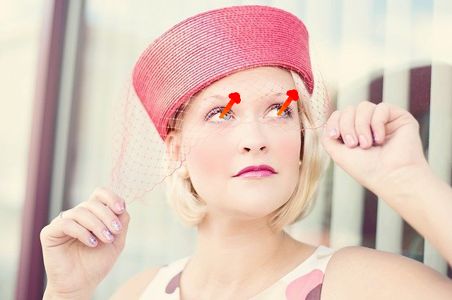

# AxGazeEstimation : A Machine Learning Model for Estimating Gaze

# AxGazeEstimation : A Machine Learning Model for Estimating Gaze

[](/@cochard-dav?source=post_page---byline--c9648042d637---------------------------------------)

[David Cochard](/@cochard-dav?source=post_page---byline--c9648042d637---------------------------------------)

2 min read

·

Jun 29, 2021

--

[Listen](/m/signin?actionUrl=https%3A%2F%2Fmedium.com%2Fplans%3Fdimension%3Dpost_audio_button%26postId%3Dc9648042d637&operation=register&redirect=https%3A%2F%2Fmedium.com%2Faxinc-ai%2Faxgazeestimation-a-machine-learning-model-for-estimating-gaze-c9648042d637&source=---header_actions--c9648042d637---------------------post_audio_button------------------)

Share

This is an introduction to「AxGazeEstimation」, a machine learning model that can be used with [ailia SDK](https://ailia.jp/en/). You can easily use this model to create AI applications using [ailia SDK](https://ailia.jp/en/) as well as many other ready-to-use [ailia MODELS](https://github.com/axinc-ai/ailia-models).

---

## Overview

*AxGazeEstimation* is a machine learning model developed by [ax Inc](https://axinc.jp/en/). to detect the direction of gaze of a person from an input image.



Source: <https://pixabay.com/ja/photos/%E3%83%93%E3%83%B3%E3%83%86%E3%83%BC%E3%82%B8-%E5%A5%B3%E6%80%A7-%E5%B8%BD%E5%AD%90-635244/>

## Architecture

*AxGazeEstimation* uses [*BlazeFace*](/axinc-ai/blazeface-a-machine-learning-model-for-fast-detection-of-face-positions-and-key-points-5dcfb9429d72)to detect faces in an image and estimates the gaze using the detected face as input. Two methods of gaze estimation are available: direct estimation from the face image, and estimation from face image combined with face orientation.

The network backbone uses a reduced version of *ResNet50* (stage 3).

The training was performed using our in-house dataset made of 97,059 training images, and 11,775 validation images.

## Usage

Use the following command to run the gaze estimation on the webcam video stream.

```
$ python3 ax_gaze_estimation.py -v 0
```

The following command can be used to estimate the face orientation in combination with the face detection.

```
$ python3 ax_gaze_estimation.py -v 0 --include-head-pose
```

[## axinc-ai/ailia-models

### (Image from https://pixabay.com/photos/vintage-woman-hat-fashion-style-635244/) ailia input shape: (1, 3, 128, 128) RGB…

github.com](https://github.com/axinc-ai/ailia-models/tree/master/face_recognition/ax_gaze_estimation?source=post_page-----c9648042d637---------------------------------------)

Here is an example of *AxGazeEstimation* in action.

## Related topics

[## BlazeFace : A Machine Learning Model for Fast Detection of Face Positions and Key Points

medium.com](/axinc-ai/blazeface-a-machine-learning-model-for-fast-detection-of-face-positions-and-key-points-5dcfb9429d72?source=post_page-----c9648042d637---------------------------------------)

[## HOPE-Net : A Machine Learning Model for Estimating Face Orientation

### This is an introduction to「HOPE-Net」, a machine learning model that can be used with ailia SDK. You can easily use this…

medium.com](/axinc-ai/hope-net-a-machine-learning-model-for-estimating-face-orientation-83d5af26a513?source=post_page-----c9648042d637---------------------------------------)

[## MediaPipe Iris: Detecting Key Points in the Eye

### This is an introduction to「MediaPipe Iris」, a machine learning model that can be used with ailia SDK. You can easily…

medium.com](/axinc-ai/mediapipe-iris-detecting-key-points-in-the-eye-637f5c1e728e?source=post_page-----c9648042d637---------------------------------------)

---

[ax Inc.](https://axinc.jp/en/) has developed [ailia SDK](https://ailia.jp/en/), which enables cross-platform, GPU-based rapid inference.

ax Inc. provides a wide range of services from consulting and model creation, to the development of AI-based applications and SDKs. Feel free to [contact us](https://axinc.jp/en/) for any inquiry.