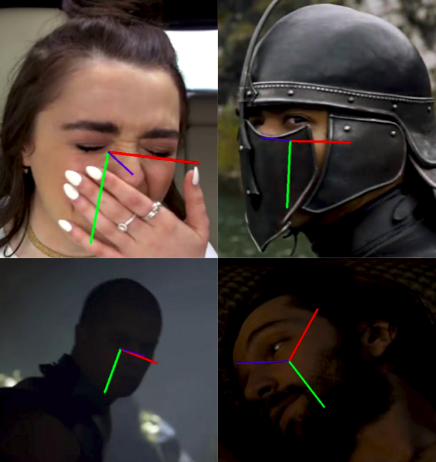

# HOPE-Net : A Machine Learning Model for Estimating Face Orientation

# HOPE-Net : A Machine Learning Model for Estimating Face Orientation

[](/@cochard-dav?source=post_page---byline--83d5af26a513---------------------------------------)

[David Cochard](/@cochard-dav?source=post_page---byline--83d5af26a513---------------------------------------)

3 min read

·

Jun 29, 2021

--

[Listen](/m/signin?actionUrl=https%3A%2F%2Fmedium.com%2Fplans%3Fdimension%3Dpost_audio_button%26postId%3D83d5af26a513&operation=register&redirect=https%3A%2F%2Fmedium.com%2Faxinc-ai%2Fhope-net-a-machine-learning-model-for-estimating-face-orientation-83d5af26a513&source=---header_actions--83d5af26a513---------------------post_audio_button------------------)

Share

This is an introduction to「HOPE-Net」, a machine learning model that can be used with [ailia SDK](https://ailia.jp/en/). You can easily use this model to create AI applications using [ailia SDK](https://ailia.jp/en/) as well as many other ready-to-use [ailia MODELS](https://github.com/axinc-ai/ailia-models).

---

## Overview

*HOPE-Net* is a machine learning model released in October 2017 which compute the angles in three axes (yaw, pitch, and roll) of a face in an input image.

[## Fine-Grained Head Pose Estimation Without Keypoints

### Estimating the head pose of a person is a crucial problem that has a large amount of applications such as aiding in…

arxiv.org](https://arxiv.org/abs/1710.00925?source=post_page-----83d5af26a513---------------------------------------)

Press enter or click to view image in full size



Detects even the most difficult face images (Source: <https://github.com/natanielruiz/deep-head-pose>)

## Architecture

Face orientation detection is an important technology used in gaze detection and recognition of which objects is being watched in a scene.

Face orientation detection usually works by detecting key points of the target face and converting those points from 2D to 3D using a standard head model. However, there is a problem that the result depends on the accuracy of the face key points, and the need for ad-hoc fitting.

*HOPE-Net* uses *multi-loss convolutional neural networks* to detect the orientation of faces in a single shot. Using the face detected by the face detector as input, *ResNet50* extracts features and FC Layer calculates yaw, pitch, and roll.

Press enter or click to view image in full size


Source: <https://arxiv.org/pdf/1710.00925>

HOPE-Net performs best on AFLW2000, a dataset made of the first 2000 images of the *Annotated Facial Landmarks in the Wild (AFLW)* dataset, which have been re-annotated with 68 3D landmarks.


Source: <https://arxiv.org/pdf/1710.00925>

## Usage

Use the following command to run HOPE-Net and detect face orientation from a web camera.

```
$ python3 hopenet.py -v 0
```

You can also use a faster version that uses *ShuffleNetV2* instead of *ResNet50* with the following command.

```
$ python3 blazehand.py --lite -v 0
```

[## axinc-ai/ailia-models

### (Image from https://pixabay.com/photos/person-human-male-face-man-view-829966/) ailia input shape: (1, 3, 128, 128) RGB…

github.com](https://github.com/axinc-ai/ailia-models/tree/master/face_recognition/hopenet?source=post_page-----83d5af26a513---------------------------------------)

Here is the kind of result you can expect.

## Related topic

[## AxGazeEstimation : A Machine Learning Model for Estimating Gaze

### This is an introduction to「AxGazeEstimation」, a machine learning model that can be used with ailia SDK. You can easily…

medium.com](/axinc-ai/axgazeestimation-a-machine-learning-model-for-estimating-gaze-c9648042d637?source=post_page-----83d5af26a513---------------------------------------)

---

[ax Inc.](https://axinc.jp/en/) has developed [ailia SDK](https://ailia.jp/en/), which enables cross-platform, GPU-based rapid inference.

ax Inc. provides a wide range of services from consulting and model creation, to the development of AI-based applications and SDKs. Feel free to [contact us](https://axinc.jp/en/) for any inquiry.