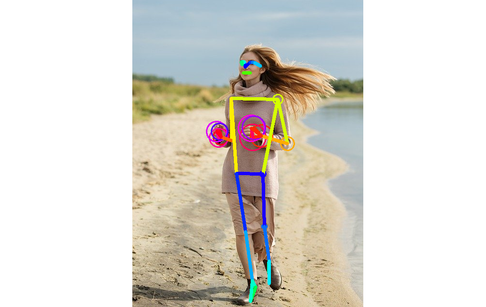
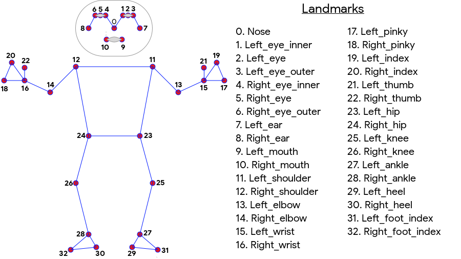
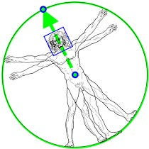
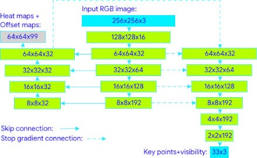

# BlazePose : A 3D Pose Estimation Model

# BlazePose : A 3D Pose Estimation Model

[](/@cochard-dav?source=post_page---byline--d8689d06b7c4---------------------------------------)

[David Cochard](/@cochard-dav?source=post_page---byline--d8689d06b7c4---------------------------------------)

4 min read

·

Jun 30, 2021

--

1

[Listen](/m/signin?actionUrl=https%3A%2F%2Fmedium.com%2Fplans%3Fdimension%3Dpost_audio_button%26postId%3Dd8689d06b7c4&operation=register&redirect=https%3A%2F%2Fmedium.com%2Faxinc-ai%2Fblazepose-a-3d-pose-estimation-model-d8689d06b7c4&source=---header_actions--d8689d06b7c4---------------------post_audio_button------------------)

Share

This is an introduction to「BlazePose」, a machine learning model that can be used with [ailia SDK](https://ailia.jp/en/). You can easily use this model to create AI applications using [ailia SDK](https://ailia.jp/en/) as well as many other ready-to-use [ailia MODELS](https://github.com/axinc-ai/ailia-models).

---

## Overview

*BlazePose* (Full Body) is a pose detection model developed by Google that can compute (x,y,z) coordinates of 33 skeleton keypoints. It can be used for example in fitness applications.

Press enter or click to view image in full size



Source: <https://pixabay.com/ja/photos/%E5%A5%B3%E3%81%AE%E5%AD%90-%E7%BE%8E%E3%81%97%E3%81%84-%E8%8B%A5%E3%81%84-%E3%83%9B%E3%83%AF%E3%82%A4%E3%83%88-5204299/>

[## BlazePose: On-device Real-time Body Pose tracking

### We present BlazePose, a lightweight convolutional neural network architecture for human pose estimation that is…

arxiv.org](https://arxiv.org/abs/2006.10204?source=post_page-----d8689d06b7c4---------------------------------------)

[## On-device, Real-time Body Pose Tracking with MediaPipe BlazePose

### Pose estimation from video plays a critical role enabling the overlay of digital content and information on top of the…

ai.googleblog.com](https://ai.googleblog.com/2020/08/on-device-real-time-body-pose-tracking.html?source=post_page-----d8689d06b7c4---------------------------------------)

## BlazePose input and output

*BlazePose* consists of two machine learning models: a *Detector* and an *Estimator*. The *Detector* cuts out the human region from the input image, while the *Estimator* takes a 256x256 resolution image of the detected person as input and outputs the keypoints.

*BlazePose* outputs the 33 keypoints according the following ordering convention. This is more points than the commonly used 17 keypoints of the COCO dataset.

Press enter or click to view image in full size



BlazePose keypoints (Source: <https://developers.google.com/ml-kit/vision/pose-detection>)

## Architecture

The *Detector* is an Single-Shot Detector(SSD) based architecture. Given an input image (1,224,224,3), it outputs a bounding box (1,2254,12) and a confidence score (1,2254,1). The 12 elements of the bounding box are of the form (x,y,w,h,kp1x,kp1y,…,kp4x,kp4y), where kp1x to kp4y are additional keypoints. Each one of the 2254 elements has its own anchor, anchor scale and offset need to be applied.

There are two ways to use the *Detector*. In *box mode*, the bounding box is determined from its position (x,y) and size (w,h). In *alignment mode*, the scale and angle are determined from (kp1x,kp1y) and (kp2x,kp2y), and bounding box including rotation can be predicted.



Source: <https://ai.googleblog.com/2020/08/on-device-real-time-body-pose-tracking.html>

The *Estimator* uses heatmap for training, but computes keypoints directly without using heatmap for faster inference.



Tracking network architecture: regression with heatmap supervision (Source: <https://ai.googleblog.com/2020/08/on-device-real-time-body-pose-tracking.html>)

The first output of the *Estimator* is (1,195) landmarks , the second output is (1,1) flags. The landmarks are made of 165 elements for the (*x,y,z,visibility,presence*) for every 33 keypoints .

The *z*-values are based on the person’s hips, with keypoints being between the hips and the camera when the value is negative, and behind the hips when the value is positive.

The *visibility* and *presence* are stored in the range of [*min\_float,max\_float*] and are converted to probability by applying a sigmoid function. The *visibility* returns the probablity of keypoints that exist in the frame and are not occluded by other objects. *presence* returns the probablity of keypoints that exist in the frame.

[## Model Card BlazePose GHUM 3D.pdf

### Edit description

drive.google.com](https://drive.google.com/file/d/10WlcTvrQnR_R2TdTmKw0nkyRLqrwNkWU/preview?source=post_page-----d8689d06b7c4---------------------------------------)

## Usage

Use the following command to run *BlazePose (Full Body)* with ailia SDK.

```
$ python3 blazepose-fullbody.py -v 0
```

[## ailia-models/pose\_estimation\_3d/blazepose-fullbody at master · axinc-ai/ailia-models

### (Image from…

github.com](https://github.com/axinc-ai/ailia-models/tree/master/pose_estimation_3d/blazepose-fullbody?source=post_page-----d8689d06b7c4---------------------------------------)

Here is a result on a sample video. The size of the circles at keypoints indicates the z-value.

The *BlazePose (Upper Body)* can also be used to estimate only the upper body. Initially, *MediaPipe* released only the upper body model, and later the full body model . The specifications of the full body and upper body models are different, for example, the detector resolution is 128x128 for the upper body model.

```
$ python3 blazepose.py -v 0
```

[## axinc-ai/ailia-models

### (Image from…

github.com](https://github.com/axinc-ai/ailia-models/tree/master/pose_estimation/blazepose?source=post_page-----d8689d06b7c4---------------------------------------)

---

## Related topics

[## LightWeightHumanPose : A Machine Learning Model for Fast Multi-person Pose Estimation.

### This is an introduction to「LightWeightHumanPose」, a machine learning model that can be used with ailia SDK. You can…

medium.com](/axinc-ai/lightweighthumanpose-a-machine-learning-model-for-fast-multi-person-skeleton-detection-631c042bed50?source=post_page-----d8689d06b7c4---------------------------------------)

[## PoseResnet : A Top-down Machine Learning Model for Pose Estimation

medium.com](/axinc-ai/poseresnet-a-top-down-machine-learning-model-for-skeletal-detection-9454f391ae4d?source=post_page-----d8689d06b7c4---------------------------------------)

[## AnimalPose : Pose Esimation for Animals

### This is an introduction to「AnimalPose」, a machine learning model that can be used with ailia SDK. You can easily use…

medium.com](/axinc-ai/animalpose-pose-esimation-for-animals-700603e0dbae?source=post_page-----d8689d06b7c4---------------------------------------)

---

[ax Inc.](https://axinc.jp/en/) has developed [ailia SDK](https://ailia.jp/en/), which enables cross-platform, GPU-based rapid inference.

ax Inc. provides a wide range of services from consulting and model creation, to the development of AI-based applications and SDKs. Feel free to [contact us](https://axinc.jp/en/) for any inquiry.