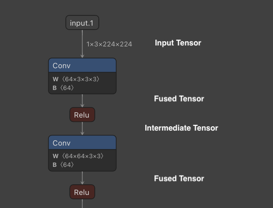
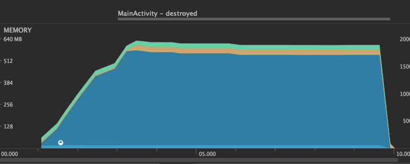
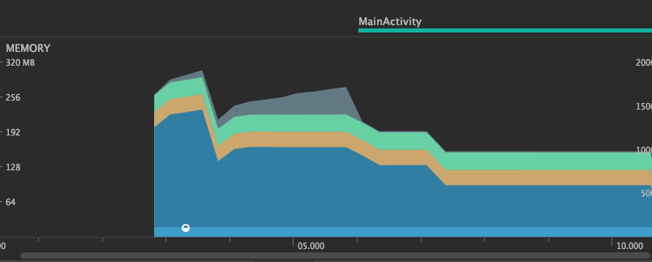
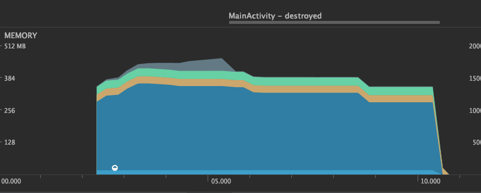

# ailia SDK Tutorial (Memory Saving Mode)

# ailia SDK Tutorial (Memory Saving Mode)

[](/@cochard-dav?source=post_page---byline--fe8d8c12c12c---------------------------------------)

[David Cochard](/@cochard-dav?source=post_page---byline--fe8d8c12c12c---------------------------------------)

5 min read

·

Aug 15, 2021

--

[Listen](/m/signin?actionUrl=https%3A%2F%2Fmedium.com%2Fplans%3Fdimension%3Dpost_audio_button%26postId%3Dfe8d8c12c12c&operation=register&redirect=https%3A%2F%2Fmedium.com%2Faxinc-ai%2Failia-sdk-tutorial-memory-saving-mode-fe8d8c12c12c&source=---header_actions--fe8d8c12c12c---------------------post_audio_button------------------)

Share

ailia SDK is a cross-platform inference engine which enables memory-saving inference for machine learning models. More information on ailia SDK can be found [here](https://ailia.jp/en/).

---

## Memory management for machine learning models

During the inference of machine learning models, an input tensor is processed through a neural network to obtain an output tensor as a result. In this computation, various tensors are allocated in tCPU or GPU memory throughout the operators of the graph.



Example of intermediate tensors

Intermediate tensors produced by *Activation* and *BatchNormalization* are automatically removed by layer fusion.

Other intermediate tensors are, by default, allocated in a separate memory space for better performance. Since intermediate tensors that do not become actual output are temporary memory, they can be allocated and released to save memory.

## Overview of Memory Saving Mode

For applications where the available memory is limited, such as inference on mobile devices and or managed servers, two memory-saving modes can be selected: `Reduce Interstage` and `Reuse Interstage`.

`Reduce Interstage` allocates memory when the tensor is needed, and releases it as soon as when it is no longer in use. This is the most efficient way to save memory. However, since repetitive memory allocations and releases make the inference run slower, it is best-suited for one-time inference.

In `Reuse Interstage`, memory is shared by tensors of the same size. Since machine learning models often involve multiple iterations of the same size Conv -> Activation, it is possible to reduce memory consumption without much impact on performances. However, for certain models, graphs that can be computed in parallel may be processed sequentially instead, which may result in a decrease in speed.

Note that `Reduce Interstage` and `Reuse Interstage` remove intermediate tensors that are not specified as output, therefore they cannot be used with models such as *PaDiM* that retrieve and use intermediate tensors. When trying to retrieve deleted tensors using `get_input_blob_data`, it returns an `AILIA_STATUS_DATA_REMOVED` error.

## Usage of Memory Saving Mode

Using the Python API, memory mode retrieved using `ailia.get_memory_mode` can be set when instantiating `ailia.Net`

```
memory_mode=ailia.get_memory_mode(True,True,True,False)  
net = ailia.Net(MODEL_PATH, WEIGHT_PATH, env_id=args.env_id, memory_mode=memory_mode)
```

In C++, set `AILIA_MEMORY_*` to the `AILIANetwork` instance. This must be done before calling `OpenStreamFile`.

```
ailiaSetMemoryMode(instance, AILIA_MEMORY_OPTIMAIZE_DEFAULT | AILIA_MEMORY_REDUCE_INTERSTAGE)
```

When using Unity, set `Ailia.AILIA_MEMORY_*` to the `AiliaModel` instance. This must be done before calling `Open`.

```
model.SetMemoryMode(Ailia.AILIA_MEMORY_REUSE_INTERSTAGE);
```

## Memory usage comparison

Here is a comparison of memory usage in [u2net](/axinc-ai/u2net-a-machine-learning-model-that-performs-object-cropping-in-a-single-shot-48adfc158483). The memory usage of ailia SDK is displayed in blue.

### Default: Allocate all tensors in separate memory

Maximum memory usage: 557.2MB  
getMemoryMode result is `true,true,false,false`

Press enter or click to view image in full size



Default mode

### Reduce Interstage : Allocate and release tensors each time

Maximum memory usage: 176.4MB  
getMemoryMode result is `true,true,true,false`

Press enter or click to view image in full size



Reduce Interstage mode

### Reuse Interstage : Reuse memory for tensors of same size

Maximum memory usage: 296.8MB  
getMemoryMode result is `true,true,false,true`

Press enter or click to view image in full size



Reuse Interstage mode

## Comparison of inference speed

Here is a comparison of the performance of u2netp on a MacBookPro13 (Intel Core i5 2.3GHz Iris Plus Graphics 655), showing the inference time for each of the five inferences.

### Default: Allocate all tensors in separate memory

This is our baseline inference speed. The first inference takes a little longer since it has to allocates memory.

CPU

INFO u2net.py (104) : ailia processing time 269 ms  
INFO u2net.py (104) : ailia processing time 178 ms  
INFO u2net.py (104) : ailia processing time 176 ms  
INFO u2net.py (104) : ailia processing time 177 ms  
INFO u2net.py (104) : ailia processing time 175 ms

GPU

INFO u2net.py (104) : ailia processing time 475 ms  
INFO u2net.py (104) : ailia processing time 153 ms  
INFO u2net.py (104) : ailia processing time 132 ms  
INFO u2net.py (104) : ailia processing time 125 ms  
INFO u2net.py (104) : ailia processing time 122 ms

### Reduce Interstage : Allocate and release tensors each time

In the default mode above, inference after the second run is faster, but `Reduce Interstage` requires the same initialization procedure at every run. Also, there is a larger penalty on GPU for allocating and freeing memory.

CPU

INFO u2net.py (104) : ailia processing time 268 ms  
INFO u2net.py (104) : ailia processing time 253 ms  
INFO u2net.py (104) : ailia processing time 254 ms  
INFO u2net.py (104) : ailia processing time 255 ms  
INFO u2net.py (104) : ailia processing time 248 ms

GPU

INFO u2net.py (104) : ailia processing time 667 ms  
INFO u2net.py (104) : ailia processing time 627 ms  
INFO u2net.py (104) : ailia processing time 609 ms  
INFO u2net.py (104) : ailia processing time 600 ms  
INFO u2net.py (104) : ailia processing time 644 ms

### Reuse Interstage : Reuse memory for tensors of same size

Although memory usage is reduced by sharing tensor allocations, memory is only allocated in the first inference, therefore following inferences are faster. This mode provides a good balance between speed and memory consumption.

CPU

INFO u2net.py (104) : ailia processing time 236 ms  
INFO u2net.py (104) : ailia processing time 167 ms  
INFO u2net.py (104) : ailia processing time 171 ms  
INFO u2net.py (104) : ailia processing time 169 ms  
INFO u2net.py (104) : ailia processing time 172 ms

GPU

INFO u2net.py (104) : ailia processing time 461 ms  
INFO u2net.py (104) : ailia processing time 158 ms  
INFO u2net.py (104) : ailia processing time 145 ms  
INFO u2net.py (104) : ailia processing time 139 ms  
INFO u2net.py (104) : ailia processing time 129 ms

---

[ax Inc.](https://axinc.jp/en/) has developed [ailia SDK](https://ailia.jp/en/), which enables cross-platform, GPU-based rapid inference.

ax Inc. provides a wide range of services from consulting and model creation, to the development of AI-based applications and SDKs. Feel free to [contact us](https://axinc.jp/en/) for any inquiry.