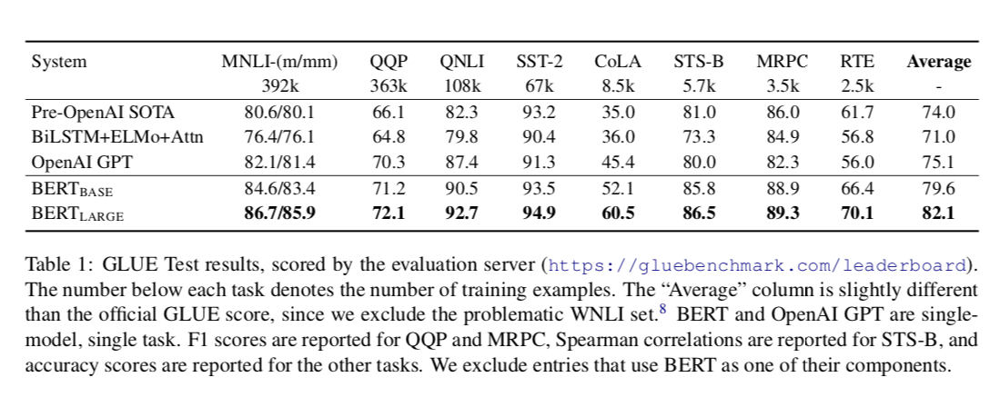
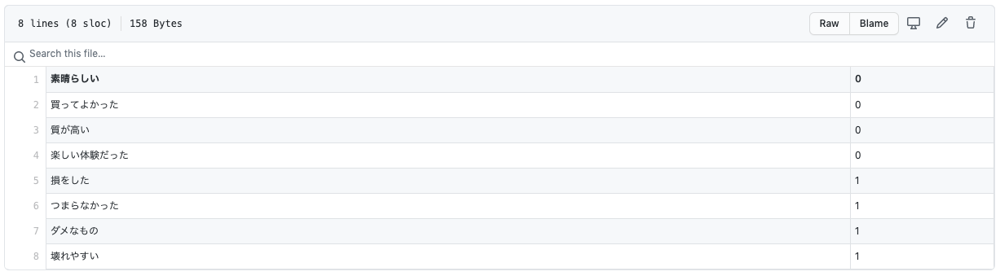

# BERT : A Machine Learning Model for Efficient Natural Language Processing

# BERT : A Machine Learning Model for Efficient Natural Language Processing

[](/@cochard-dav?source=post_page---byline--aef3081c24e8---------------------------------------)

[David Cochard](/@cochard-dav?source=post_page---byline--aef3081c24e8---------------------------------------)

7 min read

·

Aug 15, 2021

--

[Listen](/m/signin?actionUrl=https%3A%2F%2Fmedium.com%2Fplans%3Fdimension%3Dpost_audio_button%26postId%3Daef3081c24e8&operation=register&redirect=https%3A%2F%2Fmedium.com%2Faxinc-ai%2Fbert-a-machine-learning-model-for-efficient-natural-language-processing-aef3081c24e8&source=---header_actions--aef3081c24e8---------------------post_audio_button------------------)

Share

This is an introduction to「BERT」, a machine learning model that can be used with [ailia SDK](https://ailia.jp/en/). You can easily use this model to create AI applications using [ailia SDK](https://ailia.jp/en/) as well as many other ready-to-use [ailia MODELS](https://github.com/axinc-ai/ailia-models).

---

## Overview

*BERT* is a machine learning model that serves as a foundation for improving the accuracy of machine learning in Natural Language Processing (NLP). Pre-trained models based on *BERT* that were re-trained on big data to solve a variety of domain-specific NLP tasks are publicly available ([*BioBERT*](https://arxiv.org/abs/1901.08746)for biomedical text, [*SciBERT*](https://arxiv.org/abs/1903.10676)for scientific publications, [*ClinicalBERT*](https://arxiv.org/pdf/1904.05342.pdf)forclinical notes*)*.

[## BERT: Pre-training of Deep Bidirectional Transformers for Language Understanding

### We introduce a new language representation model called BERT, which stands for Bidirectional Encoder Representations…

arxiv.org](https://arxiv.org/abs/1810.04805?source=post_page-----aef3081c24e8---------------------------------------)

## Usage examples of BERT

### MaskedLM

This is a task to predict masked words. It can be used to proofread sentences.

### NER

BERT-based model to perform named entity recognition from text. It can tag whether the input word is the name of a person, a place, or an organization.

### Sentiment Analysis

This task infers sentiments from text. It is for example possible to classify whether the input string is positive or negative.

### Question Answering

Given a context sentence and a question, this task computes a plausible answer to the question. It can be used for example to generate chatbots automated responses.

### Zero Shot Classification

Given a sentence and a list of categories, this task can compute which category the sentence belongs to. It can perform this task without specific re-training.

## Architecture

*BERT* has been trained using two strategies named *Masked LM (MLM)* and *Next Sentence Prediction (NSP)*.

*Masked LM* is a task where you mask a part of the text and the model then tries to guess the word that were masked using other context words. For example, by giving the sentence “I have watched this [MASK] and it was awesome”, one possible answer from the model would be “I have watched this movie and it was awesome”.

*Next Sentence Prediction* is a task where the model gets as input pairs of sentences and it learns to predict if the second sentence is the next sentence in the original text as well. 50% of the time the sentences are actually consecutive, and 50% of the time they are random sentences.

*BERT* splits the input text into words and converts words into tokens. Each token is assigned a number associated with the word, then used as input features.

Press enter or click to view image in full size


BERT input representation (Source: <https://arxiv.org/abs/1810.04805>)

## Fine Tuning

Trained BERT-based models are rarely used as-is, but are generally fine-tuned (transfer training) to perform similar tasks on another dataset.

Similarly, when training a model for image recognition, it is common to use weights trained on *ImageNet*, a large data set, as initial values. Starting from weights trained on *ImageNet* allows the model to be trained on new images from a smaller dataset in a shorter amount of time and reduce [overfitting](/axinc-ai/prevent-overfitting-using-dropout-53041b5a3797) issues compared to learning the weights from scratch.

The same idea is applied to BERT which has been initially trained using a large data se to grasp the relationships between words. Then new models can be trained on small specialized dataset to obtain good accuracy and avoid overfitting.

Press enter or click to view image in full size


Fine-Tuning (Source: <https://arxiv.org/abs/1810.04805>)

*BERT* has achieved significant accuracy improvements in various tasks such as *GLUE (General Language Understanding Evaluation)* and *SQuAD (The Stanford Question Answering Dataset)*.

Press enter or click to view image in full size



BERT performance (Source: <https://arxiv.org/abs/1810.04805>)

## Transformers

*Transformers* is a Pytorch implementation of BERT which allows for fine tuning on custom data sets using Pytorch.

[## huggingface/transformers

### State-of-the-art Natural Language Processing for PyTorch and TensorFlow 2.0 🤗 Transformers provides thousands of…

github.com](https://github.com/huggingface/transformers?source=post_page-----aef3081c24e8---------------------------------------)

*Transformers* includes a pre-trained model for the Japanese language. In addition, the tokenizer included in Transformers can be used to morphologically analyze Japanese and convert it into tokens. Internally, *Mecab* and its Python wrapper, *Fugashi*, are used.

## Using Transformers for fine tuning BERT

Using *Transformers*, we will try to solve a text classification problem by fine tuning BERT. The goal is to predict whether a given text has a positive or negative meaning.

The code is available in the following repository.

[## axinc-ai/bert-japanese-onnx

### Tutorial to learn using Japanese bert, export to onnx and infer python3==3.7.8 torch==1.6.0 transformers==3.4.0…

github.com](https://github.com/axinc-ai/bert-japanese-onnx?source=post_page-----aef3081c24e8---------------------------------------)

First, install *Transformers*.

```
$ pip3 install transformers==3.4.0
```

The script to perform the training is available at the path `transformers/examples/text-classification/run_glue.py`. It contains dataset loaders for various tasks in GLUE, a leading natural language processing benchmark.

We need to create our own loader om order to load our own dataset. Please refer to `glue_processor.py` for the actual dataset loader to be used.

In the script `run_glue.py`, the training model is set by `AutoModelForSequenceClassification` and GLUE dataset is instantiated by the dataset loader. The loader instantiated the dataset based on the given argument `data_args.task_name`.

In order to use our own dataset, we will rewrite `run_glue.py` to register our own dataset loader.

The data set is in tsv format, separated by tabs. The text comes first, followed by the label number. In this case, we have assigned 0 to “positive” and 1 to “negative” sentences.

Press enter or click to view image in full size



<https://github.com/axinc-ai/bert-japanese-onnx/blob/main/data/original/train.tsv>

Then train the model.

The score is displayed once the training completes.

> eval\_loss = 0.6668145656585693  
> eval\_acc = 1.0  
> epoch = 3.0  
> total\_flos = 2038927233024

Trained models are stored in the `output/original` folder. The trained model is stored as `pytorch_model.bin`, and the morphological word-token associations are stored in `output/original/vocab.txt`

If you want to run the program more than once, delete the `output` folder before running it a second time or an error will occur.

A file used for caching will be created under `data/original` during the training. Note that even if you update the tsv file, the old data will be used for training if you do not delete this file.

If you want to use a trained model for inference, use the `--do_predict` option.

## Export BERT to ONNX

To convert a BERT model to ONNX, use `transformers.convert_graph_to_onnx`. Simply specify the path of the trained model and the `pipeline_name`.

In this case, we are using `AutoModelForSequenceClassification` for training, so we specify `pipeline_name=”sentiment-analysis”` . Refer to the link below for the correspondence between pipeline names and models.

[## transformers.pipelines — transformers 3.4.0 documentation

### docs]def get\_framework ( model ): “”” Select framework (TensorFlow or PyTorch) to use. Args: model (:obj:`str`…

huggingface.co](https://huggingface.co/transformers/_modules/transformers/pipelines.html?source=post_page-----aef3081c24e8---------------------------------------)

The newly trained model can be used with ONNX Runtime using the script below to classify `text` as positive or negative.

Several sample programs using various ONNX exports are available at the link below.

[## axinc-ai/bert-japanese-onnx

### Tutorial to learn using Japanese bert, export to onnx and infer python3==3.7.8 torch==1.6.0 transformers==3.4.0…

github.com](https://github.com/axinc-ai/bert-japanese-onnx?source=post_page-----aef3081c24e8---------------------------------------)

## Question answering task

*Transformers* also supports question answering, which allows you to enter a context and a question, and get the position of the most probable answer to the question in the context sentence as a result.

> INPUT  
> {“question”: “What is ONNX Runtime ?”,  
> “context”: “ONNX Runtime is a highly performant single inference engine for multiple platforms and hardware”}
>
> OUTPUT  
> {‘answer’: ‘highly performant single inference engine for multiple platforms and hardware’, ‘end’: 94, ‘score’: 0.751201868057251, ‘start’: 18}

The pre-trained model `deepset/roberta-base-squad2` was used. *RoBERTa* is an improved model of BERT.

The model input consists of `input_ids` (batch x sequence) computed using the Tokenizer and `attension_mask` (batch x sequence). The output is `output_0` (batch x sequence) and `output_1` (batch x sequence).

To export the question answering model to ONNX, you can use `transformers.convert_graph_to_onnx` script as for GLUE.

However, calculating *start* and *end* from the exported ONNX output requires complex post-processing, so we recommend using `onnx_transformers` below.

[## patil-suraj/onnx\_transformers

### Accelerated NLP pipelines for fast inference 🚀 on CPU. Built with 🤗 Transformers and ONNX runtime. pip install…

github.com](https://github.com/patil-suraj/onnx_transformers?source=post_page-----aef3081c24e8---------------------------------------)

## BERT usage with ailia SDK

BERT can be used with the ailia SDK with the following command.

```
$ python3 bert_maskedlm.py
```

Since BERT uses the transformers tokenizer, you need to install the transformers beforehand using the `requirements.txt` file in the `ailia-models/neural_language_processing` folder.

```
$ pip3 install -r requirements.txt
```

ailia SDK supports models for the tasks `maskedlm`, `ner`, `question_answering`, `sentiment_analysis` and `zero_shot_classification`

Here are result examples.

[## ailia-models/natural\_language\_processing at master · axinc-ai/ailia-models

### The collection of pre-trained, state-of-the-art AI models for ailia SDK - ailia-models/natural\_language\_processing at…

github.com](https://github.com/axinc-ai/ailia-models/tree/master/natural_language_processing?source=post_page-----aef3081c24e8---------------------------------------)

---

[ax Inc.](https://axinc.jp/en/) has developed [ailia SDK](https://ailia.jp/en/), which enables cross-platform, GPU-based rapid inference.

ax Inc. provides a wide range of services from consulting and model creation, to the development of AI-based applications and SDKs. Feel free to [contact us](https://axinc.jp/en/) for any inquiry.