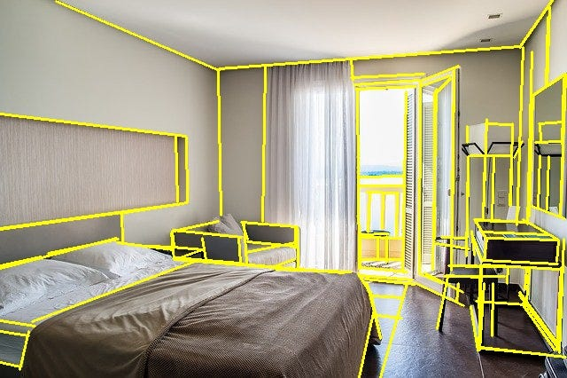

# Released ailia SDK 1.2.8

# Released ailia SDK 1.2.8

[](/@cochard-dav?source=post_page---byline--a46ebfdbcdad---------------------------------------)

[David Cochard](/@cochard-dav?source=post_page---byline--a46ebfdbcdad---------------------------------------)

3 min read

·

Sep 1, 2021

--

[Listen](/m/signin?actionUrl=https%3A%2F%2Fmedium.com%2Fplans%3Fdimension%3Dpost_audio_button%26postId%3Da46ebfdbcdad&operation=register&redirect=https%3A%2F%2Fmedium.com%2Faxinc-ai%2Freleased-ailia-sdk-1-2-8-a46ebfdbcdad&source=---header_actions--a46ebfdbcdad---------------------post_audio_button------------------)

Share

We are pleased to introduce version 1.2.8 of ailia SDK, a cross-platform framework to perform fast AI inference on GPU or CPU. You can find more information about ailia SDK on the [official website](https://ailia.jp/en/).

---

## Addition of new layers

This release adds support for `opset=11`, as well as operators`ConcatFromSequence`, `SequenceEmpty`, `SequenceConstruct`, `SequenceInsert`, `SequenceErase`, `SequenceAt` and `SplitToSequence` which are sometimes used in *Pytorch*. `HardSigmoid`, `If`, `MaxUnpool`, and `OneHot` are also newly supported.

## Support memory saving mode for Android (JNI)

ailia’s [memory saving mode](/axinc-ai/ailia-sdk-tutorial-memory-saving-mode-fe8d8c12c12c) can now be used on Android (JNI) platform. You can specify one of the memory modes available obtained via `AiliaModel.getMemoryMode` to the `AiliaModel` instance as shown below.

```
EnumSet<AiliaMemoryMode> memory_mode = AiliaModel.getMemoryMode(true, true, false, true);  
ailia = new AiliaModel(envId, Ailia.MULTITHREAD_AUTO, memory_mode,  
        loadRawFile(R.raw.u2netp_opset11_proto), loadRawFile(R.raw.u2netp_opset11_weight));
```

For more information about memory saving mode, please refer to the tutorial below.

[## ailia SDK Tutorial (Memory Saving Mode)

### ailia SDK is a cross-platform inference engine which enables memory-saving inference for machine learning models. More…

medium.com](/axinc-ai/ailia-sdk-tutorial-memory-saving-mode-fe8d8c12c12c?source=post_page-----a46ebfdbcdad---------------------------------------)

## Propagation of tensor types

All the inference processing was done using floats up to ailia SDK 1.2.7. Starting from ailia SDK 1.2.8, each tensor type in ONNX is now propagated, so it is possible to infer models that perform operations with integer precision and dynamically calculate tensor sizes. It mainly improves the compatibility of models exported from *TensorFlow*.

## Introducing ailia.audio

As an experimental feature, we added `ailia.audio`, a library for audio pre and post-processing.

Speech recognition and generation requires pre-processing of the input waveform of the AI model, such as *MelSpectrum* transformation and resampling. `torch.audio` and `librosa` are usually used for these pre-processing tasks. However, these speech processing libraries do not work on edge devices such as *Jetson* and *RaspberryPi*, therefore models for speech recognition and generation do not work.

To address this issue, `ailia.audio` provides the equivalent of `torch.audio` and `librosa` for all platforms, enabling consistent audio pre and post-processing.

To use `ailia.audio`, use the `--ailia_audio` option for speech recognition models available in [ailia MODELS](https://github.com/axinc-ai/ailia-models).

```
python3 pytorch-dc-tts.py --ailia_audio
```

[## ailia-models/audio\_processing at master · axinc-ai/ailia-models

### Pretrained models for ailia SDK. Contribute to axinc-ai/ailia-models development by creating an account on GitHub.

github.com](https://github.com/axinc-ai/ailia-models/tree/master/audio_processing?source=post_page-----a46ebfdbcdad---------------------------------------)

## New supported models

Thanks to the addition of new supported layers and the implementation of type propagation, the following models are supported.

**M-LSD** : Wireframe Extraction Model



Source: <https://pixabay.com/ja/photos/%e6%97%85%e8%a1%8c%e3%81%99%e3%82%8b-%e3%83%9b%e3%83%86%e3%83%ab%e3%81%ae%e9%83%a8%e5%b1%8b-%e3%83%9b%e3%83%86%e3%83%ab-1677347/>

[## ailia-models/line\_segment\_detection/mlsd at master · axinc-ai/ailia-models

### (Image from…

github.com](https://github.com/axinc-ai/ailia-models/tree/master/line_segment_detection/mlsd?source=post_page-----a46ebfdbcdad---------------------------------------)

**3D Object Detection Pytorch**

Press enter or click to view image in full size


Source: <https://github.com/google-research-datasets/Objectron/blob/master/notebooks/Download%20Data.ipynb>

[## ailia-models/object\_detection/3d-object-detection.pytorch at master · axinc-ai/ailia-models

### (Image from Objectron Dataset…

github.com](https://github.com/axinc-ai/ailia-models/tree/master/object_detection/3d-object-detection.pytorch?source=post_page-----a46ebfdbcdad---------------------------------------)

**MoveNet** : Pose estimation for videos with intense motion

[## ailia-models/pose\_estimation/movenet at master · axinc-ai/ailia-models

### (Image from…

github.com](https://github.com/axinc-ai/ailia-models/tree/master/pose_estimation/movenet?source=post_page-----a46ebfdbcdad---------------------------------------)

**MMFashion VirtualTryOn** : Virtual try-on of fashion items

[## ailia-models/deep\_fashion/mmfashion\_tryon at master · axinc-ai/ailia-models

### Cloth image file Person image file Person-parse png image file created in palette mode that indexes 1, 2, 4, and 13…

github.com](https://github.com/axinc-ai/ailia-models/tree/master/deep_fashion/mmfashion_tryon?source=post_page-----a46ebfdbcdad---------------------------------------)

**Pytorch ENet** : Image Segmentation model

[## ailia-models/image\_segmentation/pytorch-enet at master · axinc-ai/ailia-models

### (Image from CamVid Dataset https://github.com/alexgkendall/SegNet-Tutorial/tree/master/CamVid) Shape : (1, 3, 360, 480)…

github.com](https://github.com/axinc-ai/ailia-models/tree/master/image_segmentation/pytorch-enet?source=post_page-----a46ebfdbcdad---------------------------------------)

---

[ax Inc.](https://axinc.jp/en/) has developed [ailia SDK](https://ailia.jp/en/), which enables cross-platform, GPU-based rapid inference.

ax Inc. provides a wide range of services from consulting and model creation, to the development of AI-based applications and SDKs. Feel free to [contact us](https://axinc.jp/en/) for any inquiry.