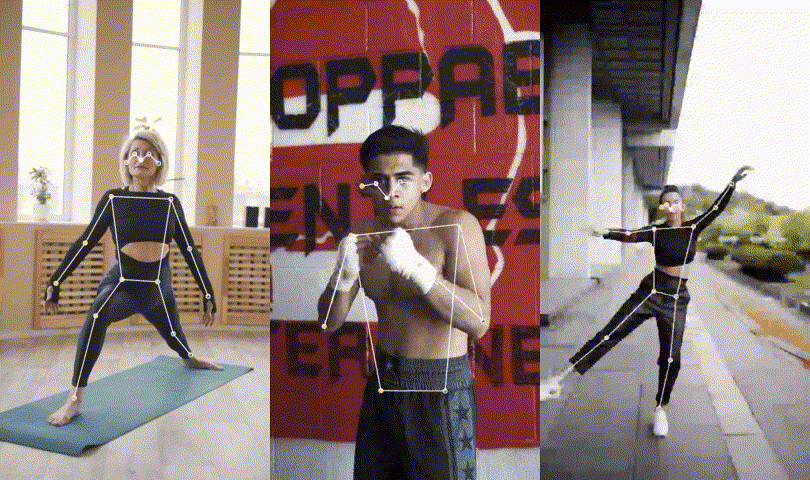
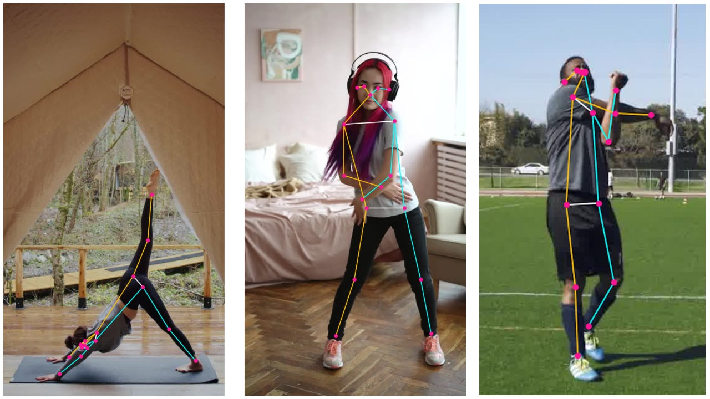

# MoveNet : Pose Estimation for Video with Intense Motion

# MoveNet : Pose Estimation for Video with Intense Motion

[](/@cochard-dav?source=post_page---byline--2b92f53f3c8---------------------------------------)

[David Cochard](/@cochard-dav?source=post_page---byline--2b92f53f3c8---------------------------------------)

3 min read

·

Sep 2, 2021

--

1

[Listen](/m/signin?actionUrl=https%3A%2F%2Fmedium.com%2Fplans%3Fdimension%3Dpost_audio_button%26postId%3D2b92f53f3c8&operation=register&redirect=https%3A%2F%2Fmedium.com%2Faxinc-ai%2Fmovenet-pose-estimation-for-video-with-intense-motion-2b92f53f3c8&source=---header_actions--2b92f53f3c8---------------------post_audio_button------------------)

Share

This is an introduction to「MoveNet」, a machine learning model that can be used with [ailia SDK](https://ailia.jp/en/). You can easily use this model to create AI applications using [ailia SDK](https://ailia.jp/en/) as well as many other ready-to-use [ailia MODELS](https://github.com/axinc-ai/ailia-models).

---

## Overview

*MoveNet* is a pose estimation model released by *Google* on May 17, 2021. Compared to conventional pose estimation models, it improves the detection accuracy in videos with intense motion. It is ideal for live fitness and sports applications.

Press enter or click to view image in full size



Source: <https://blog.tensorflow.org/2021/05/next-generation-pose-detection-with-movenet-and-tensorflowjs.html>

[## Next-Generation Pose Detection with MoveNet and TensorFlow.js

### May 17, 2021 — Posted by Ronny Votel and Na Li, Google Research Today we’re excited to launch our latest pose detection…

blog.tensorflow.org](https://blog.tensorflow.org/2021/05/next-generation-pose-detection-with-movenet-and-tensorflowjs.html?source=post_page-----2b92f53f3c8---------------------------------------)

## Architecture

*MoveNet* is able to detect 17 two-dimensional keypoints with high speed and high accuracy. There are two models available, *Lighting* and *Thunder.* The former can be used for applications that require speed and the latter for applications that require accuracy. Both *Lightning* and *Thunder* can run at 30FPS or higher on desktop PCs, laptops, and smartphones.

The architecture is similar to [*CenterNet*](/axinc-ai/centernet-a-machine-learning-model-for-anchorless-object-detection-462c48483cfe). The feature extractor is based on *MobileNetV2* to which *Feature Pyramid Network* (FPN) was added. By setting output stride to 4, it can handle high resolution feature map output.

Press enter or click to view image in full size


Source: <https://blog.tensorflow.org/2021/05/next-generation-pose-detection-with-movenet-and-tensorflowjs.html>

The output of the AI model is a person center heatmap, a keypoint regression field, a person keypoint heatmap, and a 2D per-keypoint offset field.

Press enter or click to view image in full size


Source: <https://blog.tensorflow.org/2021/05/next-generation-pose-detection-with-movenet-and-tensorflowjs.html>

The model was trained using the COCO dataset and another Google’s internal dataset called *Active*. One limitation of the COCO dataset is that it does not include data from harsh environments where poses change drastically or motion blur is present, making it unsuitable for fitness and dance apps. However Google’s internal dataset is made of annotated yoga, fitness, and dance videos from YouTube. Only three frames are taken from each video to ensure diversity in the dataset.

Press enter or click to view image in full size



Source: <https://blog.tensorflow.org/2021/05/next-generation-pose-detection-with-movenet-and-tensorflowjs.html>

## Usage

You can use MoveNet with ailia SDK on the video stream of a web camera with the following command.

```
$ python3 movenet.py -v 0
```

And here is the result you can expect.

[## ailia-models/pose\_estimation/movenet at master · axinc-ai/ailia-models

### (Image from…

github.com](https://github.com/axinc-ai/ailia-models/tree/master/pose_estimation/movenet?source=post_page-----2b92f53f3c8---------------------------------------)

## Related topics

[## MARS : A Machine Learning Model for Identifying Actions from Videos

medium.com](/axinc-ai/mars-a-machine-learning-model-for-identifying-actions-from-videos-6b93c06ac6a5?source=post_page-----2b92f53f3c8---------------------------------------)

[## ST-GCN : A Machine Learning Model for Detecting Human Actions from Skeletons

### This is an introduction to「ST-GCN」, a machine learning model that can be used with ailia SDK. You can easily use this…

medium.com](/axinc-ai/st-gcn-a-machine-learning-model-for-detecting-human-actions-from-skeletons-46a95b31b5db?source=post_page-----2b92f53f3c8---------------------------------------)

[## GAST : A machine learning model that predicts a 3D skeleton from a 2D skeleton

medium.com](/axinc-ai/gast-a-machine-learning-model-that-predicts-a-3d-skeleton-from-a-2d-skeleton-44449d1ff78d?source=post_page-----2b92f53f3c8---------------------------------------)

[## CenterNet : A Machine Learning Model for Anchorless Object Detection

medium.com](/axinc-ai/centernet-a-machine-learning-model-for-anchorless-object-detection-462c48483cfe?source=post_page-----2b92f53f3c8---------------------------------------)

---

[ax Inc.](https://axinc.jp/en/) has developed [ailia SDK](https://ailia.jp/en/), which enables cross-platform, GPU-based rapid inference.

ax Inc. provides a wide range of services from consulting and model creation, to the development of AI-based applications and SDKs. Feel free to [contact us](https://axinc.jp/en/) for any inquiry.