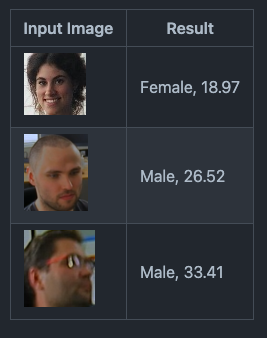
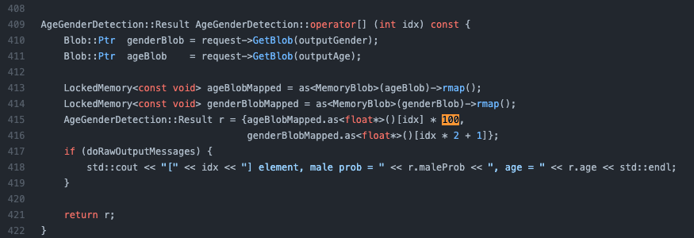
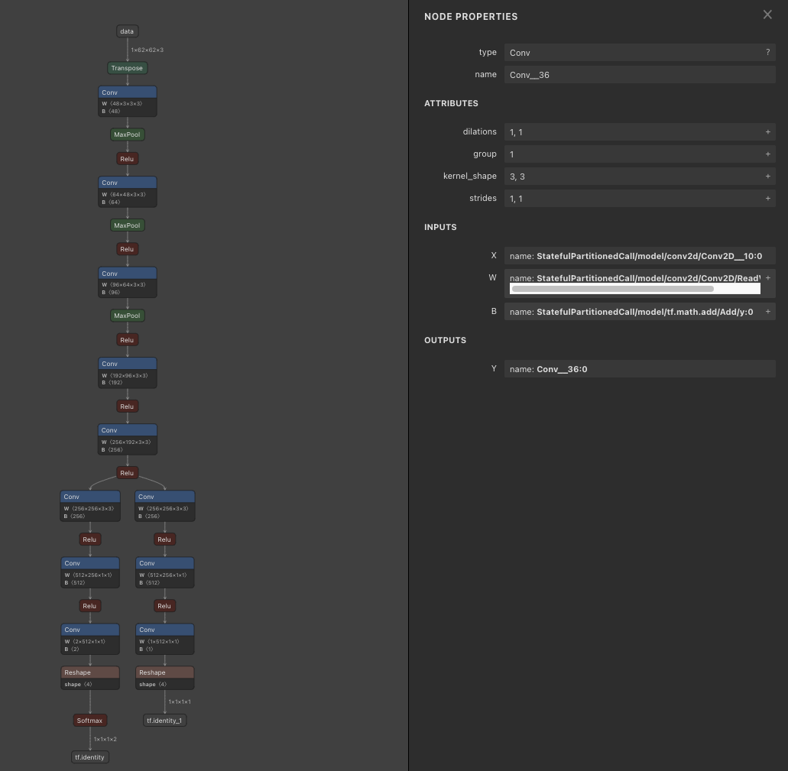
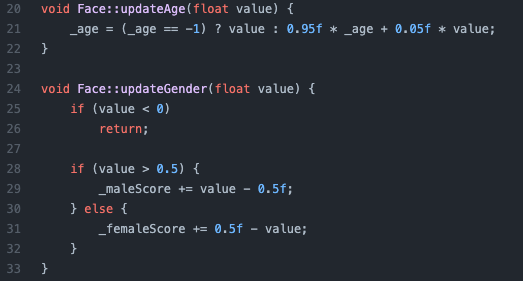

# AgeGenderRecognitionRetail : A Machine Learning Model to Identify Age and Gender

# AgeGenderRecognitionRetail : A Machine Learning Model to Identify Age and Gender

[](/@cochard-dav?source=post_page---byline--8506510414b---------------------------------------)

[David Cochard](/@cochard-dav?source=post_page---byline--8506510414b---------------------------------------)

3 min read

·

Sep 6, 2021

--

[Listen](/m/signin?actionUrl=https%3A%2F%2Fmedium.com%2Fplans%3Fdimension%3Dpost_audio_button%26postId%3D8506510414b&operation=register&redirect=https%3A%2F%2Fmedium.com%2Faxinc-ai%2Fagegenderrecognitionretail-a-machine-learning-model-to-identify-age-and-gender-8506510414b&source=---header_actions--8506510414b---------------------post_audio_button------------------)

Share

This is an introduction to「AgeGenderRecognitionRetail」, a machine learning model that can be used with [ailia SDK](https://ailia.jp/en/). You can easily use this model to create AI applications using [ailia SDK](https://ailia.jp/en/) as well as many other ready-to-use [ailia MODELS](https://github.com/axinc-ai/ailia-models).

---

## Overview

*AgeGenderRecognitionRetail* is a machine learning model developed by *Intel* to identify the age and gender of a person from a single picture.

Press enter or click to view image in full size


Source: <https://pixabay.com/ja/videos/%E3%82%AB%E3%83%83%E3%83%97%E3%83%AB-%E8%8B%A5%E3%81%84%E3%81%A7%E3%81%99-%E9%9B%BB%E8%A9%B1-50020/>

[## open\_model\_zoo/models/intel/age-gender-recognition-retail-0013 at master ·…

### Fully convolutional network for simultaneous Age/Gender recognition. The network is able to recognize age of people in…

github.com](https://github.com/openvinotoolkit/open_model_zoo/tree/master/models/intel/age-gender-recognition-retail-0013?source=post_page-----8506510414b---------------------------------------)

## Architecture

*AgeGenderRecognitionRetail* takes a 62x62 face image as input, and outputs the gender and age. The gender is output as a two-dimensional probability vector, and the age as a number.



Source: <https://github.com/openvinotoolkit/open_model_zoo/tree/master/models/intel/age-gender-recognition-retail-0013>

The age is output as a value between 0 and 1.0 which has to be multiplied by 100 to compute the age.

Press enter or click to view image in full size



Source: <https://github.com/openvinotoolkit/open_model_zoo/blob/master/demos/interactive_face_detection_demo/cpp/detectors.cpp>

The model architecture is a simple CNN. Caffe was used for training.

Press enter or click to view image in full size



*AgeGenderRecognitionRetail* was trained using Intel’s internal dataset made of 20,000 images. This model is capable of recognizing ages from 18 to 75 years old. A person under the age of 18 cannot be accurately estimated since the dataset did not contain images of children.

Faces facing the camera with an angle up to 45 degrees are supported. Since the accuracy is higher with faces facing the camera, it is desirable to use a face orientation detection model such as [*HopeNet*](/axinc-ai/hope-net-a-machine-learning-model-for-estimating-face-orientation-83d5af26a513).

[## HOPE-Net : A Machine Learning Model for Estimating Face Orientation

### This is an introduction to「HOPE-Net」, a machine learning model that can be used with ailia SDK. You can easily use this…

medium.com](/axinc-ai/hope-net-a-machine-learning-model-for-estimating-face-orientation-83d5af26a513?source=post_page-----8506510414b---------------------------------------)


Source: <https://github.com/openvinotoolkit/open_model_zoo/tree/master/models/intel/age-gender-recognition-retail-0013>

The average error for the age estimation is 6.99 years, and the accuracy of the gender estimation is 95.80%.


Source: <https://github.com/openvinotoolkit/open_model_zoo/tree/master/models/intel/age-gender-recognition-retail-0013>

In the official demo application, when the model is applied to videos, the tracking of faces is smoothed over multiple frames. Age is updated by 5%, and gender is calculated by summing the probability values.



Source: <https://github.com/openvinotoolkit/open_model_zoo/blob/master/demos/interactive_face_detection_demo/cpp/face.cpp>

Even when the person is wearing a mask, a face properly facing the camera can be detected with a reasonable degree of accuracy.

Press enter or click to view image in full size


Source: <https://pixabay.com/ja/photos/%e7%9c%8b%e8%ad%b7%e5%a9%a6-%e3%83%9e%e3%82%b9%e3%82%af%e3%82%b5%e3%83%bc%e3%82%b8%e3%82%ab%e3%83%ab%e3%83%9e%e3%82%b9%e3%82%af-4962034/>

## Usage

AgeGenderRecognitionRetail can be used with ailia SDK on the webcam video stream with the following command.

```
$ python3 age-gender-recognition-retail.py -v 0
```

[## ailia-models/face\_recognition/age-gender-recognition-retail at master · axinc-ai/ailia-models

### (Image from…

github.com](https://github.com/axinc-ai/ailia-models/tree/master/face_recognition/age-gender-recognition-retail?source=post_page-----8506510414b---------------------------------------)

Use the following command to estimate the age after face recognition if performed for images in a specific folder.

```
$ python3 age-gender-recognition-retail.py -i faces -d
```

Here is an output example.

---

[ax Inc.](https://axinc.jp/en/) has developed [ailia SDK](https://ailia.jp/en/), which enables cross-platform, GPU-based rapid inference.

ax Inc. provides a wide range of services from consulting and model creation, to the development of AI-based applications and SDKs. Feel free to [contact us](https://axinc.jp/en/) for any inquiry.