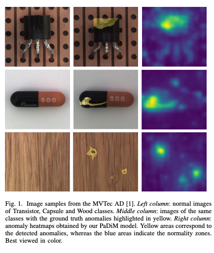
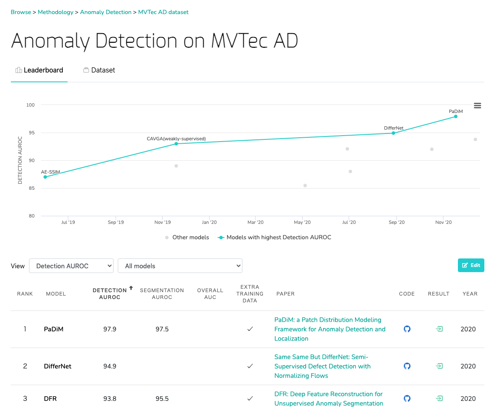
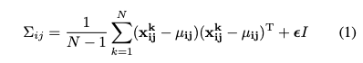
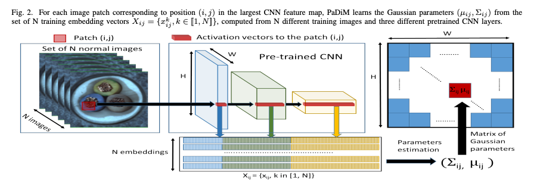
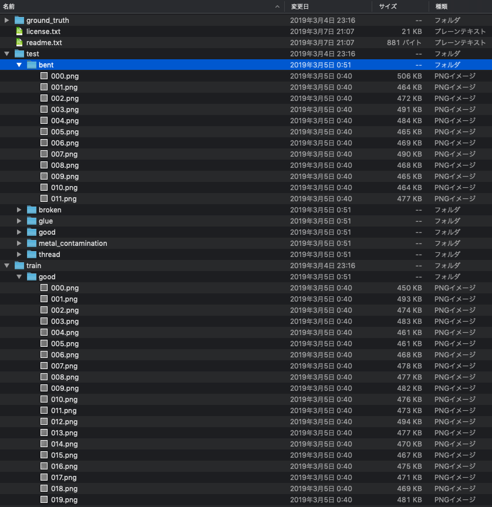
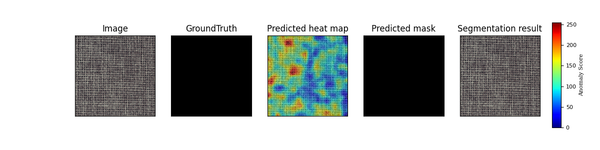

# PaDiM : A machine learning model for detecting defective products without retraining

# PaDiM : A machine learning model for detecting defective products without retraining

[](/@cochard-dav?source=post_page---byline--5daa6f203377---------------------------------------)

[David Cochard](/@cochard-dav?source=post_page---byline--5daa6f203377---------------------------------------)

8 min read

·

Oct 2, 2021

--

2

[Listen](/m/signin?actionUrl=https%3A%2F%2Fmedium.com%2Fplans%3Fdimension%3Dpost_audio_button%26postId%3D5daa6f203377&operation=register&redirect=https%3A%2F%2Fmedium.com%2Faxinc-ai%2Fpadim-a-machine-learning-model-for-detecting-defective-products-without-retraining-5daa6f203377&source=---header_actions--5daa6f203377---------------------post_audio_button------------------)

Share

This is an introduction to「PaDiM」, a machine learning model that can be used with [ailia SDK](https://ailia.jp/en/). You can easily use this model to create AI applications using [ailia SDK](https://ailia.jp/en/) as well as many other ready-to-use [ailia MODELS](https://github.com/axinc-ai/ailia-models).

---

## Overview

*PaDiM* is a machine learning model for detecting defective products published in November 2020. Defective goods, produced in a factory assembly line for example, can be detected based on images of normal products only, no retraining required. This state-of-the-art model was produced using *MVTec AD*, a data set for defective product detection.



Source: <https://arxiv.org/pdf/2011.08785.pdf>

[## PaDiM: a Patch Distribution Modeling Framework for Anomaly Detection and Localization

### We present a new framework for Patch Distribution Modeling, PaDiM, to concurrently detect and localize anomalies in…

arxiv.org](https://arxiv.org/abs/2011.08785?source=post_page-----5daa6f203377---------------------------------------)

## Methods to detect defective products

There are three methods for detecting defective products using machine learning.

1. Learning from normal and defective products (at least 10000 images of both normal and defective products are required)
2. Learning from normal products only (more than 10000 images of normal products are required)
3. Determination using distribution of image features from normal products only (more than 240 images of normal products are required)

Method 1. relies on a classic classification model, which is trained to detect normal and defective products based on networks such as *ResNet*. *GradCam* is used to visualize defective areas. In recent years, distance learning has also been used. However, in a factory assembly line, many images of normal products can be acquired, but not many images of defective products.

Method 2. was developed with this issue in mind, and it was trained using *AutoEncoder* and other methods from normal products only. *AutoEncoder* is a model architecture that maps the input image to a low-dimensional vector and recovers the original image from this low-dimensional vector. *AutoEncoder*, which is trained only from images of normal products, only learns features of normal products, so even if you put in images of defective products, it will output images of normal products. Using this feature, we can detect abnormalities by taking the difference between the input image and the image restored by the *AutoEncoder*. In recent years, GANs have also been used in combination. However, there is a problem that the model needs to be retrained for each product.

Press enter or click to view image in full size


Source: <https://arxiv.org/pdf/1711.00937.pdf>

Method 3. has received a lot of attention in recent years and uses machine learning models only for feature extraction. The data in the middle layer of the machine learning model trained by *ImageNet* characterizes the features of the image well. Therefore, the input image is passed through a network such as *ResNet*, and the data in the middle layer is extracted and used as features. The defective product detection is then performed by taking the difference between the distribution of features of the normal product and the distribution of features of the input image.

*PaDiM* belongs to the third approach and improves on SPADE’s architecture, which required K-NN clustering and achieved SOTA despite its simple architecture with only Gaussian distribution. The accuracy calculated by AUROC is 97.9%.

Press enter or click to view image in full size



Source: <https://paperswithcode.com/sota/anomaly-detection-on-mvtec-ad>

## PaDiM architecture

For training *PaDiM*, *WideResNet50* is applied to a sequence of images of normal products to calculate the feature map and compute the feature vector. To produce the feature vectors, shallow features of layers 1 to 3 are used. The feature vectors are calculated for each pixel in the image plane of the feature map.

From the calculated feature vector, calculate the mean of a group of images of normal products and calculate the [covariance matrix](https://en.wikipedia.org/wiki/Covariance_matrix). The covariance matrix is a generalization of the variance in scalar values.



Covariance matrix

From the mean and covariance matrix, we can calculate the [N-dimensional normal distribution](https://en.wikipedia.org/wiki/Normal_distribution) of the normal product.


N-dimensional normal distribution

The following image illustrates the feature vector computation. Input N images of a normal products to a CNN with a resolution of (W,H)=(224,224), compute the covariance matrix Σ and the mean μ for each pixel in the image plane of the feature map.

The training result will be the covariance matrix and the mean.

Press enter or click to view image in full size



Source: <https://arxiv.org/pdf/2011.08785.pdf>

During *PaDiM* inference, feature vectors are computed for the input image like during training, and the [Mahalanobis distance](https://en.wikipedia.org/wiki/Mahalanobis_distance) is computed from the precomputed covariance matrix and mean. The Mahalanobis distance is a generalization of the ordinary distance, which allows us to calculate the dissimilarity of two random variable vectors.


Mahalanobis distance

The Mahalanobis distance is calculated for each pixel, then normalized over the entire image to build a heatmap, and the maximum value of the Mahalanobis distance is the anomaly level.

## Reducing the amount of PaDiM operations

As a way to reduce the computational complexity of *PaDiM*, the paper proposes to reduce the dimensionality of feature vectors and to use CNNs of different architectures. For dimensionality reduction, *Principal Component Analysis* (PCA) and random extraction were compared, the latter was shown to have better performance.

In a different implementation of *PaDiM*, the 448-dimensional feature vector in *resnet18* is reduced to 100 dimensions, and the 1792-dimensional feature vector in *wide\_resnet50\_2* is reduced to 550 dimensions using random extraction.

## Dataset of defective products

The *MVTec AD* dataset was used for the evaluation of defect detection.

[## MVTec AD

### MVTec AD is a dataset for benchmarking anomaly detection methods with a focus on industrial inspection. It contains…

www.mvtec.com](https://www.mvtec.com/company/research/datasets/mvtec-ad?source=post_page-----5daa6f203377---------------------------------------)

The *MVTec AD* dataset contains images of normal products in the folders `train/good`and `test`, the rest are images of defective products. The mask of defects is stored in the folder `ground_truth`. This mask is used to calculate the pixel ROCAUC.

Press enter or click to view image in full size



Dataset folder structure

Due to its architecture, *PaDiM* is vulnerable to large misalignment due to the use of shallow features. Therefore, centering of the image to be detected is necessary.

[## Whether the object position is strictly required to be consistent？ · Issue #1 ·…

### You can’t perform that action at this time. You signed in with another tab or window. You signed out in another tab or…

github.com](https://github.com/xiahaifeng1995/PaDiM-Anomaly-Detection-Localization-master/issues/1?source=post_page-----5daa6f203377---------------------------------------)

Since the *MVTec AD* dataset is centered with high accuracy, the paper proposes a modified version that includes random crop from 256x256 to 224x224 and random rotation of +-10 degrees during training for real-world applications.

## Usage

### Pytorch

Clone the *PaDiM* repository.

[## xiahaifeng1995/PaDiM-Anomaly-Detection-Localization-master

### This is an implementation of the paper PaDiM: a Patch Distribution Modeling Framework for Anomaly Detection and…

github.com](https://github.com/xiahaifeng1995/PaDiM-Anomaly-Detection-Localization-master?source=post_page-----5daa6f203377---------------------------------------)

Place the dataset in `mvtec_anomaly_detection`.

Press enter or click to view image in full size


Adapt `CLASS_NAMES` in `datasets/mvtec.py`

```
CLASS_NAMES = ['grid']
```

Run `python3 main.py`, which uses about 7GB of memory for *Pytorch*, and takes about 2 minutes to train on a MacBookPro 13 using the *MVTec AD* carpet dataset (279 sheets).

```
$ python3 main.py   
| feature extraction | train | grid |: 100%|██████| 9/9 [01:30<00:00, 10.08s/it]  
| feature extraction | test | grid |: 100%|███████| 3/3 [00:28<00:00,  9.60s/it]  
image ROCAUC: 0.957  
pixel ROCAUC: 0.965  
Average ROCAUC: 0.957  
Average pixel ROCUAC: 0.965
```

When the execution is complete, the heatmap of the detection results will be stored in `mvtec_result`. An example of the detection result is shown below. We are able to detect defective carpets and visualize the defective areas.

Press enter or click to view image in full size



Normal product

Press enter or click to view image in full size


Defective product

### PaDiM with ailia SDK

Resources are in the `PaDiM` folder of the *ailia MODELS* repository below.

[## axinc-ai/ailia-models

### (Image from MVTec AD datasets https://www.mvtec.com/company/research/datasets/mvtec-ad/) Shape : (n, 3, 244, 244) Left…

github.com](https://github.com/axinc-ai/ailia-models/tree/master/anomaly_detection/padim?source=post_page-----5daa6f203377---------------------------------------)

Place the image of normal products in the `train` folder. In the example below, we use the images in the `bottle` folder of [MVTec AD](https://www.mvtec.com/company/research/datasets/mvtec-ad/).

Press enter or click to view image in full size


Structure of the image for training

Start the training with the command below.

```
python3 padim.py --train_dir train
```

The training results will be stored in `train.pkl`, which is 127.9MB in the case of *Resnet18*. Anomaly detection is performed using this file with the command below.

```
python3 pading.py -i input.png -f train.pkl -th 0.5
```

The anomaly level is displayed on the console. The higher the value, the bigger the defect.

```
Anomaly score: 25.189980 #defective product  
Anomaly score: 8.388268 #normal product used for training  
Anomaly score: 11.866211 #normal product not used for training
```

Defects can be visualized with `output.png`

Press enter or click to view image in full size


Visualization of defects

The optimal detection thresholds for anomalies can be calculated from the mask images in `GroundTruth`, and the recommended thresholds can be output by placing the mask images corresponding to the names of the input images in the `gt_masks` folder.

```
INFO padim.py (392) : Optimal threshold: 0.592428
```

If the mask image for `GroundTruth` does not exist, `output.png` will be empty.

Since the abnormal areas are normalized by the maximum value of the abnormality degree for each pixel, the output will be such that the entire object will be abnormal in the case of normal products. If the abnormality level of the entire image is low, ignore the image of the abnormal part.

Note that it is also possible to process multiple images at once by giving a folder instead of the input images.

```
python3 pading.py -i input_folder -s output_folder -f train.pkl -th 0.5
```

## Other applications of PaDiM

In addition to detecting defective products, *PaDiM* can also be applied to detect anomalies in surveillance cameras. *PaDiM* achieved an AUROC score of 91.2% on the *ShanghaiTech Campus* dataset, exceeding CAVGA’s 85%.

Press enter or click to view image in full size


<https://svip-lab.github.io/dataset/campus_dataset.html>

[## Shanghaitech Vision and Intelligent Perception(SVIP) LAB

### ShanghaiTech Campus dataset (Anomaly Detection) It is desirable that the anomaly detection model trained can be…

svip-lab.github.io](https://svip-lab.github.io/dataset/campus_dataset.html?source=post_page-----5daa6f203377---------------------------------------)

## Related research

*MahalanobisAD* calculates the Mahalanobis distance for feature vectors obtained by applying *GlobalAveragePooling* to *EfficientNet* B4’s layers 1 to 7 feature maps. *MahalanobisAD* calculates a single Mahalanobis distance for the entire image. Since the Mahalanobis distance is not computed for each pixel, it is not possible to visualize anomalies. If anomalies are needed, heat maps can be generated by *GradCAM*.

[## byungjae89/MahalanobisAD-pytorch

### PyTorch implementation of Modeling the Distribution of Normal Data in Pre-Trained Deep Features for Anomaly Detection…

github.com](https://github.com/byungjae89/MahalanobisAD-pytorch?source=post_page-----5daa6f203377---------------------------------------)

---

[ax Inc.](https://axinc.jp/en/) has developed [ailia SDK](https://ailia.jp/en/), which enables cross-platform, GPU-based rapid inference.

ax Inc. provides a wide range of services from consulting and model creation, to the development of AI-based applications and SDKs. Feel free to [contact us](https://axinc.jp/en/) for any inquiry.