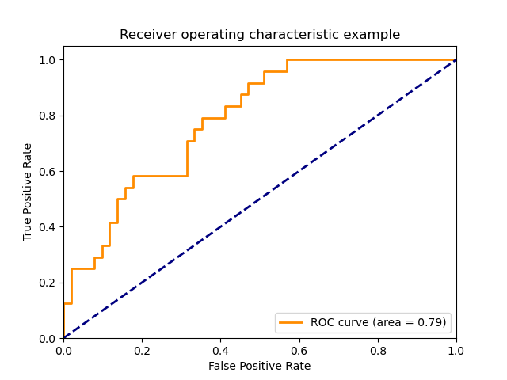
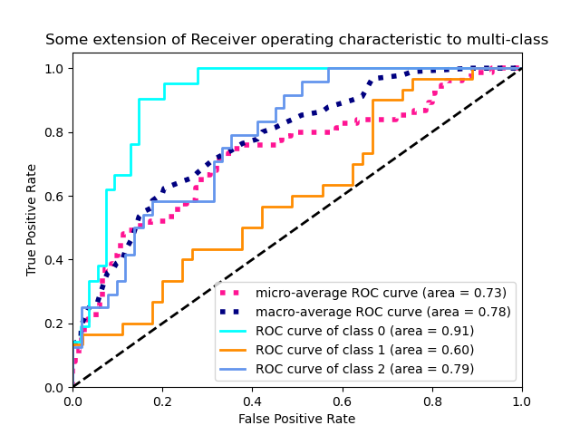

# ROC curve and AUC: Evaluation metrics for machine learning models

# ROC curve and AUC: Evaluation metrics for machine learning models

[David Cochard](/@cochard-dav?source=post_page---byline--fca2907f6a81---------------------------------------)

4 min read

·

Oct 5, 2021

--

[Listen](/m/signin?actionUrl=https%3A%2F%2Fmedium.com%2Fplans%3Fdimension%3Dpost_audio_button%26postId%3Dfca2907f6a81&operation=register&redirect=https%3A%2F%2Fmedium.com%2Faxinc-ai%2Froc-curve-and-auc-evaluation-metrics-for-machine-learning-models-fca2907f6a81&source=---header_actions--fca2907f6a81---------------------post_audio_button------------------)

Share

This article presents two metrics used in machine learning model evaluation: the *Receiver Operating Characteristic (ROC) curve* and *Area Under Curve (AUC)*.

---

## ROC curve

The *Receiver Operating Characteristic (ROC) curve* is a two-dimensional curve with the *True Positive Rate* on the vertical axis and *False Positive Rate* on the horizontal axis.

Source: <https://scikit-learn.org/stable/auto_examples/model_selection/plot_roc.html#sphx-glr-auto-examples-model-selection-plot-roc-py>

Let’s consider a machine learning model that determines whether an image is a cat or not. We assume that the machine learning model outputs a “*catness*” value between 0 and 1.0, and if the value exceeds the specified threshold, the image is assumed to be a cat.

In this case, if threshold=0, the image will always be judged as a cat, so the *True Positive Rate* (the ratio at which a cat image is judged as a cat) will be 1.0, and the *False Positive Rate* (the ratio at which a non-cat image is judged as a cat) will be 1.0.

Conversely, if threshold=1, the image will always be judged as not being a cat, so the *True Positive Rate* (the ratio of cat images being judged as cats) is 0.0, and the *False Positive Rate* (the ratio of non-cat images being judged as cats) is 0.0.

Assuming a model that randomly determines whether an image is a cat or not, the *True Positive Rate* (the ratio at which a cat image is determined to be a cat) and the *False Positive Rate* (the ratio at which a non-cat image is determined to be a cat) will be the same. It is shown as the blue line in the graph above.

The *ROC curve* can be calculated by plotting the *True Positive Rate* (the ratio at which a cat image is judged as a cat) and *False Positive Rate* (the ratio at which a non-cat image is judged as a cat) while varying the threshold of the machine learning model. It is shown as the orange line in the graph above.

## AUC

The *AUC (Area Under Curve)* indicates the area of the *ROC curve*.

The better the machine learning model, the more the ROC curve will be plotted in the upper left corner. In the following figure for example, the light blue curve is a better machine learning model than the orange one.

Source: <https://scikit-learn.org/stable/auto_examples/model_selection/plot_roc.html#sphx-glr-auto-examples-model-selection-plot-roc-py>

A good machine learning model will always output a high confidence value for cats and a low confidence value for non-cat images, so the *True Positive Rate* will remain high even if the threshold is increased (i.e., the False Positive Rate is decreased). As a result, the ROC curve will be plotted in the upper left corner.

Since it is difficult to judge whether the ROC curve is in the upper left corner by eye and subjective judgment is involved, AUC, which is the area of the ROC curve, is used for simpler evaluation.

## Advantages over simple accuracy comparison

If we try to compare the performance of machine learning models without using the ROC curve, we could draw a graph with the threshold on the horizontal axis, and the percentage of correct answers (TPR/(TPR+FPR)) on the vertical axis (where TPR stands for *True Positive Rate* and FPR stands for *False Positive Rate)*. However, the scale of the threshold is different for each machine learning model, so it is not possible to make comparisons between them. By unifying the horizontal axis with FPR, the advantage of using the ROC curve is that it allows us to compare different machine learning models.

Another possible approach is to calculate the highest correct answer rate while varying the threshold, and use it as the performance of the machine learning model. However, in real-world applications, it is difficult to determine the appropriate threshold because the input data is unknown. In terms of generalization performance, it is important that the accuracy is maintained even when the input data changes, i.e., the optimal threshold changes. Evaluating with the ROC curve, we can guarantee that the higher to the left the ROC curve is, the more robust it is to changes the threshold.

---

[ax Inc.](https://axinc.jp/en/) has developed [ailia SDK](https://ailia.jp/en/), which enables cross-platform, GPU-based rapid inference.

ax Inc. provides a wide range of services from consulting and model creation, to the development of AI-based applications and SDKs. Feel free to [contact us](https://axinc.jp/en/) for any inquiry.