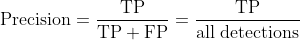
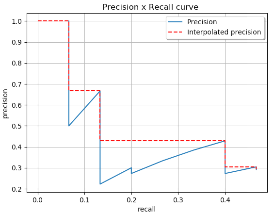
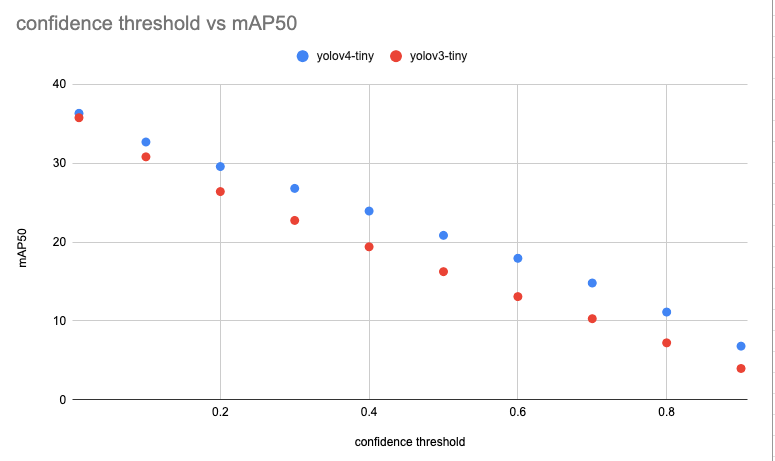

# mAP : Evaluation metric for object detection models

# mAP : Evaluation metric for object detection models

[David Cochard](/@cochard-dav?source=post_page---byline--dd20e2dc2472---------------------------------------)

5 min read

·

Oct 6, 2021

--

[Listen](/m/signin?actionUrl=https%3A%2F%2Fmedium.com%2Fplans%3Fdimension%3Dpost_audio_button%26postId%3Ddd20e2dc2472&operation=register&redirect=https%3A%2F%2Fmedium.com%2Faxinc-ai%2Fmap-evaluation-metric-of-object-detection-model-dd20e2dc2472&source=---header_actions--dd20e2dc2472---------------------post_audio_button------------------)

Share

This section explains mAP, an evaluation metric for object detection models.

---

## What is mAP?

*mAP (mean Average Precision)* is an evaluation metric used in object detection models such as [YOLO](/axinc-ai/yolov5-the-latest-model-for-object-detection-b13320ec516b). The calculation of *mAP* requires *IOU, Precision, Recall, Precision Recall Curve*, and *AP*.

[## rafaelpadilla/Object-Detection-Metrics

### If you use this code for your research, please consider citing: @Article{electronics10030279, AUTHOR = {Padilla, Rafael…

github.com](https://github.com/rafaelpadilla/Object-Detection-Metrics?source=post_page-----dd20e2dc2472---------------------------------------)

## About IOU

Object detection models predict the bounding box and category of objects in an image. *Intersection Over Union (IOU)* is used to determine if the bounding box was correctly predicted.

The IOU indicates how much bounding boxes overlap. This ratio of overlap between the regions of two bounding boxes becomes 1.0 in the case of an exact match and 0.0 if there is no overlap.

Source: <https://github.com/rafaelpadilla/Object-Detection-Metrics>

In the evaluation of object detection models, it is necessary to define how much overlap of bounding boxes with respect to the ground truth data should be considered as successful recognition. For this purpose, IOUs are used, and *mAP50* is the accuracy when IOU=50, i.e., if there is more than 50% overlap, the detection is considered successful. The larger the IOU, the more accurate the bounding box needs to be detected and the more difficult it becomes. For example, the value of *mAP75* is lower than the value of *mAP50*.

## About Precision and Recall

*Precision* is the ability of a model to identify only the relevant objects. It answers the question *What proportion of positive identifications was actually correct*? A model that produces no false positives has a precision of 1.0. However, the value will be 1.0 even if there are undetected or not detected bounding boxes that should be detected.

Source: <https://github.com/rafaelpadilla/Object-Detection-Metrics>

*Recall* is the ability of a model to find all ground truth bounding boxes. It answers the question *What proportion of actual positives was identified correctly?* A model that produces no false negatives (i.e. there are no undetected bounding boxes that should be detected) has a recall of 1.0. However, even if there is an “overdetection” and wrong bounding box are detected, the recall will still be 1.0.

Source: <https://github.com/rafaelpadilla/Object-Detection-Metrics>

## About Precision Recall Curve

The *Precision Recall Curve* is a plot of *Precision* on the vertical axis and *Recall* on the horizontal axis.

Source: <https://github.com/rafaelpadilla/Object-Detection-Metrics>

There is a threshold for object detection. Increasing the threshold reduces the of risk of over-detecting objects, but increases the risk of missed detections. For example, if threshold=1.0, no object will be detected, *Precision* will be 1.0, and *Recall* will be 0.0. On the other hand, if threshold=0.0, an infinite number of objects will be detected, Precision will be 0.0, and Recall will be 1.0. Conversely, if threshold=0.0, an infinite number of objects will be detected, *Precision* will be 0.0, and *Recall* will be 1.0.

In the case of a good machine learning model, over-detection will not occur even if threshold is reduced (*Recall* is increased), and *Precision* will remain high. Therefore, the higher up the curve to the right in the graph, the better the machine learning model is.

## About AP

When comparing the performance of two machine learning models, the higher the *Precision Recall Curve*, the better the performance. It is time-consuming to actually plot this curve, and as the *Precision Recall Curve* is often zigzagging, it is subjective judgment whether the model is good or not.

A more intuitive way to evaluate models is the *AP (Average Precision)*, which represents the area under the curve (AUC) *Precision Recall Curve*. The higher the curve is in the upper right corner, the larger the area, so the higher the *AP*, and the better the machine learning model.

Source: <https://github.com/rafaelpadilla/Object-Detection-Metrics>

## About mAP

The *mAP* is an average of the *AP* values, which is a further average of the *AP*s for all classes.

## Maximizing mAP

The *mAP* is calculated by fixing the *confidence threshold*. *COCO2017 TestSet* can be used to measure *mAP* on various *confidence thresholds* to check the effect of this threshold.

As a result, we confirmed that the smaller the *confidence threshold* is, the higher the *mAP* becomes.

Press enter or click to view image in full size

mAP50 for various thresholds measured on yolov4-tiny and yolov3-tiny

Press enter or click to view image in full size

mAP75 for various thresholds measured on yolov4-tiny and yolov3-tiny

This result suggests that the more over-detection occurs, the higher the *mAP. A* higher *Recall* will result in a larger area than a higher *Precision*, and we believe this is due to the small number images (40 670) in *COCO2017 TestSet*.

In the script `test.py` of the yolov5 repository, the *confidence threshold* for *mAP* calculation has an extremely small value of 0.001.

[## ultralytics/yolov5

### You can’t perform that action at this time. You signed in with another tab or window. You signed out in another tab or…

github.com](https://github.com/ultralytics/yolov5/blob/master/test.py?source=post_page-----dd20e2dc2472---------------------------------------)

---

[ax Inc.](https://axinc.jp/en/) has developed [ailia SDK](https://ailia.jp/en/), which enables cross-platform, GPU-based rapid inference.

ax Inc. provides a wide range of services from consulting and model creation, to the development of AI-based applications and SDKs. Feel free to [contact us](https://axinc.jp/en/) for any inquiry.