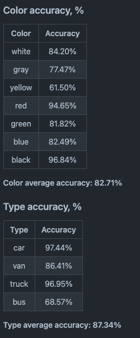
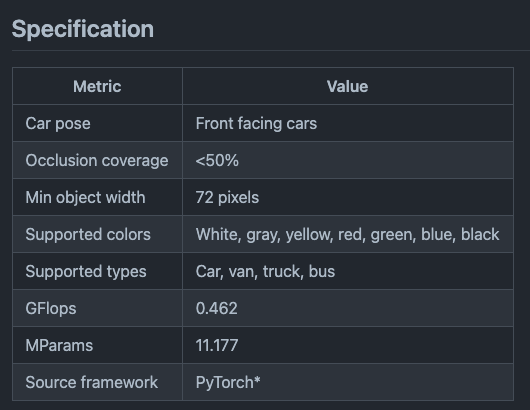

# VehicleAttributeRecognitionBarrier : A Machine Learning Model for Detecting Car Attributes

# VehicleAttributeRecognitionBarrier : A Machine Learning Model for Detecting Car Attributes

[](/@cochard-dav?source=post_page---byline--fe8fda7649ff---------------------------------------)

[David Cochard](/@cochard-dav?source=post_page---byline--fe8fda7649ff---------------------------------------)

2 min read

·

Oct 15, 2021

--

[Listen](/m/signin?actionUrl=https%3A%2F%2Fmedium.com%2Fplans%3Fdimension%3Dpost_audio_button%26postId%3Dfe8fda7649ff&operation=register&redirect=https%3A%2F%2Fmedium.com%2Faxinc-ai%2Fvehicleattributerecognitionbarrier-a-machine-learning-model-for-detecting-car-attributes-fe8fda7649ff&source=---header_actions--fe8fda7649ff---------------------post_audio_button------------------)

Share

This is an introduction to「VehicleAttributeRecognitionBarrier」, a machine learning model that can be used with [ailia SDK](https://ailia.jp/en/). You can easily use this model to create AI applications using [ailia SDK](https://ailia.jp/en/) as well as many other ready-to-use [ailia MODELS](https://github.com/axinc-ai/ailia-models).

---

## Overview

*VehicleAttributeRecognitionBarrier* is a machine learning model developed by *Intel* to identify the type and the color of a car.

[## open\_model\_zoo/README.md at master · openvinotoolkit/open\_model\_zoo

### This model presents a vehicle attributes classification algorithm for a traffic analysis scenario. Color average…

github.com](https://github.com/openvinotoolkit/open_model_zoo/blob/master/models/intel/vehicle-attributes-recognition-barrier-0042/README.md?source=post_page-----fe8fda7649ff---------------------------------------)

Press enter or click to view image in full size


Source: <https://pixabay.com/ja/videos/%E8%AD%A6%E5%AF%9F%E3%81%AE%E8%BB%8A-%E5%B8%82-%E3%83%88%E3%83%A9%E3%83%95%E3%82%A3%E3%83%83%E3%82%AF-6095/>

## Architecture

The model takes a frontal image of a car and outputs attributes.


Source: <https://github.com/openvinotoolkit/open_model_zoo/blob/master/models/intel/vehicle-attributes-recognition-barrier-0042/README.md>

There are 7 categories for colors and 4 categories for vehicle types, with accuracies of respectively 82.71% and 87.34%



Source: <https://github.com/openvinotoolkit/open_model_zoo/blob/master/models/intel/vehicle-attributes-recognition-barrier-0042/README.md>

The model architecture has a *ResNet*-like structure. The input is a (1,72,72,3) image and the output is a (1,7) vector of color probabilities and a (1,4) vector of car types.


Source: [https://netron.app/?url=https://storage.googleapis.com/ailia-models/vehicle-attributes-recognition-barrier/vehicle-attributes-recognition-barrier-0042.onnx.prototxt](https://netron.app/?url=https%3A%2F%2Fstorage.googleapis.com%2Failia-models%2Fvehicle-attributes-recognition-barrier%2Fvehicle-attributes-recognition-barrier-0042.onnx.prototxt)

As a constraint, you need to give the image of the front of the car with less than 50% occlusion.



Source: <https://github.com/openvinotoolkit/open_model_zoo/blob/master/models/intel/vehicle-attributes-recognition-barrier-0042/README.md>

## Usage

You can use *VehicleAttributeRecognitionBarrier* with ailia SDK using the following command. After detecting the car with [YOLOv3](/axinc-ai/yolov3-a-machine-learning-model-to-detect-the-position-and-type-of-an-object-60f1c18f8107) for any video, the attributes will be inferred.

```
$ python3 vehicle-attributes-recognition-barrier.py -v input.mp4
```

[## ailia-models/vehicle\_recognition/vehicle-attributes-recognition-barrier at master ·…

### (Image from…

github.com](https://github.com/axinc-ai/ailia-models/tree/master/vehicle_recognition/vehicle-attributes-recognition-barrier?source=post_page-----fe8fda7649ff---------------------------------------)

Here is an example output.

---

[ax Inc.](https://axinc.jp/en/) has developed [ailia SDK](https://ailia.jp/en/), which enables cross-platform, GPU-based rapid inference.

ax Inc. provides a wide range of services from consulting and model creation, to the development of AI-based applications and SDKs. Feel free to [contact us](https://axinc.jp/en/) for any inquiry.