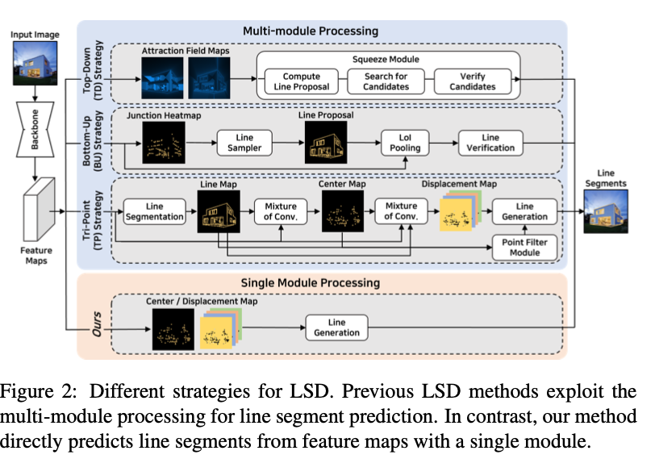
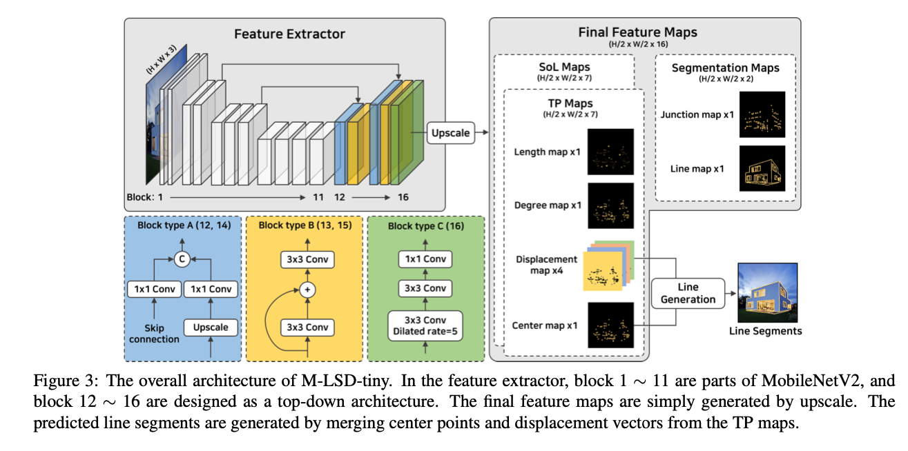
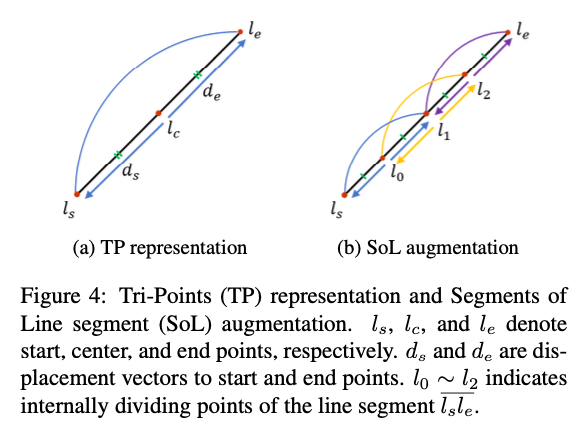
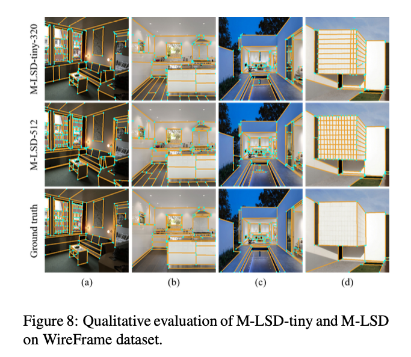

# M-LSD : Machine Learning Model for Detecting Wireframes

# M-LSD : Machine Learning Model for Detecting Wireframes

[](/@cochard-dav?source=post_page---byline--ac1b618f459b---------------------------------------)

[David Cochard](/@cochard-dav?source=post_page---byline--ac1b618f459b---------------------------------------)

3 min read

·

Oct 20, 2021

--

[Listen](/m/signin?actionUrl=https%3A%2F%2Fmedium.com%2Fplans%3Fdimension%3Dpost_audio_button%26postId%3Dac1b618f459b&operation=register&redirect=https%3A%2F%2Fmedium.com%2Faxinc-ai%2Fm-lsd-machine-learning-model-for-detecting-wireframes-ac1b618f459b&source=---header_actions--ac1b618f459b---------------------post_audio_button------------------)

Share

This is an introduction to「M-LSD」, a machine learning model that can be used with [ailia SDK](https://ailia.jp/en/). You can easily use this model to create AI applications using [ailia SDK](https://ailia.jp/en/) as well as many other ready-to-use [ailia MODELS](https://github.com/axinc-ai/ailia-models).

---

## Overview

*M-LSD* is a machine learning model developed by *NAVER* to detect wireframes of objects. Since it can accurately detect the contours of sheets of paper and books, it can be used for pre-processing of OCR.

Press enter or click to view image in full size


Source: <https://github.com/navervision/mlsd>

[## Towards Real-time and Light-weight Line Segment Detection

### Previous deep learning-based line segment detection (LSD) suffer from the immense model size and high computational…

arxiv.org](https://arxiv.org/abs/2106.00186?source=post_page-----ac1b618f459b---------------------------------------)

## Architecture

The classic approach to line detection is complex and made of with multiple modules, whereas M-LSD detects lines in a single shot, which allows for fast processing.

Press enter or click to view image in full size



Source: <https://arxiv.org/pdf/2106.00186.pdf>

The model uses *MobileNetV2* as backbone, with the addition of a block for generating heatmaps in the later stage.

Press enter or click to view image in full size



Source: <https://arxiv.org/pdf/2106.00186.pdf>

Line segments are defined as *Tri-Points (TP)*, as shown below. The line segment is defined by `lc`, which indicates the center point, `ds` which is the displacement vector to the start point, and `de` which is the displacement vector to the end point.



Source: <https://arxiv.org/pdf/2106.00186.pdf>

The output of the model is a (1,200,2) vector `lc` representing the center point of the line segments, a (1,200) vector which is the confidence of the line segments, and a displacement map (1,256,256,4) representing the displacement from the center point to the start and end points of the line segments. Line segments can then be calculated by adding the three vectors of center points, start points, and end points.


Source: <https://arxiv.org/pdf/2106.00186.pdf>

The data sets used for training are *Wireframe* and *YorkUrban*.



Source: <https://arxiv.org/pdf/2106.00186.pdf>

## Usage

M-LSD can be used with ailia SDK 1.2.8 and later with the following command to detect wireframes from the webcam video stream.

```
$ python3 mlsd.py -v 0
```

[## ailia-models/line\_segment\_detection/mlsd at master · axinc-ai/ailia-models

### (Image from…

github.com](https://github.com/axinc-ai/ailia-models/tree/master/line_segment_detection/mlsd?source=post_page-----ac1b618f459b---------------------------------------)

Here is the result you can expect.

---

[ax Inc.](https://axinc.jp/en/) has developed [ailia SDK](https://ailia.jp/en/), which enables cross-platform, GPU-based rapid inference.

ax Inc. provides a wide range of services from consulting and model creation, to the development of AI-based applications and SDKs. Feel free to [contact us](https://axinc.jp/en/) for any inquiry.