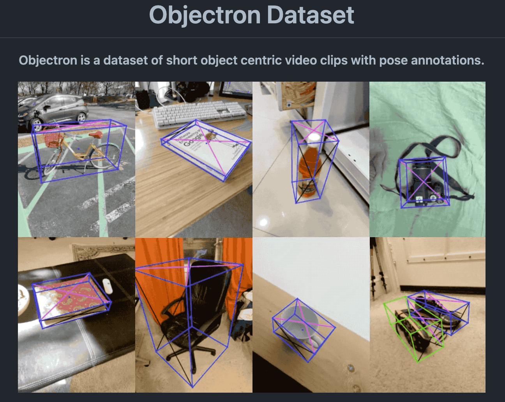

# 3DObjectDetectionPytorch : 3D Object Detection Model

# 3DObjectDetectionPytorch : 3D Object Detection Model

[](/@cochard-dav?source=post_page---byline--3e1da4c53f---------------------------------------)

[David Cochard](/@cochard-dav?source=post_page---byline--3e1da4c53f---------------------------------------)

2 min read

·

Oct 21, 2021

--

[Listen](/m/signin?actionUrl=https%3A%2F%2Fmedium.com%2Fplans%3Fdimension%3Dpost_audio_button%26postId%3D3e1da4c53f&operation=register&redirect=https%3A%2F%2Fmedium.com%2Faxinc-ai%2F3dobjectdetectionpytorch-3d-object-detection-model-3e1da4c53f&source=---header_actions--3e1da4c53f---------------------post_audio_button------------------)

Share

This is an introduction to「3DObjectDetectionPyrorch」, a machine learning model that can be used with [ailia SDK](https://ailia.jp/en/). You can easily use this model to create AI applications using [ailia SDK](https://ailia.jp/en/) as well as many other ready-to-use [ailia MODELS](https://github.com/axinc-ai/ailia-models).

---

## Overview

*3DObjectDetectionPytorch* is a machine learning model that calculates 3D bounding boxes of objects. Other object detection models such as [YOLO](/axinc-ai/yolov5-the-latest-model-for-object-detection-b13320ec516b) generally computes 2D bounding boxes, but this new model returns bounding boxes with depth information.

Press enter or click to view image in full size


Source: Objectron dataset

[## GitHub — sovrasov/3d-object-detection.pytorch

### This project provides code to train a two stage 3d object detection models on the Objectron dataset. Training includes…

github.com](https://github.com/sovrasov/3d-object-detection.pytorch?source=post_page-----3e1da4c53f---------------------------------------)

## Architecture

*3DObjectDetectionPytorch* is capable of recognizing the following 9 classes.

> OBJECTRON\_CLASSES = (‘bike’, ‘book’, ‘bottle’, ‘cereal\_box’, ‘camera’, ‘chair’, ‘cup’, ‘laptop’, ‘shoe’)

First, the 2D bounding box of the object is computed with *MobileNetV2 SSD*, and then the 3D bounding box is calculated with *MobileNetV3* regression model. This regression model takes an image (1,3,224,224) as input and returns 9 keypoints (x,y) for each class (9,1,9,2).

*3DObjectDetectionPytorch* was trained on the *Objectron* dataset, which is publicly available from *Google*.

Press enter or click to view image in full size



Source: <https://github.com/google-research-datasets/Objectron>

[## GitHub — google-research-datasets/Objectron: Objectron is a dataset of short, object-centric video…

### Objectron is a dataset of short, object-centric video clips. In addition, the videos also contain AR session metadata…

github.com](https://github.com/google-research-datasets/Objectron?source=post_page-----3e1da4c53f---------------------------------------)

The *Objectron* dataset is a dataset developed for AR development and contains 15K annotated videos and 4M annotated images.

Press enter or click to view image in full size


Source: <https://github.com/google-research-datasets/Objectron>

## Usage

Use the following command to run *3DObjectDetectionPytorch* with ailia SDK on a web camera video stream.

```
$ python3 3d-object-detection.pytorch.py -v 0
```

Here is the result you can expect.

[## ailia-models/object\_detection\_3d/3d-object-detection.pytorch at master · axinc-ai/ailia-models

### (Image from Objectron Dataset…

github.com](https://github.com/axinc-ai/ailia-models/tree/master/object_detection_3d/3d-object-detection.pytorch?source=post_page-----3e1da4c53f---------------------------------------)

## Related topics

ailia MODELS also contains Google’s *mediapipe\_objectron* which is a model also trained using the Objectron dataset.

[## ailia-models/object\_detection\_3d/mediapipe\_objectron at master · axinc-ai/ailia-models

### (Image from Objectron Dataset…

github.com](https://github.com/axinc-ai/ailia-models/tree/master/object_detection_3d/mediapipe_objectron?source=post_page-----3e1da4c53f---------------------------------------)

---

[ax Inc.](https://axinc.jp/en/) has developed [ailia SDK](https://ailia.jp/en/), which enables cross-platform, GPU-based rapid inference.

ax Inc. provides a wide range of services from consulting and model creation, to the development of AI-based applications and SDKs. Feel free to [contact us](https://axinc.jp/en/) for any inquiry.